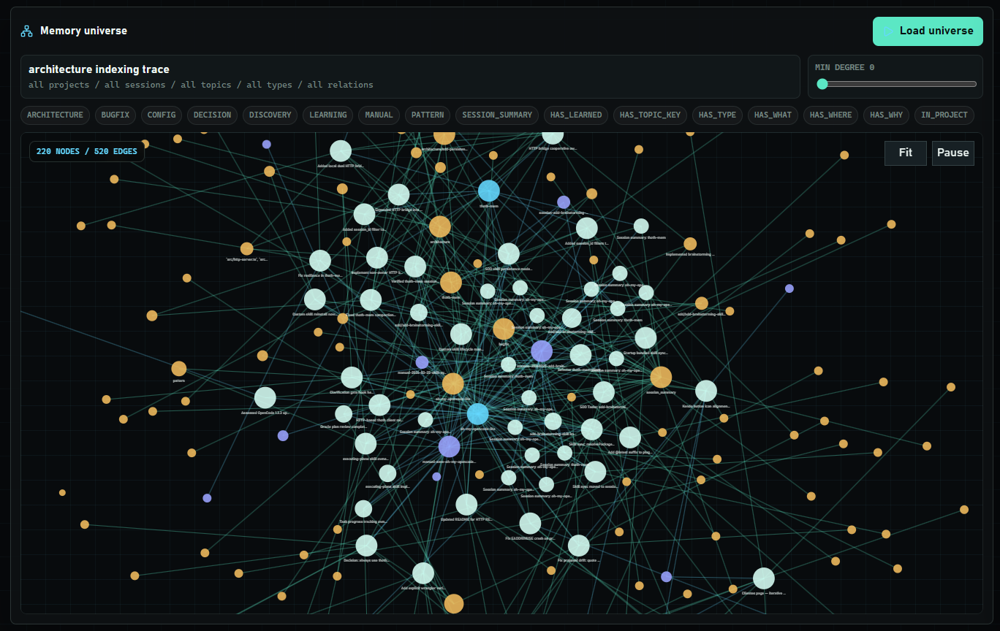

<div align="center">


# Thoth-Mem

**Persistent memory for AI coding agents**

[](https://www.npmjs.com/package/thoth-mem)
[](https://nodejs.org)
[](LICENSE)

Give your AI coding agent a brain that survives across sessions, compactions, and context resets.

</div>

---

Thoth-Mem is an MCP server with an optional HTTP REST API that stores what your agent learns — architecture decisions, bug fixes, patterns, preferences — in a local SQLite database with full-text search. When a new session starts, the agent picks up right where it left off.

```
Agent Session 1                    Agent Session 2
┌─────────────────┐               ┌─────────────────┐
│ discovers auth   │──── save ───▶│ recalls auth     │
│ uses JWT+refresh │               │ pattern instantly │
│ fixes edge case  │──── save ───▶│ avoids same bug  │
└─────────────────┘               └─────────────────┘
         │                                 ▲
         └──── thoth.db (SQLite) ──────────┘
```

## Features

- **6 compact MCP tools** — workflow-level tools instead of one tool per internal view
- **Dashboard v2 operations console** served by the HTTP bridge at `/`, with OpenAPI docs preserved at `/docs`
- **CLI + MCP dual mode** — use as a server or directly from the terminal
- **SQLite + FTS5** full-text search (fast, zero external dependencies)
- **Git-friendly sync** — export memory as gzipped chunks for version control
- **JSON export/import** — portable memory backup and transfer
- **Project migration** — rename projects across all entities in one operation
- **Knowledge Graph Ledger rebuild** — backfill derived KG/ledger facts for existing memories; legacy graph endpoint compatibility is preserved
- **MCP Server Instructions** — built-in protocol guidance for connected agents
- **Observation versioning** — full history preserved on topic_key upserts
- **Session enrichment** — sessions auto-fill missing project/directory on reconnect
- **Normalized deduplication** — whitespace/formatting-insensitive duplicate detection
- **Strict type taxonomy** — observation types enforced at the database level
- **Paginated retrieval** — large observations served in chunks via offset/max_length
- **Privacy defense** — `<private>` tags stripped before storage
- **Token-efficient recall** — compact fused evidence first, context expansion only when needed
- **Retrieval and KG eval baselines** — deterministic hybrid retrieval and graph-quality benchmarks (lexical, semantic raw/HyDE, KG, compression, lineage, forbidden triples, optional LLM KG acceptance)
- **Agent-first MCP tools** — recall, save, context, project navigation, session lifecycle, and full-content fetch
- **Admin tools via CLI & HTTP** — export, import, sync, and migration available without cluttering the MCP tool surface
- **Operation trace logging** — MCP and HTTP calls persist sanitized request/response traces for dashboard inspection

## Quick Start

```bash
# Run the MCP server + HTTP bridge directly (no install needed)
npx -y thoth-mem@latest mcp

# Or install globally
pnpm add -g thoth-mem
thoth-mem mcp
```

Requires Node.js >= 18.

For backwards compatibility, running `thoth-mem` with no subcommand also starts the MCP server and HTTP bridge. New MCP client configs should prefer the explicit `mcp` subcommand.

## MCP Configuration

### Claude Code

```bash
claude mcp add thoth-mem -- npx -y thoth-mem@latest mcp
```

### OpenCode

Add to `~/.config/opencode/config.json`:

```json
{
  "mcp": {
    "thoth": {
      "type": "local",
      "command": [
        "npx",
        "-y",
        "thoth-mem@latest",
        "mcp"
      ]
    }
  }
}
```

### Gemini CLI

Add to `~/.gemini/settings.json`:

```json
{
  "mcpServers": {
    "thoth": {
      "command": "npx",
      "args": ["-y", "thoth-mem@latest", "mcp"]
    }
  }
}
```

## CLI Commands

Thoth-Mem also works as a standalone CLI. When no subcommand is given, it starts the MCP server (and HTTP bridge by default).

```bash
thoth-mem                              # Start MCP server + HTTP bridge (default)
thoth-mem mcp                          # Start MCP server (explicit)
thoth-mem mcp --no-http                # Start MCP server without HTTP bridge
thoth-mem search <query>               # Search memories
thoth-mem save <title> <content>       # Save a memory
thoth-mem timeline <observation_id>    # Chronological context around an observation
thoth-mem context                      # Recent session context
thoth-mem stats                        # Memory statistics
thoth-mem export [file]                # Export to JSON (stdout if no file)
thoth-mem import <file>                # Import from JSON
thoth-mem sync [--dir=<path>]     # Git sync export
thoth-mem sync-import [--dir=<path>]  # Git sync import from another instance
thoth-mem migrate-project <old> <new>  # Rename a project across all entities
thoth-mem delete-project <project>     # Delete a project and its related data
thoth-mem rebuild-graph --project <name> # Rebuild graph facts for one project
thoth-mem rebuild-graph --all          # Rebuild graph facts for every project
thoth-mem rebuild-index --project <name> # Queue semantic index rebuild for one project
thoth-mem rebuild-index --all          # Queue semantic index rebuild for all projects
thoth-mem rebuild-index --all --process 500 # Queue and process up to 500 jobs
thoth-mem rebuild-index --status       # Show semantic index queue/coverage progress
thoth-mem version                      # Show version
thoth-mem help                         # Show help
```

Common CLI path/filter flags:

```bash
thoth-mem stats --data-dir=/custom/path
thoth-mem search "auth pattern" -p my-project
```

`--no-http` is a server startup flag, so use it with MCP/server mode:

```bash
thoth-mem mcp --no-http
```

## HTTP REST API

Thoth-Mem runs an HTTP REST API bridge alongside the MCP server by default. The bridge listens on port `7438`, serves Dashboard v2 at `/` when dashboard assets are built, and provides full access to memory operations via standard HTTP.

**Local dashboard:**

- Dashboard: `http://localhost:7438/`
- Build assets locally with `pnpm run dashboard:build` during development or release packaging.
- If `dist/dashboard/index.html` is missing, `/` returns a clear local build message while `/docs`, `/openapi.json`, and REST APIs remain available.
- Dashboard v2 is a local operations console for retrieval lanes, operation traces, indexing/background state, graph exploration, and HTTP/CLI-equivalent commands.
- Dashboard deep links live under `/console/*` so API routes such as `/operations` and `/graph/rebuild` are never shadowed.
- The console can create observations and queue rebuild operations through the same REST contracts documented in OpenAPI.



_Memory universe D3 graph view with clustered nodes and relationship edges._

**Interactive Documentation:**

- OpenAPI spec: `http://localhost:7438/openapi.json`
- Interactive docs: `http://localhost:7438/docs`

**Disable the HTTP bridge:**

```bash
thoth-mem mcp --no-http
# or
THOTH_HTTP_DISABLED=true thoth-mem mcp
```

**Example: Search memories via HTTP**

```bash
curl http://localhost:7438/observations/search?query=auth+pattern
```

**Example: Get memory statistics**

```bash
curl http://localhost:7438/stats
```

**Example: Inspect operation traces**

```bash
curl "http://localhost:7438/operation-traces?origin=http&status=error&limit=20"
```

**Example: Queue an index rebuild**

```bash
curl -X POST http://localhost:7438/index/rebuild \
  -H "content-type: application/json" \
  -d '{"project":"my-project","reason":"manual","process_limit":0}'
```

The HTTP API supports sessions, observations, prompts, search, export/import, sync, operation traces, index status/rebuild, graph rebuild, operation catalog, and version inspection. See the interactive `/docs` interface for the full API reference.

## Development Checks

```bash
pnpm run build
pnpm run dashboard:typecheck
pnpm run dashboard:build
pnpm test
pnpm run eval:retrieval
pnpm run eval:kg
```

`pnpm run eval:retrieval` runs a deterministic in-memory hybrid retrieval eval against seeded observations, curated non-synthetic project-documentation examples, and synthetic distractors. It reports hybrid recall under noise, corpus size, direct vs rephrased vs non-synthetic case mix, measured surgical compression, HyDE lift, pending/degraded fallback, lexical prefix behavior, semantic raw vs HyDE contribution, sentence-first small-to-big promotion, KG enrichment, KG-as-primary lane rate, and evidence lineage coverage without requiring model downloads or remote APIs. The CLI gate fails below 95% recall@1 or 90% recall@k, while curated non-synthetic/current-state cases keep stricter per-case assertions.

Scale the retrieval eval with `THOTH_RETRIEVAL_EVAL_NOISE` when you want hundreds or thousands of synthetic distractors. In PowerShell:

```powershell
$env:THOTH_RETRIEVAL_EVAL_NOISE='250'; pnpm run eval:retrieval
```

`pnpm run eval:kg` runs a deterministic KG quality eval for subject-relation-object extraction. It reports expected triple recall, forbidden triple rate, long-conversation cases where deterministic extraction should be paired with optional LLM enrichment, and acceptance of validated LLM triples while rejecting unknown relations.

## MCP Tools (6)


| Tool                    | Purpose                                                           |
| ----------------------- | ----------------------------------------------------------------- |
| `mem_save`              | Save observations, prompts, session summaries, or passive learnings |
| `mem_recall`            | Primary fused hybrid recall across semantic, KG, and lexical lanes |
| `mem_context`           | Get recent context — sessions, prompts, observations, stats      |
| `mem_get`               | Retrieve an observation or prompt by ID, with optional timeline or pagination |
| `mem_project`           | List projects, summarize one project, inspect graph facts/topics |
| `mem_session`           | Start, checkpoint, or summarize a memory session                  |

Current tool/action map:

| Tool | Current shape |
| --- | --- |
| `mem_save` | `kind="observation"`, `kind="prompt"`, `kind="session_summary"`, or `kind="passive_learnings"` |
| `mem_recall` | `mode="compact"` first, `mode="context"` for retrieved text; supports filters plus `hyde` and `debug` |
| `mem_context` | Recent sessions/prompts/observations, optionally with `recall_query` fused evidence |
| `mem_get` | `id`, `kind`, `offset`, `max_length`, `include_timeline`, `before`, and `after` |
| `mem_project` | `action="list"`, `"summary"`, `"graph"`, `"topics"`, or `"topic"` |
| `mem_session` | `action="start"`, `"checkpoint"`, or `"summary"` |

Legacy one-tool-per-view names are intentionally obsolete and are not registered. Use `mem_recall` instead of `mem_search`, `mem_get` instead of `mem_get_observation` or `mem_timeline`, `mem_project` instead of `mem_project_summary`, `mem_project_graph`, or `mem_topic_keys`, `mem_session` instead of `mem_session_start` or `mem_session_summary`, and `mem_save(kind="prompt")` instead of `mem_save_prompt`.

> **Admin operations** (export, import, sync, sync-import, migrate-project, delete-project, rebuild-graph, rebuild-index) are available via the [CLI](#cli-commands). Export, import, sync, migration, operation traces, index status/rebuild, graph rebuild, operation catalog, and version inspection are also available through the [HTTP REST API](#http-rest-api). They are not registered as MCP tools to keep the agent's tool surface lean.

## Retrieval and Embeddings

- `mem_recall` is the primary retrieval tool. Use `mode=compact` first, then `mode=context` for the strongest hits, and `mem_get` only when full content is needed.
- `mem_recall` accepts precision filters for `project`, `session_id`, `scope`, `topic_key`, `type`, `time_from`, and `time_to`; these pass through to all retrieval lanes.
- Hybrid retrieval defaults use tuned core lane fusion: sentence top-k 100, chunk top-k 20, lexical limit 20, min semantic score 0.3, and lane order `sentence > kg > chunk > lexical`. Knowledge-graph facts now participate as a first-class ranking lane and also enrich returned hits with supporting graph evidence.
- Lexical ranking filters low-signal query stopwords and scores prefix matches by content-term coverage, so a broad one-word overlap cannot outrank stronger semantic/KG evidence under noisy corpora.
- Surgical trimming is explicit in `mem_recall mode=context`: sentence hits return a `primary_sentence` and, when the score clears the small-to-big threshold, a labeled `surrounding_parent_chunk`. Lexical hits return matching sentences instead of whole observations. Each context hit includes `retrieval_contract`, `compression_ratio`, `evidence_chars`, and `full_chars` so noise reduction is measured rather than claimed.
- Semantic indexing is eventual and non-blocking. Save/update operations can return while indexing stays pending in the background. Terminal job failures keep `last_error` and `finished_at`, stale running leases are recoverable, and later queued jobs continue processing instead of being starved by failed work.
- Semantic lane state is reconciled from queue health plus vector coverage on startup/status reads, so completed lanes do not remain stuck in `pending` after a restart when queue and coverage are clean.
- `/viz/health`, `/observatory/health`, and `/index/status` include product telemetry for semantic lanes, job totals, job-kind breakdowns, queue lag, vector coverage ratios, and recent indexing/KG warnings. Optional KG LLM failures are recorded as job telemetry while deterministic KG extraction still completes.
- Automatic rebuild is triggered when embedding configuration hash changes; manual rebuild is available through `thoth-mem rebuild-index --project <name>`, `thoth-mem rebuild-index --all`, and `POST /index/rebuild`. Use `thoth-mem rebuild-index --status` or `GET /index/status` to inspect queue progress, lane state, recent errors, and vector coverage.
- When semantic lanes are pending or unavailable, retrieval degrades safely to lexical recall with graph enrichment where matching facts exist, and reports fallback metadata (`pending`, `degraded_fallback`) instead of failing.
- `sqlite-vec` is optional at runtime: if unavailable, Thoth-Mem marks semantic lanes degraded and continues serving lexical retrieval with KG enrichment.
- Local embeddings default to provider `transformers_local` and model `nomic-ai/nomic-embed-text-v1.5` unless overridden.
- HyDE is enabled by default. The local fallback uses Transformers.js text generation with `onnx-community/Qwen2.5-Coder-0.5B-Instruct`; remote HyDE can use Ollama or an OpenAI-compatible LM Studio server.
- KG extraction is deterministic-first. Optional LLM enrichment can be enabled for long conversations with Ollama or LM Studio; generated triples are filtered through the same relation taxonomy and merged with deterministic triples. If the remote extractor is disabled or unavailable, deterministic KG extraction still completes.

### Recommended Embedding Models

Model choice affects vector dimensions, quality, memory use, and index compatibility. Keep the same provider/model/dimensions for an existing semantic index; changing them marks embeddings stale and queues a rebuild.

| Use case | Ollama model | LM Studio model to look for | Notes |
| --- | --- | --- | --- |
| Lightweight local default | [`nomic-embed-text`](https://ollama.com/library/nomic-embed-text) | [`nomic-ai/nomic-embed-text-v1.5`](https://lmstudio.ai/docs/typescript/embedding) | Good first choice for local RAG. Small download, mature support, 768-dimensional embeddings in the upstream model card. |
| Strong general retrieval | [`mxbai-embed-large`](https://ollama.com/library/mxbai-embed-large) | [`mixedbread-ai/mxbai-embed-large-v1`](https://huggingface.co/mixedbread-ai/mxbai-embed-large-v1) | Good quality/performance balance for English and technical notes. Use the exact loaded model id shown by LM Studio. |
| Multilingual / Spanish-heavy memory | [`bge-m3`](https://ollama.com/library/bge-m3) | [`BAAI/bge-m3`](https://huggingface.co/BAAI/bge-m3) | Strong multilingual option. The upstream model card highlights 100+ languages and inputs up to 8192 tokens. |
| Higher-quality modern option | [`qwen3-embedding:0.6b`](https://ollama.com/library/qwen3-embedding) | [`Qwen/Qwen3-Embedding-0.6B`](https://huggingface.co/Qwen/Qwen3-Embedding-0.6B) | Better multilingual/code retrieval when you can spend more RAM/CPU than `nomic-embed-text`. Upstream lists 0.6B parameters, 32K context, and up to 1024 dimensions. |

Ollama example:

```bash
ollama pull bge-m3
THOTH_EMBEDDING_PROVIDER=ollama \
THOTH_EMBEDDING_BASE_URL=http://127.0.0.1:11434 \
THOTH_EMBEDDING_MODEL=bge-m3 \
thoth-mem
```

LM Studio example:

```bash
# In LM Studio, load an embedding-capable model and start the local server.
# Use the exact model id shown by LM Studio for THOTH_EMBEDDING_MODEL.
THOTH_EMBEDDING_PROVIDER=lmstudio \
THOTH_EMBEDDING_BASE_URL=http://127.0.0.1:1234 \
THOTH_EMBEDDING_MODEL=nomic-embed-text-v1.5 \
thoth-mem
```

`THOTH_EMBEDDING_DIMENSIONS` is inferred for known models such as `nomic-ai/nomic-embed-text-v1.5` and `nomic-embed-text`. Set it explicitly when using a custom model or when the selected runtime supports a stable dimension override and you want to force a specific sqlite-vec table shape.

### Recommended HyDE Models

HyDE needs a generative/instruct model, not an embedding model. It writes a short hypothetical answer to the recall query; Thoth-Mem embeds both the raw query and the HyDE answer as separate semantic inputs.

| Use case | Provider/model | Notes |
| --- | --- | --- |
| Default local fallback | [`onnx-community/Qwen2.5-Coder-0.5B-Instruct`](https://huggingface.co/onnx-community/Qwen2.5-Coder-0.5B-Instruct) via Transformers.js | Small ONNX model for local text generation. Good enough for short retrieval hints and code-heavy memories; loaded with `dtype: "q4"`. |
| Ollama code-heavy memory | [`qwen2.5-coder:7b`](https://ollama.com/library/qwen2.5-coder) | Recommended 7B-class local model for coding-agent memory and technical HyDE prompts. |
| Ollama general/multilingual | [`qwen2.5:7b-instruct`](https://ollama.com/library/qwen2.5) | Better general-purpose choice when memory is not mostly code. |
| LM Studio code-heavy memory | [`Qwen/Qwen2.5-Coder-7B-Instruct`](https://huggingface.co/Qwen/Qwen2.5-Coder-7B-Instruct) GGUF | In LM Studio, use the exact model id shown in the Developer panel, often from an `lmstudio-community/...-GGUF` download. |
| LM Studio general fallback | [`meta-llama/Meta-Llama-3.1-8B-Instruct`](https://huggingface.co/meta-llama/Meta-Llama-3.1-8B-Instruct) GGUF | Strong general 8B-class option if you already have Llama available locally. |

Example with LM Studio embeddings and LM Studio HyDE:

```json
{
  "embedding": {
    "provider": "lmstudio",
    "model": "text-embedding-nomic-embed-text-v1.5@q8_0",
    "baseUrl": "http://127.0.0.1:1234",
    "dimensions": 768
  },
  "hyde": {
    "enabled": true,
    "provider": "lmstudio",
    "model": "loaded_model",
    "baseUrl": "http://127.0.0.1:1234/v1",
    "timeoutMs": 4000
  }
}
```

### Optional KG LLM Enrichment

KG extraction defaults to the deterministic extractor. To enrich long observations, enable the local Transformers.js provider or a remote local model provider and set the minimum content length that should trigger the LLM pass:

```bash
THOTH_KG_LLM_ENABLED=true \
THOTH_KG_LLM_PROVIDER=transformers_local \
THOTH_KG_LLM_MODEL=onnx-community/Qwen2.5-Coder-0.5B-Instruct \
THOTH_KG_LLM_MIN_CONTENT_CHARS=12000 \
thoth-mem
```

Ollama remains available for remote local generation:

```bash
THOTH_KG_LLM_ENABLED=true \
THOTH_KG_LLM_PROVIDER=ollama \
THOTH_KG_LLM_BASE_URL=http://127.0.0.1:11434 \
THOTH_KG_LLM_MODEL=qwen2.5:7b-instruct \
THOTH_KG_LLM_MIN_CONTENT_CHARS=12000 \
thoth-mem
```

LM Studio uses the OpenAI-compatible chat completions endpoint:

```bash
THOTH_KG_LLM_ENABLED=true \
THOTH_KG_LLM_PROVIDER=lmstudio \
THOTH_KG_LLM_BASE_URL=http://127.0.0.1:1234/v1 \
THOTH_KG_LLM_MODEL=loaded_model \
thoth-mem
```

The LLM pass is an enrichment step, not the source of truth: invalid relation names are discarded, duplicate triples are deduped, and KG jobs continue with deterministic triples if the remote request fails.


## Sync & Portability

### JSON Export/Import

Full memory backup in a single JSON file:

```bash
# Export everything
thoth-mem export backup.json

# Export one project
thoth-mem export --project=my-app backup.json

# Import (duplicates are skipped via sync_id)
thoth-mem import backup.json
```

### Git Sync

Incremental, append-only gzipped chunks designed for version control — no merge conflicts:

```bash
# Export a chunk to the sync directory
thoth-mem sync --dir=.thoth-sync

# Structure created:
# .thoth-sync/
#   manifest.json        ← ordered chunk list
#   chunks/
#     <timestamp>.json.gz ← compressed memory chunk
```

Import on another machine:

```bash
thoth-mem sync-import --dir=.thoth-sync
```

Each observation and prompt carries a `sync_id` (UUID) that prevents duplicates on re-import.

**Incremental exports:** Only changes since the last sync are exported, tracked via mutation journal for efficiency.

**Tombstones:** Deleted observations propagate correctly across synced instances, ensuring consistency.

**Replay safety:** Re-importing the same data is safe; duplicates are detected and skipped automatically via `sync_id`.

### Project Migration

Rename a project across every entity in one transaction:

```bash
thoth-mem migrate-project old-name new-name
```

Updates sessions, observations, and prompts atomically.

### Project Deletion

Delete a project and its related data safely:

```bash
thoth-mem delete-project project-name
```

This runs as a transaction, blocks deletion if shared sessions or data are detected in another project, and keeps sync tombstones consistent.

## Configuration

On startup, Thoth-Mem creates `~/.thoth/config.json` if it does not exist and backfills missing keys when the file is partial. The config starts with a public `$schema` URL served from the published package on unpkg; the schema source lives in this repo at `config.schema.json`. Environment variables override config file values at runtime, but they are not written back to the file.

Default editable config:

```json
{
  "$schema": "https://unpkg.com/thoth-mem/config.schema.json",
  "version": 1,
  "maxContentLength": 100000,
  "maxContextResults": 20,
  "maxSearchResults": 20,
  "dedupeWindowMinutes": 15,
  "previewLength": 300,
  "http": {
    "port": 7438,
    "disabled": false
  },
  "retrievalDefaults": {
    "sentenceTopK": 100,
    "chunkTopK": 20,
    "lexicalLimit": 20,
    "minSemanticScore": 0.3,
    "l2DistanceScale": 20
  },
  "embedding": {
    "provider": "transformers_local",
    "model": "nomic-ai/nomic-embed-text-v1.5",
    "baseUrl": null,
    "dimensions": 768
  },
  "hyde": {
    "enabled": true,
    "provider": "transformers_local",
    "model": "onnx-community/Qwen2.5-Coder-0.5B-Instruct",
    "baseUrl": null,
    "timeoutMs": 4000
  },
  "kgLlm": {
    "enabled": false,
    "provider": "transformers_local",
    "model": "onnx-community/Qwen2.5-Coder-0.5B-Instruct",
    "baseUrl": null,
    "timeoutMs": 8000,
    "minContentChars": 12000
  },
  "knowledgeGraph": {
    "kgMultiHopEnabled": true,
    "kgMaxDepth": 2,
    "kgNeighborhoodLimit": 50,
    "kgMultiHopWeight": 0.7,
    "kgDepthDecay": 0.5,
    "kgTraversalTimeoutMs": 50,
    "kgSupersedeEnabled": true,
    "kgSupersedeContentPatterns": false,
    "kgSupersedeConfidenceThreshold": 0.8,
    "kgSupersedeDeprioritizeWeight": 0.5,
    "kgPruneEnabled": true,
    "kgSupersededKeepN": 10,
    "kgPruneOrphanEntities": true
  },
  "communitySummaries": {
    "enabled": true,
    "readPath": {
      "enabled": false
    },
    "algorithm": "connected_components",
    "maxCommunitiesPerProject": 200,
    "maxRetrievalCommunities": 3,
    "maxEvidencePerCommunity": 8,
    "summaryMaxChars": 1200
  },
  "maintenance": {
    "enabled": true,
    "defaultMode": "dry-run",
    "automatic": {
      "enabled": false,
      "maxRecordsPerRun": 500
    },
    "readPath": {
      "enabled": true
    }
  }
}
```

`communitySummaries` derives compressed graph neighborhoods for maintenance/rebuild and retrieval support. Rebuilds are enabled by config (`communitySummaries.enabled`) and can generate metadata continuously, but retrieval/context read-path usage remains opt-in via `communitySummaries.readPath.enabled` (default `false`) to avoid token-cost regressions before full default-on rollout. This lets agents reuse cross-session project context without re-reading all raw observations.

`knowledgeGraph.kgSupersedeContentPatterns` is intentionally default-off. Deterministic same-source graph diffs remain the primary supersession signal; optional content phrases such as "replaced by" or "deprecated" are lower-confidence hints and should only be enabled after validating the project corpus against false positives.

| Environment Variable          | Default    | Description                                 |
| ----------------------------- | ---------- | ------------------------------------------- |
| `THOTH_DATA_DIR`              | `~/.thoth` | Data directory for SQLite database          |
| `THOTH_MAX_CONTENT_LENGTH`    | `100000`   | Max content length (warns, never truncates) |
| `THOTH_MAX_CONTEXT_RESULTS`   | `20`       | Max observations in context response        |
| `THOTH_MAX_SEARCH_RESULTS`    | `20`       | Max search results returned                 |
| `THOTH_DEDUPE_WINDOW_MINUTES` | `15`       | Rolling deduplication window                |
| `THOTH_PREVIEW_LENGTH`        | `300`      | Search result preview length                |
| `THOTH_HTTP_PORT`             | `7438`     | HTTP REST API port                          |
| `THOTH_HTTP_DISABLED`         | `false`    | Disable HTTP REST API bridge                |
| `THOTH_EMBEDDING_PROVIDER`    | `transformers_local` | Embedding provider (`transformers_local`, `ollama`, `lmstudio`) |
| `THOTH_EMBEDDING_MODEL`       | `nomic-ai/nomic-embed-text-v1.5` (local) | Embedding model id |
| `THOTH_EMBEDDING_BASE_URL`    | provider-specific | Base URL for remote/local API providers |
| `THOTH_EMBEDDING_DIMENSIONS`  | inferred for known models | Optional embedding dimensions override |
| `THOTH_HYDE_ENABLED`          | `true`     | Enable HyDE dual-input semantic query expansion |
| `THOTH_HYDE_PROVIDER`         | `transformers_local` | HyDE generation provider (`transformers_local`, `ollama`, `lmstudio`) |
| `THOTH_HYDE_MODEL`            | `onnx-community/Qwen2.5-Coder-0.5B-Instruct` | HyDE generation model id |
| `THOTH_HYDE_BASE_URL`         | unset      | Optional HyDE provider base URL |
| `THOTH_HYDE_TIMEOUT_MS`       | `4000`     | HyDE timeout before raw-query-only fallback |
| `THOTH_KG_LLM_ENABLED`        | `false`    | Enable optional LLM KG enrichment for long observations |
| `THOTH_KG_LLM_PROVIDER`       | `transformers_local` | KG LLM provider (`transformers_local`, `ollama`, `lmstudio`) |
| `THOTH_KG_LLM_MODEL`          | `onnx-community/Qwen2.5-Coder-0.5B-Instruct` | KG LLM model id |
| `THOTH_KG_LLM_BASE_URL`       | unset      | KG LLM provider base URL for remote providers |
| `THOTH_KG_LLM_TIMEOUT_MS`     | `8000`     | KG LLM timeout before deterministic-only fallback |
| `THOTH_KG_LLM_MIN_CONTENT_CHARS` | `12000` | Minimum observation size that triggers LLM enrichment |
| `THOTH_KG_SUPERSEDE_ENABLED` | `true` | Enable KG supersession marking/current-state graph views |
| `THOTH_KG_SUPERSEDE_CONTENT_PATTERNS` | `false` | Optional lower-confidence content phrase supersession hints |
| `THOTH_KG_SUPERSEDE_CONFIDENCE_THRESHOLD` | `0.8` | Minimum confidence for optional content-pattern hints |
| `THOTH_KG_SUPERSEDE_DEPRIORITIZE_WEIGHT` | `0.5` | Ranking multiplier for superseded KG evidence |
| `THOTH_KG_PRUNE_ENABLED` | `true` | Enable keep-N pruning of superseded KG history |
| `THOTH_KG_SUPERSEDED_KEEP_N` | `10` | Superseded KG triples retained per source/subject/relation slot |
| `THOTH_KG_PRUNE_ORPHAN_ENTITIES` | `true` | Remove KG entities left without referencing triples after pruning |
| `THOTH_COMMUNITY_ENABLED` | `true` | Enable derived community metadata/rebuild behavior |
| `THOTH_COMMUNITY_READ_PATH_ENABLED` | `false` | Opt-in retrieval/context use of community summaries |
| `THOTH_COMMUNITY_ALGORITHM` | `connected_components` | Community detection algorithm |
| `THOTH_COMMUNITY_ADVANCED_ALGORITHM_FALLBACK` | `connected_components` | Fallback community algorithm |
| `THOTH_COMMUNITY_SUMMARY_MAX_CHARS` | `1200` | Max chars per community summary |
| `THOTH_COMMUNITY_MAX_COMMUNITIES_PER_PROJECT` | `200` | Max communities built per project |
| `THOTH_COMMUNITY_MAX_RETRIEVAL_COMMUNITIES` | `3` | Max communities surfaced per retrieval |
| `THOTH_COMMUNITY_MAX_EVIDENCE_PER_COMMUNITY` | `8` | Evidence rows per community summary |
| `THOTH_COMMUNITY_SOURCE_OBSERVATION_LIMIT` | `12` | Max source observations sampled per community |
| `THOTH_COMMUNITY_REBUILD_MAX_TRIPLES` | `5000` | Rebuild triplets cap |
| `THOTH_COMMUNITY_STALE_BEHAVIOR` | `skip` | Stale community metadata handling |
| `THOTH_COMMUNITY_KG_WEIGHT` | `0.45` | Ranking weight for community signal |
| `THOTH_COMMUNITY_ENRICHMENT_ENABLED` | `false` | Optional community summary enrichment |
| `THOTH_COMMUNITY_ENRICHMENT_TIMEOUT_MS` | `8000` | Community enrichment timeout |
| `THOTH_COMMUNITY_ENRICHMENT_MAX_COST_USD` | `0` | Community enrichment cost ceiling |
| `THOTH_COMMUNITY_ENRICHMENT_MAX_CHARS` | `1200` | Max chars per enriched community summary |
| `THOTH_MAINTENANCE_ENABLED` | `true` | Global maintenance switch |
| `THOTH_MAINTENANCE_DEFAULT_MODE` | `dry-run` | Maintenance default mode |
| `THOTH_MAINTENANCE_AUTOMATIC_ENABLED` | `false` | Enable automatic maintenance jobs |
| `THOTH_MAINTENANCE_AUTOMATIC_MAX_RECORDS_PER_RUN` | `500` | Automatic job batch size |
| `THOTH_MAINTENANCE_READ_PATH_ENABLED` | `true` | Consume maintenance metadata in retrieval/context |
| `THOTH_MAINTENANCE_CONSOLIDATION_ENABLED` | `true` | Enable consolidation metadata generation |
| `THOTH_MAINTENANCE_CONSOLIDATION_EXACT_HASH_THRESHOLD` | `1` | Consolidation hash threshold |
| `THOTH_MAINTENANCE_CONSOLIDATION_LEXICAL_SIMILARITY_THRESHOLD` | `0.92` | Consolidation lexical threshold |
| `THOTH_MAINTENANCE_CONSOLIDATION_REVIEW_SIMILARITY_THRESHOLD` | `0.82` | Consolidation review threshold |
| `THOTH_MAINTENANCE_REFLECTION_ENABLED` | `true` | Enable reflection maintenance lane |
| `THOTH_MAINTENANCE_REFLECTION_MIN_SOURCE_COUNT` | `2` | Reflection minimum source count |
| `THOTH_MAINTENANCE_REFLECTION_MAX_SOURCE_COUNT` | `8` | Reflection maximum source count |
| `THOTH_MAINTENANCE_REFLECTION_CONTENT_BUDGET_CHARS` | `1200` | Reflection content budget |
| `THOTH_MAINTENANCE_REFLECTION_MODEL_ASSISTED` | `false` | Optional model-assisted reflection |
| `THOTH_MAINTENANCE_DECAY_ENABLED` | `true` | Enable maintenance decay metadata |
| `THOTH_MAINTENANCE_DECAY_DEFAULT_STATE` | `attenuated` | Default decay state |
| `THOTH_MAINTENANCE_DECAY_STALE_AFTER_DAYS` | `180` | Decay staleness window |
| `THOTH_MAINTENANCE_DECAY_REDUNDANT_DUPLICATE_COUNT` | `2` | Consolidation duplicate trigger |
| `THOTH_MAINTENANCE_DECAY_LOW_VALUE_TYPES` | `discovery,manual` | Low-value observation types |
| `THOTH_MAINTENANCE_DECAY_SCORE_MULTIPLIER` | `0.6` | Decay score multiplier |

## Storage

All data lives in a single SQLite database at `~/.thoth/thoth.db` (configurable via `THOTH_DATA_DIR` or `--data-dir`).

- **WAL journal mode** for concurrent read performance
- **FTS5** full-text search over observations and prompts
- **Foreign keys + CHECK constraints** for data integrity
- **Automatic schema migrations** for seamless upgrades

## Observation Types

Observations are categorized with an enforced taxonomy:


| Type              | Use for                                 |
| ----------------- | --------------------------------------- |
| `decision`        | Architecture or design choices          |
| `architecture`    | System structure and patterns           |
| `bugfix`          | Bug fixes and root causes               |
| `pattern`         | Established conventions                 |
| `config`          | Configuration and environment setup     |
| `discovery`       | Non-obvious findings about the codebase |
| `learning`        | General learnings and gotchas           |
| `session_summary` | End-of-session summaries                |
| `manual`          | Anything that doesn't fit above         |

## License

MIT
