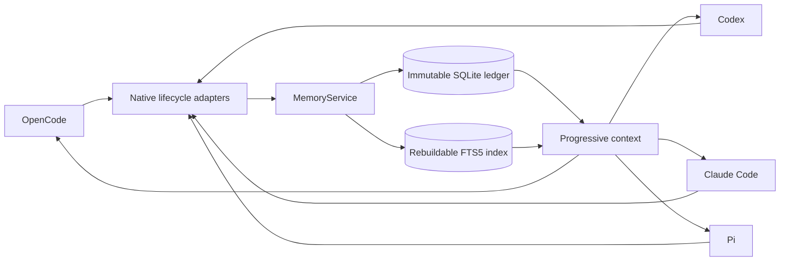

# thoth-mem

**Persistent memory your coding agents can share — and you can audit.**

A local, SQLite-first memory service for OpenCode, Codex, Claude Code, and Pi.

[](https://www.npmjs.com/package/thoth-mem) [](https://github.com/EremesNG/thoth-mem/actions/workflows/ci.yml) [](https://github.com/EremesNG/thoth-mem/blob/master/package.json) 

[Why thoth-mem](#why-thoth-mem) • [How it works](#how-it-works) • [Install](#install) • [Use](#use-the-memory) • [MCP toolkit](#mcp-toolkit) • [Benchmarks](#longmemeval-s) • [Development](#development)

---

| **91.9%** | **6** | **4** | **0** |
| :---: | :---: | :---: | :---: |
| LongMemEval-S RecallAny@5 | focused MCP tools | native coding-agent hosts | model calls required |

## Why thoth-mem

Coding agents lose the decisions that matter between sessions: why an approach was chosen, which failure already occurred, what the next safe action is, and which evidence supports the current answer. Static instruction files help with rules, but they do not provide temporal history, scoped retrieval, or attributable provenance.

thoth-mem gives all four supported hosts one durable local memory without turning memory into an opaque second agent.

| | Design choice | What it gives you |
| --- | --- | --- |
| 🗄️ | **SQLite is the source of truth** | One local, inspectable ledger with rebuildable FTS5 retrieval. |
| 🔎 | **Evidence before memory** | Immutable supporting records remain separate from promoted conclusions. |
| 🕰️ | **Temporal history** | Corrections and supersession preserve how project knowledge changed. |
| 🎯 | **Progressive retrieval** | Start compact, expand context only when useful, fetch full records last. |
| 🔐 | **Scoped identity** | Projects and root sessions are explicit; memory does not guess ownership. |
| 🧩 | **A deliberately small API** | Six workflow-level MCP tools instead of a sprawling CRUD surface. |

No embedding model, vector extension, graph engine, LLM, network service, HTTP server, or dashboard is required.

## How it works


```mermaid
flowchart LR
  O[OpenCode] --> H[Native lifecycle adapters]
  C[Codex] --> H
  A[Claude Code] --> H
  P[Pi] --> H
  H --> S[MemoryService]
  S --> L[(Immutable SQLite ledger)]
  S --> F[(Rebuildable FTS5 index)]
  L --> R[Progressive context]
  F --> R
  R --> O
  R --> C
  R --> A
  R --> P
```

1.  Native lifecycle adapters map each host into the same project and root-session contract.
2.  Captured evidence is immutable. Session events receive a database-ordered sequence.
3.  Observation candidates stay outside memory until a verified review accepts them and an explicit promotion materializes their proposed memory.
4.  Recall combines project isolation, temporal truth, lexical ranking, and a strict character budget.
5.  Every host receives the same bounded context without introducing another model into the loop.

> [!IMPORTANT] thoth-mem never silently promotes an observation into durable memory. Rejection is terminal, corrections append successors, and provenance remains available through stable IDs.

## Install

Requirements: Node.js `>=22.12.0` and a supported OpenCode, Codex, Claude Code, or Pi installation. Pi support is certified against `@earendil-works/pi-coding-agent` `0.84.4` (the supported `0.84.x` manager family).

thoth-mem integrates with each harness through its native extension points. It installs memory tooling and lifecycle integration—not agents or subagents. Preview any managed setup by adding `--plan --json` to its `npx` command.

| Harness | What thoth-mem installs | Install |
| --- | --- | --- |
| <a href="https://claude.com/product/claude-code"></a><br/>**Claude Code** | Marketplace plugin with native hooks, one six-tool MCP registration, and the shared memory skill. The plugin loads the exact published npm version declared by the marketplace distribution. | `claude plugin marketplace add https://github.com/EremesNG/thoth-plugins.git --scope user`<br/>`claude plugin install thoth-mem@thoth-plugins --scope user`<br/><br/>Managed alternative: `npx --yes thoth-mem@latest setup claude` |
| <a href="https://github.com/openai/codex"></a><br/>**Codex CLI** | Marketplace plugin with native hooks, one six-tool MCP registration, and the shared memory skill. Codex `0.151.x` is supported without a forced manager override. | `codex plugin marketplace add https://github.com/EremesNG/thoth-plugins.git`<br/>`codex plugin add thoth-mem@thoth-plugins`<br/><br/>Managed alternative: `npx --yes thoth-mem@latest setup codex` |
| <a href="https://github.com/anomalyco/opencode"><picture><source media="(prefers-color-scheme: dark)" srcset="https://svgl.app/library/opencode-dark.svg"></picture></a><br/>**OpenCode** | Native npm plugin, lifecycle adapter, exact six-tool MCP surface, and shared memory skill. Setup pins the executing package version and synchronizes the skill globally. | `npx --yes thoth-mem@latest setup opencode` |
| <a href="https://github.com/earendil-works/pi"></a><br/>**Pi** | Native package extension with lifecycle integration and one package-relative Node MCP child exposing the exact six memory tools. Certified for the `0.84.x` manager family. | `npx --yes thoth-mem@latest setup pi` |

> [!NOTE] Managed setup is global/user-native only, idempotent when already current, and requests a host restart after a changed install. `--plan --json` performs no writes or mutating manager commands. Project-scoped copied bundles, broad manager-cache edits, legacy fallback, and fragment migration are intentionally unsupported.

## Use the memory

### Recall progressively

Use the smallest useful payload first:

```text
mem_recall mode=compact
        ↓
mem_recall mode=context  or  mem_context
        ↓
mem_get only for selected stable IDs
```

-   `mem_recall` searches promoted project memory.
-   `mem_context` builds a bounded, handoff-first project or session recovery briefing.
-   `mem_get` expands one selected memory, summary, or observation with its lineage.

### Inspect temporal history

Use the timeline when the question is how promoted project memory changed, rather than which memories best match a query:

```json
{
  "action": "timeline",
  "project_key": "git:verified-project-id",
  "since": "2026-01-01T00:00:00Z",
  "until": "2026-12-31T23:59:59Z",
  "limit": 20,
  "budget_chars": 4000
}
```

Timeline entries include current, superseded, retracted, and historical states in deterministic validity order. They expose bounded metadata and stable IDs; raw evidence remains withheld until explicitly requested.

### Structured session checkpoints

Verified session saves return an ordered event sequence. At `checkpoint_pre_compact` or `finalize`, `mem_session` can accept an externally produced summary whose claims cite in-range evidence from the same project and root session.

The core validates and versions the summary but never generates it or automatically promotes a handoff. Recovery renders the newest eligible summary first as untrusted historical data and exposes a stable `summary:<id>` expansion reference. Raw support remains withheld until explicitly fetched.

### Reviewed observation promotion

Observation candidates remain outside memory and FTS until a verified root review accepts them and a separate explicit promotion materializes their exact proposed memory. Rejection is terminal. Corrections append successors, and complete support/review/promotion lineage remains auditable.

## MCP toolkit

The MCP server exposes exactly six tools:

| Tool | Purpose |
| --- | --- |
| `mem_save` | Save evidence and durable memories, or submit, review, and promote supported observation candidates. |
| `mem_recall` | Search current or historical project memory in compact or contextual form. |
| `mem_context` | Build a bounded handoff-first recovery briefing for a verified project or root session. |
| `mem_get` | Expand one selected record with bounded provenance and lineage. |
| `mem_project` | Inspect timelines, summaries, observation queues, history, and project briefings. |
| `mem_session` | Record verified root lifecycle events and source-supported structured session summaries. |

OpenCode additionally exposes the read-only native `thoth_mem_root_identity` tool for active-session metadata. It is not an MCP memory operation. Codex, Claude, and Pi receive the same root identity through verified native lifecycle context; Pi uses its documented session-manager identity and working directory.

## LongMemEval-S

The public results below use the same immutable cleaned LongMemEval-S corpus and its 470 eligible non-abstention questions. The current runtime remains lexical and local: no embeddings, models, or evaluation-time network calls.

| Lexical strategy | RecallAny@5 | Recall@5 | RecallAll@5 | NDCG@10 | MRR | Retrieval p95 | Role |
| --- | ---: | ---: | ---: | ---: | ---: | ---: | --- |
| `all-prefix-v1` | 61/470 (13.0%) | 9.8% | 6.6% | 0.1045 | 0.1287 | 1.1471 ms | Archived control |
| `any-prefix-v1` | 388/470 (82.6%) | 67.7% | 54.0% | 0.6965 | 0.7947 | 1.4437 ms | Bounded candidate |
| `all-then-any-prefix-v1` | 446/470 (94.9%) | 87.9% | 78.7% | 0.8538 | 0.8717 | 3.9512 ms | Broad quality reference |
| `strict-selected-any-cap5-rrf-v1` | 419/470 (89.1%) | 79.7% | 68.3% | 0.7700 | 0.8177 | 2.0552 ms | Archived E0 candidate |
| **`strict-selected-any-cap5-stable-v1`** | **432/470 (91.9%)** | **84.8%** | **75.5%** | **0.8165** | **0.8538** | **9.3504 ms** | **Current optimized default** |

### Reading the results

-   **RecallAny@5:** questions with at least one gold session in the first five results.
-   **Recall@5:** fractional coverage across all gold sessions.
-   **RecallAll@5:** questions whose every gold session appears in the first five.
-   **NDCG@10 / MRR:** ranking quality and first-gold position.
-   **Retrieval p95:** environment-sensitive; compare latency only within the same report.

The first four rows come from the immutable [Top-5 lexical comparison](https://github.com/EremesNG/thoth-mem/blob/master/benchmarks/results/longmemeval-s-lexical-recall-at-5-report.json). The current-default row comes from the passing [stable optimization round](https://github.com/EremesNG/thoth-mem/blob/master/benchmarks/results/longmemeval-s-stable-v1-optimized-round5-2026-09-03.json), which preserved complete ordered output while reducing p95 by `28.3%` from its stable baseline. Every listed run records zero errors and zero model, LLM, or evaluation-time network calls.

### Protocol and evaluation boundaries

The dataset is pinned to immutable revision `98d7416c24c778c2fee6e6f3006e7a073259d48f` and SHA-256 `d6f21ea9d60a0d56f34a05b609c79c88a451d2ae03597821ea3d5a9678c3a442`. Only the 30 `_abs` abstention records are excluded. Gold IDs and oracle data never enter indexed text or ranking.

Evaluation runs offline through the real built `MemoryService`, with one isolated SQLite database per question. Candidate quality uses Top-20 with a 20,000-UTF-16-unit measurement allowance; delivery is measured separately at 4,000 UTF-16 units.

The product profile is `sqlite-fts5-bm25-session-full`; it does not claim numerical parity with the official user-only, space-tokenized `rank_bm25` runner. A baseline-only report is always incomplete for promotion.

Protocol sources: [LongMemEval repository](https://github.com/xiaowu0162/LongMemEval), [official cleaned dataset](https://huggingface.co/datasets/xiaowu0162/longmemeval-cleaned), and [pinned dataset revision](https://huggingface.co/datasets/xiaowu0162/longmemeval-cleaned/commit/98d7416c24c778c2fee6e6f3006e7a073259d48f).

## Runtime data and migration

### Shared runtime data

All hosts resolve one data directory in this order: an explicit command value, `THOTH_MEM_DATA_DIR`, strict provider configuration, then `~/.thoth-mem`. The provider file lives below `XDG_CONFIG_HOME/thoth-mem/config.json` when XDG configuration is set, or below `~/.config/thoth-mem/config.json` otherwise. The database is always `memory.sqlite` inside the selected data directory.

Changed OpenCode, Codex, and Claude setup requests a host restart; restart Pi
after a changed package install when needed to load updated native assets.
`--plan` performs no writes or mutating manager commands. Malformed, unreadable,
schema-invalid, or missing-runtime configuration fails closed.

Opening a revision-9 database with the Pi-capable runtime performs the one-time
revision-10 migration. It retains or creates `memory.sqlite.pre-v10.bak`, takes
an immediate write-excluding lock, and rechecks the exact live logical state
against that backup before rebuilding only the `sessions` harness constraint to
include `pi`. Existing sessions, evidence, events, summaries, receipts, and
FTS rows are preserved; a mismatched backup or source drift fails closed before
mutation. A revision-10 database reopens idempotently. This migration is
separate from the unsupported import of manually copied host configuration.

### Legacy SQLite import

The current runtime never opens a legacy database during normal operation. Stop every process that may hold the target database, then import the conventional `~/.thoth/thoth.db`:

```sh
thoth-mem import-legacy
```

Nonstandard sources, explicit mapping, and an explicit data directory remain one-command options:

```sh
thoth-mem import-legacy --source ./legacy.sqlite --map ./mapping.json --data-dir ./current-memory
thoth-mem import-legacy --json
```

The importer fingerprints its inputs, creates a verified backup and isolated candidate when needed, publishes only after integrity checks pass, and retains create-only plans and reports below `<dataDir>/imports`. Equivalent repeats are idempotent. Keep the legacy database, verified backup, and recovery bundle until the migrated runtime has been independently validated.

## Development

Clone, build, local host wiring, verification, benchmark reproduction, and repository layout are documented separately in the [development guide](https://github.com/EremesNG/thoth-mem/blob/master/docs/development.md).

See [the agent context index](https://github.com/EremesNG/thoth-mem/blob/master/docs/agent/index.md) for task-specific engineering, persistence, privacy, lifecycle, and testing guidance.

## Principles

-   **Local-first:** the authoritative ledger stays on the machine you select.
-   **Evidence-backed:** durable conclusions retain attributable support.
-   **Bounded:** every retrieval and delivery path has explicit limits.
-   **Host-neutral core:** adapters translate lifecycle events; the memory service owns semantics.
-   **Fail closed:** ambiguous identity, unsafe configuration, and invalid state do not silently degrade into writes.
-   **Rebuildable projections:** SQLite evidence is durable; FTS state is derived.

## License

[MIT](https://github.com/EremesNG/thoth-mem/blob/master/package.json), as declared in the package manifest.
