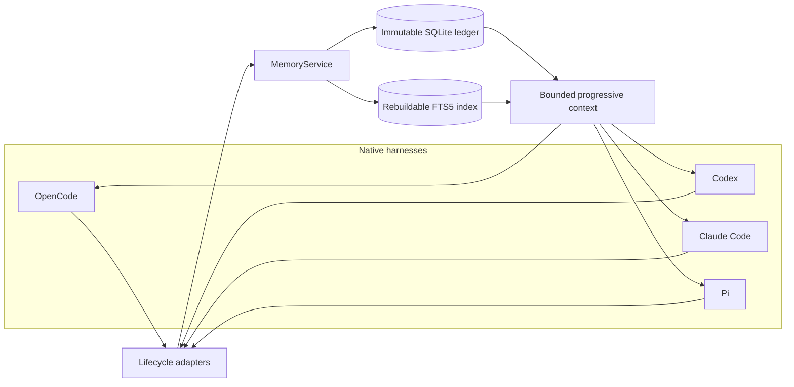

<div align="center">


# thoth-mem

**Persistent memory your coding agents can share — and you can audit.**

Local, SQLite-first memory for OpenCode, Codex, Claude Code, and Pi. Six focused MCP tools. Zero model calls required.

[](https://www.npmjs.com/package/thoth-mem)
[](https://github.com/EremesNG/thoth-mem/actions/workflows/ci.yml)

[](https://github.com/EremesNG/thoth-mem/blob/master/package.json)

[Overview](#why-thoth-mem) • [Install](#install) • [How it works](#how-it-works) • [Use](#use-the-memory) • [Tools](#choose-tools-by-intent) • [Benchmarks](#longmemeval-s) • [Runtime](#runtime-data-and-migration) • [Development](#development)

</div>

---

| **91.9%** | **6** | **4** | **0** |
| :---: | :---: | :---: | :---: |
| LongMemEval-S RecallAny@5 | focused MCP tools | native harnesses | model calls required |

## Why thoth-mem

Coding agents lose the decisions that matter between sessions: why an approach was chosen, which failure already occurred, what the next safe action is, and which evidence supports the current answer. Static instruction files help with rules, but they do not provide temporal history, scoped retrieval, or attributable provenance.

thoth-mem gives every supported harness one durable local memory without turning memory into an opaque second agent.

| Design choice | What it gives you |
| --- | --- |
| **SQLite is the source of truth** | One local, inspectable ledger with rebuildable FTS5 retrieval. |
| **Evidence before memory** | Immutable supporting records remain separate from promoted conclusions. |
| **Temporal history** | Corrections and supersession preserve how project knowledge changed. |
| **Progressive retrieval** | Start compact, expand context only when useful, fetch full records last. |
| **Scoped identity** | Projects and root sessions are explicit; memory does not guess ownership. |
| **A deliberately small API** | Six workflow-level MCP tools instead of a sprawling CRUD surface. |

> [!NOTE]
> No embedding model, vector extension, graph engine, LLM, network service, HTTP server, or dashboard is required.

## Install

Requirements: Node.js `>=22.12.0` and a supported harness. Pi support is certified against `@earendil-works/pi-coding-agent` `0.84.4`, within the supported `0.84.x` manager family.

thoth-mem installs memory tooling and lifecycle integration—not agents or subagents. Add `--plan --json` to any managed `npx` setup command to preview its changes without writing.

| Harness | Native integration | Install |
| --- | --- | --- |
| <a href="https://claude.com/product/claude-code"></a><br/>**Claude Code** | Marketplace plugin, native hooks, six-tool MCP registration, and memory skill | `claude plugin marketplace add https://github.com/EremesNG/thoth-plugins.git --scope user`<br/>`claude plugin install thoth-mem@thoth-plugins --scope user`<br/><br/>Managed: `npx --yes thoth-mem@latest setup claude` |
| <a href="https://github.com/openai/codex"></a><br/>**Codex CLI** | Marketplace plugin, native hooks, six-tool MCP registration, and memory skill | `codex plugin marketplace add https://github.com/EremesNG/thoth-plugins.git`<br/>`codex plugin add thoth-mem@thoth-plugins`<br/><br/>Managed: `npx --yes thoth-mem@latest setup codex` |
| <a href="https://github.com/anomalyco/opencode"><picture><source media="(prefers-color-scheme: dark)" srcset="https://svgl.app/library/opencode-dark.svg"></picture></a><br/>**OpenCode** | Native npm plugin, lifecycle adapter, six-tool MCP surface, and memory skill | `npx --yes thoth-mem@latest setup opencode` |
| <a href="https://github.com/earendil-works/pi"></a><br/>**Pi** | Native package extension, lifecycle adapter, and one package-relative six-tool MCP child | `npx --yes thoth-mem@latest setup pi` |

> [!IMPORTANT]
> Managed setup is global/user-native, idempotent when already current, and requests a host restart after a changed install. Project-scoped copied bundles, broad manager-cache edits, legacy fallback, and fragment migration are intentionally unsupported.

## How it works


```mermaid
flowchart LR
  subgraph Hosts[Native harnesses]
    O[OpenCode]
    C[Codex]
    A[Claude Code]
    P[Pi]
  end

  O & C & A & P --> H[Lifecycle adapters]
  H --> S[MemoryService]
  S --> L[(Immutable SQLite ledger)]
  S --> F[(Rebuildable FTS5 index)]
  L & F --> R[Bounded progressive context]
  R --> O & C & A & P
```

1. Native adapters map each harness into the same project and root-session contract.
2. Evidence is immutable; session events receive a database-ordered sequence.
3. Observations stay outside durable memory until a verified review accepts them and an explicit promotion materializes the proposed memory.
4. Recall combines project isolation, temporal truth, lexical ranking, and a strict character budget.
5. Every harness receives the same bounded context without introducing another model into the loop.

> [!IMPORTANT]
> thoth-mem never silently promotes an observation into durable memory. Rejection is terminal, corrections append successors, and provenance remains available through stable IDs.

## Use the memory

### Retrieve progressively

```text
mem_recall mode=compact
        ↓
mem_recall mode=context  or  mem_context
        ↓
mem_get only for selected stable IDs
```

### Choose tools by intent

| Intent | Tool |
| --- | --- |
| Save evidence or durable knowledge | `mem_save` |
| Find current or historical project memory | `mem_recall` |
| Recover a bounded project or session briefing | `mem_context` |
| Expand one selected record and its lineage | `mem_get` |
| Inspect timelines, summaries, observations, or project state | `mem_project` |
| Record verified root lifecycle events and supported summaries | `mem_session` |

The MCP server exposes exactly these six tools. OpenCode additionally exposes the read-only native `thoth_mem_root_identity` tool; it is session metadata, not a memory operation.

<details>
<summary><strong>Temporal history, summaries, and observation review</strong></summary>

- Use `mem_project` with `action=timeline` when you need to understand how promoted knowledge changed, rather than which memories best match a query.
- At `checkpoint_pre_compact` or `finalize`, `mem_session` can validate and version an externally produced summary whose claims cite in-range evidence from the same project and root session. The core never generates that summary.
- Observation candidates remain outside memory and FTS until a verified root review accepts them and a separate explicit promotion materializes their exact proposed memory.

</details>

## LongMemEval-S

The public results use the immutable cleaned LongMemEval-S corpus and its 470 eligible non-abstention questions. The runtime remains lexical and local: no embeddings, models, or evaluation-time network calls.

| Lexical strategy | RecallAny@5 | Recall@5 | RecallAll@5 | NDCG@10 | MRR | Retrieval p95 | Role |
| --- | ---: | ---: | ---: | ---: | ---: | ---: | --- |
| `all-prefix-v1` | 61/470 (13.0%) | 9.8% | 6.6% | 0.1045 | 0.1287 | 1.1471 ms | Archived control |
| `any-prefix-v1` | 388/470 (82.6%) | 67.7% | 54.0% | 0.6965 | 0.7947 | 1.4437 ms | Bounded candidate |
| `all-then-any-prefix-v1` | 446/470 (94.9%) | 87.9% | 78.7% | 0.8538 | 0.8717 | 3.9512 ms | Broad quality reference |
| `strict-selected-any-cap5-rrf-v1` | 419/470 (89.1%) | 79.7% | 68.3% | 0.7700 | 0.8177 | 2.0552 ms | Archived E0 candidate |
| **`strict-selected-any-cap5-stable-v1`** | **432/470 (91.9%)** | **84.8%** | **75.5%** | **0.8165** | **0.8538** | **9.3504 ms** | **Current default** |

<details>
<summary><strong>Methodology and reproducibility</strong></summary>

- **RecallAny@5:** questions with at least one gold session in the first five results.
- **Recall@5:** fractional coverage across all gold sessions.
- **RecallAll@5:** questions whose every gold session appears in the first five.
- **NDCG@10 / MRR:** ranking quality and first-gold position.
- **Retrieval p95:** environment-sensitive; compare latency only within the same report.

The first four rows come from the immutable [Top-5 lexical comparison](https://github.com/EremesNG/thoth-mem/blob/master/benchmarks/results/longmemeval-s-lexical-recall-at-5-report.json). The current-default row comes from the passing [stable optimization round](https://github.com/EremesNG/thoth-mem/blob/master/benchmarks/results/longmemeval-s-stable-v1-optimized-round5-2026-09-03.json), which preserved complete ordered output while reducing p95 by `28.3%` from its stable baseline. Every listed run records zero errors and zero model, LLM, or evaluation-time network calls.

The dataset is pinned to revision `98d7416c24c778c2fee6e6f3006e7a073259d48f` and SHA-256 `d6f21ea9d60a0d56f34a05b609c79c88a451d2ae03597821ea3d5a9678c3a442`. Evaluation runs offline through the real built `MemoryService`, with one isolated SQLite database per question. Gold IDs and oracle data never enter indexed text or ranking.

Protocol sources: [LongMemEval repository](https://github.com/xiaowu0162/LongMemEval), [official cleaned dataset](https://huggingface.co/datasets/xiaowu0162/longmemeval-cleaned), and [pinned dataset revision](https://huggingface.co/datasets/xiaowu0162/longmemeval-cleaned/commit/98d7416c24c778c2fee6e6f3006e7a073259d48f).

</details>

## Runtime data and migration

All harnesses resolve one data directory in this order: an explicit command value, `THOTH_MEM_DATA_DIR`, strict provider configuration, then `~/.thoth-mem`. The database is always `memory.sqlite` inside the selected directory.

<details>
<summary><strong>Provider configuration and revision-10 migration</strong></summary>

The provider file lives below `XDG_CONFIG_HOME/thoth-mem/config.json` when XDG configuration is set, or below `~/.config/thoth-mem/config.json` otherwise. Malformed, unreadable, schema-invalid, or missing-runtime configuration fails closed.

Opening a revision-9 database with the Pi-capable runtime performs the one-time revision-10 migration. It retains or creates `memory.sqlite.pre-v10.bak`, takes an immediate write-excluding lock, rechecks the live state against that backup, and rebuilds only the `sessions` harness constraint. Existing sessions, evidence, events, summaries, receipts, and FTS rows are preserved; a mismatched backup or source drift fails closed before mutation.

</details>

<details>
<summary><strong>Import a legacy SQLite database</strong></summary>

Stop every process that may hold the target database, then import the conventional `~/.thoth/thoth.db`:

```sh
thoth-mem import-legacy
```

For a nonstandard source or explicit mapping:

```sh
thoth-mem import-legacy --source ./legacy.sqlite --map ./mapping.json --data-dir ./current-memory
thoth-mem import-legacy --json
```

The importer fingerprints its inputs, creates a verified backup and isolated candidate when needed, and publishes only after integrity checks pass. Keep the legacy database, verified backup, and recovery bundle until the migrated runtime has been independently validated.

</details>

## Development

Clone, build, local host wiring, verification, benchmark reproduction, and repository layout live in the [development guide](https://github.com/EremesNG/thoth-mem/blob/master/docs/development.md).

Task-specific engineering, persistence, privacy, lifecycle, and testing guidance starts at the [agent context index](https://github.com/EremesNG/thoth-mem/blob/master/docs/agent/index.md).
