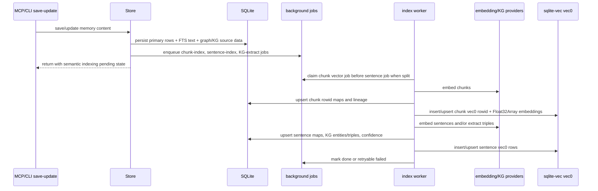
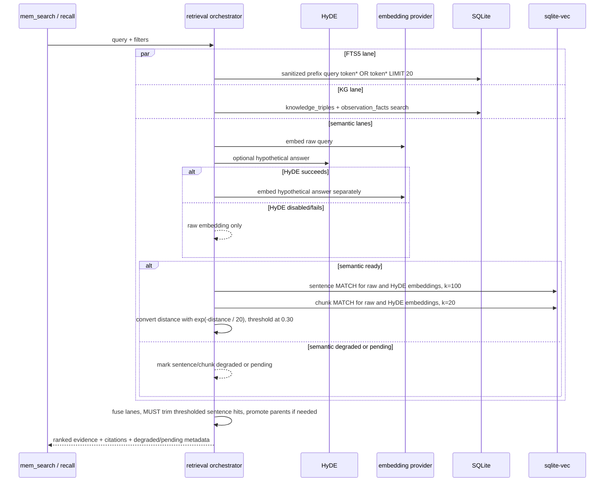

# Design: Hybrid Core Retrieval for thoth-mem

## Technical Approach
This branch adopts a hybrid retrieval core engine as thoth-mem base capability: sqlite-vec-backed sentence and chunk semantic retrieval, FTS5 lexical retrieval, KG retrieval, HyDE query augmentation, surgical sentence trimming, small-to-big context promotion, and background indexing. The implementation remains SQLite-first and keeps existing FTS5/graph-lite behavior available when semantic lanes are degraded.

Reference implementation evidence anchors this design: sentence KNN uses `k = 100`, chunk KNN uses `k = 20`, lexical FTS uses sanitized prefix tokens such as `encrypt*`, the semantic threshold is `0.30`, and sqlite-vec L2 distances are converted with `score = exp(-distance / 20)`.

Implementation tracks:
1. Configuration: resolve embedding and HyDE settings from env -> `{dataDir}/config.json` -> defaults, with local Transformers.js fallback only when no provider is configured.
2. Dependencies: add `sqlite-vec` and `@huggingface/transformers`.
3. Runtime capability: load sqlite-vec on the active `better-sqlite3` connection and record semantic lane availability.
4. Schema: add vec0 virtual tables for chunk and sentence vectors plus normal metadata, rowid mapping, job, and KG tables.
5. Background indexing: enqueue non-blocking jobs from save/update flows for chunk vectors, sentence vectors, rebuilds, and KG extraction.
6. Retrieval: run raw-query and optional HyDE-answer embeddings through sentence KNN and chunk KNN, run FTS5 prefix matching and graph/KG lanes in parallel, then fuse results with citations and degraded-state metadata.
7. Tools/CLI/evals: expose fused retrieval without breaking existing `mem_search`/`mem_context`, add `rebuild-index`, and expand evals.

## Architecture Decisions
### Decision: sqlite-vec is the required semantic index
**Choice**: Add `sqlite-vec` and call `sqliteVec.load(db)` during Store startup before semantic table/query use. Semantic features depend on successful sqlite-vec load and vec0 readiness.

**Alternatives considered**:
- Store vectors as BLOBs and compute similarity in Node.
- Treat sqlite-vec as a future optional optimization.

**Rationale**:
- The branch objective requires real sentence/chunk vector search in SQLite, aligned with Hybrid Retrieval core behavior.
- SQLite-native KNN keeps retrieval scalable enough for the memory store while preserving the embedded DB architecture.
- Fallback is still available by degrading semantic lanes, not by weakening the core design.

### Decision: vec0 virtual tables are dimensioned from active embedding metadata
**Choice**: Create sentence and chunk vec0 tables with fixed dimensions derived from the active embedding config or provider probe, for example `embedding float[768]`. Keep normal mapping tables that bind logical sentence/chunk identities to vec0 `rowid` values and source lineage.

**Alternatives considered**:
- One generic vector table with opaque dimensions.
- Separate vector table per provider/model without a canonical active table.

**Rationale**:
- sqlite-vec vec0 schemas require explicit dimensions.
- Dimension changes are expected when provider/model changes, so persisted provider/model/dimensions/config hash must control stale-state detection and table rebuild.
- Mapping tables keep vector rows compact and make citations/rebuilds deterministic.

### Decision: tuned hybrid retrieval defaults are canonical and test-covered
**Choice**: Centralize these defaults: sentence top-k `100`, chunk top-k `20`, lexical FTS limit `20`, minimum semantic score threshold `0.30`, and default sqlite-vec L2 score conversion `score = Math.exp(-distance / 20)`. FTS-only evidence may enter fusion with a lexical floor score of `0.30` unless the lexical ranker provides a stronger normalized score.

**Alternatives considered**:
- Leave scoring/top-k implicit in implementation.
- Use cosine `1 - distance` for sqlite-vec L2 distances.

**Rationale**:
- The user asked for defaults inspired by Hybrid Retrieval, and Hybrid Retrieval uses these constants in its sqlite-vector service.
- Explicit defaults make tests, tuning, and future configuration safer.
- sqlite-vec L2 distances are not cosine distances, so `1 - distance` is not the correct default for this lane.

### Decision: Embedding provider is remote-first, local only when unset
**Choice**: Resolve provider config in this order: `THOTH_EMBEDDING_*` / `THOTH_HYDE_*` env overrides, then `{dataDir}/config.json`, then local Transformers.js fallback. Remote providers target Ollama/LM Studio-compatible embedding endpoints. Local Transformers.js is selected only when no provider is configured.

**Alternatives considered**:
- Always fall back to local embeddings when a configured remote provider fails.
- Env-only configuration.

**Rationale**:
- If a user explicitly configures a provider, silent runtime model switching would corrupt semantic lineage and ranking expectations.
- Config-file support matches the existing `~/.thoth` data-dir model and avoids forcing env vars for local users.
- Canonical config hash makes auto rebuild idempotent and auditable.

### Decision: HyDE uses dual semantic inputs
**Choice**: Always embed the raw query. When HyDE is enabled and generation succeeds, generate a hypothetical answer, embed it separately, run sentence/chunk semantic retrieval for both embeddings, and fuse raw-query and HyDE-answer semantic candidates. If HyDE fails, times out, or is disabled, raw-query semantic retrieval continues alone.

**Alternatives considered**:
- Concatenate raw query and hypothetical answer into one augmented text before embedding.
- Require HyDE generation before semantic retrieval.

**Rationale**:
- Hybrid Retrieval concatenates query plus hypothetical answer, but making the two embeddings explicit avoids ambiguous implementation and preserves raw-query recall.
- Dual embedding fusion lets the ranker distinguish direct query matches from hypothetical-answer matches.
- HyDE remains a recall improvement, not an availability risk.

### Decision: FTS5 lexical lane uses sanitized prefix matching
**Choice**: Build lexical FTS queries from sanitized eligible tokens, append `*` to each token, join with `OR`, and limit lexical candidates to `20` by default.

**Alternatives considered**:
- Exact-token FTS only.
- Free-form user query passed directly to FTS5.

**Rationale**:
- Hybrid Retrieval uses prefix matching to catch variants such as `encrypt*` matching `encryption`.
- Sanitization is required because thoth-mem already treats FTS queries as a safety boundary.
- Prefix lexical recall complements semantic search when embeddings are stale or unavailable.

### Decision: Save remains fast and semantic recall is eventual
**Choice**: Save/update flows persist primary rows, FTS-compatible text, graph/KG-compatible source data, and job requests, then return without waiting for chunk or sentence vectors. Background workers index chunk vectors before sentence vectors when jobs are split for the same source, but both are eventual. Retrieval/tool output must signal pending/degraded semantic coverage until indexing completes.

**Alternatives considered**:
- Block save until chunk vectors are available.
- Hide pending semantic state from callers.

**Rationale**:
- Hybrid Retrieval's save path stores chunk vectors before sentence indexing, but thoth-mem's reliability goal favors fully non-blocking semantic indexing.
- Immediate FTS5 and graph/KG-compatible recall preserves usefulness right after save.
- Explicit pending/degraded state prevents callers from interpreting eventual semantic recall as missing data.

### Decision: Retrieval is four-lane and degrades by lane
**Choice**: Retrieval runs sentence semantic KNN, chunk semantic KNN, lexical FTS5, and graph/KG lanes. Semantic failures mark sentence/chunk lanes degraded; lexical and graph/KG remain available.

**Alternatives considered**:
- Fail retrieval when semantic KNN fails.
- Only run graph after lexical/vector hits.

**Rationale**:
- The existing product guarantee is that memory search remains useful with plain SQLite/FTS.
- Graph/KG facts are valuable independent evidence and should not be hidden behind vector success.
- Degraded metadata makes quality state explicit to callers.

### Decision: Surgical sentence trimming is mandatory under thresholded sentence evidence
**Choice**: When a result has one or more sentence semantic evidence items at or above the sentence score threshold (`0.30` by default), the primary evidence text must be the matched sentence text, not the full parent chunk. Small-to-big parent promotion may attach broader context separately when answerability requires it.

**Alternatives considered**:
- Treat sentence trimming as best effort.
- Always return parent chunks for semantic hits.

**Rationale**:
- Surgical trimming is one of the main prompt-noise reduction features in Hybrid Retrieval.
- Making it conditional on thresholded sentence evidence avoids trimming weak or unrelated matches.
- Separating primary sentence evidence from parent promotion preserves precision and context.

### Decision: KG scope is broader than graph-lite but preserves graph-lite compatibility
**Choice**: Add `knowledge_entities` and `knowledge_triples`-style storage with typed subject/relation/object records, provenance, confidence, extractor metadata, and dedupe keys. Define a default thoth-mem taxonomy with at least 22 entity categories and 20 relation categories. Keep `observation_facts` as compatibility fallback/source.

**Alternatives considered**:
- Only reuse existing `observation_facts`.
- Require exact Hybrid Retrieval taxonomy labels.

**Rationale**:
- Existing graph-lite facts are useful but do not equal Hybrid Retrieval's broader KG extraction layer.
- A thoth-mem adapted taxonomy gives strict enough parity while respecting this project's memory domain.
- Provenance/confidence allows graph evidence to be fused without pretending every extracted fact is equally reliable.

## Data Flow
### Save / Update / Rebuild


### Retrieval


## File Changes
- `package.json`, `pnpm-lock.yaml` (modify): add `sqlite-vec` and `@huggingface/transformers`.
- `src/config.ts` (modify): load `{dataDir}/config.json`; add embedding/HyDE config, retrieval defaults, env overrides, canonical hash, default local model.
- `src/store/types.ts` (modify): add semantic index state, vector mapping, job, KG entity/triple, retrieval evidence, retrieval defaults, and degraded/pending-state types.
- `src/store/schema.ts` (modify): add normal tables for semantic metadata, rowid maps, jobs, KG entities/triples; add helpers for vec0 DDL.
- `src/store/migrations.ts` (modify/create as applicable): add idempotent migration helpers for new normal tables and dimension-aware vec0 lifecycle.
- `src/store/index.ts` (modify): load sqlite-vec, evaluate semantic readiness/staleness, enqueue jobs on writes, expose hybrid retrieval orchestration.
- `src/retrieval/providers.ts` (create): provider interface and resolver.
- `src/retrieval/remote-provider.ts` (create): Ollama/LM Studio-compatible embedding adapter.
- `src/retrieval/local-transformers-provider.ts` (create): Transformers.js fallback adapter.
- `src/retrieval/hyde.ts` (create): fail-safe hypothetical answer generation.
- `src/retrieval/sentences.ts` (create): deterministic chunk/sentence splitting helpers.
- `src/retrieval/sqlite-vec.ts` (create): vec0 load/query/serialization helpers and distance-score conversion.
- `src/retrieval/fts-prefix.ts` (create): sanitized FTS5 prefix query builder.
- `src/retrieval/ranking.ts` (create): dual embedding candidate merge, lane scoring, fusion, mandatory sentence trimming, small-to-big promotion.
- `src/indexing/jobs.ts` (create): queue claims, retries, rebuild dedupe, chunk-before-sentence priority, worker orchestration.
- `src/indexing/kg-extractor.ts` (create): taxonomy, extraction adapter, triple normalization/dedupe.
- `src/tools/mem-search.ts`, `src/tools/mem-context.ts` (modify): preserve compatibility while surfacing degraded/pending/fused evidence where appropriate.
- `src/tools/mem-recall.ts`, `src/tools/index.ts` (create/modify): additive recall surface if kept separate from search.
- `src/cli.ts`, `src/index.ts` (modify): add `rebuild-index` command and startup/worker hooks.
- `src/evals/retrieval.ts`, `tests/**/*.test.ts`, `README.md` (modify/add): coverage, evals, and operator docs.

## Interfaces / Contracts
```ts
interface RetrievalDefaults {
  sentenceTopK: 100;
  chunkTopK: 20;
  lexicalLimit: 20;
  minSemanticScore: 0.30;
  l2DistanceScale: 20;
}

interface EmbeddingConfig {
  provider: 'ollama' | 'lmstudio' | 'transformers_local';
  model: string;
  baseUrl: string | null;
  dimensions: number | null;
  configHash: string;
}

interface SemanticLaneState {
  sqliteVecLoaded: boolean;
  vectorTablesReady: boolean;
  provider: string;
  model: string;
  dimensions: number | null;
  configHash: string;
  stale: boolean;
  rebuilding: boolean;
  pending: boolean;
  degradedReason?: string;
}

interface HybridEvidence {
  lane: 'sentence' | 'chunk' | 'lexical' | 'kg';
  semanticInput?: 'raw_query' | 'hyde_answer';
  observationId: number;
  score: number;
  text: string;
  chunkId?: string;
  sentenceId?: string;
  tripleId?: number;
  parentPromoted?: boolean;
  citation: { title: string; topicKey: string | null; project: string | null };
}
```

Conceptual tables:
```sql
semantic_index_state(provider, model, dimensions, config_hash, stale, rebuilding, pending, last_indexed_at)
semantic_index_jobs(dedupe_key unique, kind, target_scope, status, attempts, priority, last_error)
semantic_chunks(chunk_id unique, observation_id, chunk_index, text, config_hash)
semantic_sentences(sentence_id unique, chunk_id, observation_id, sentence_index, text, config_hash)
chunk_vector_map(chunk_id unique, vec_rowid unique, config_hash, dimensions)
sentence_vector_map(sentence_id unique, vec_rowid unique, config_hash, dimensions)
vec_chunks using vec0(embedding float[N])
vec_sentences using vec0(embedding float[N])
knowledge_entities(entity_key unique, name, entity_type, aliases, confidence)
knowledge_triples(subject_entity_id, relation_type, object_entity_id, source_kind, source_id, confidence, dedupe_key unique)
```

## Testing Strategy
- Config: env/file/default precedence, local fallback selection, stable hash, retrieval defaults, hash mismatch.
- sqlite-vec/schema: load success/failure, vec0 table creation, dimension mismatch stale marking, idempotent migration/rebuild.
- Provider: remote adapter request shape, local fallback adapter, explicit provider failure does not silently switch models.
- Indexing: save returns before deep indexing, semantic pending state, chunk-before-sentence priority, rowid mapping determinism, retry/restart convergence, auto/manual rebuild dedupe.
- Retrieval: sentence k=100 and chunk k=20 KNN via sqlite-vec, distance-score conversion, thresholding, FTS5 prefix query building, KG fusion, HyDE raw-plus-answer fusion, mandatory sentence trimming, small-to-big promotion, degraded/pending states.
- KG: taxonomy breadth, triple extraction, provenance/confidence, dedupe, graph-lite fallback.
- Tools/CLI: backward compatibility, degraded/pending-state signaling, `rebuild-index` status.
- Evals: hybrid vs lexical baseline, KNN defaults, FTS prefix recall, HyDE success/failure, citation lineage, compression quality, degraded/pending fallback metrics.

## Migration / Rollout
1. Add dependencies, config, retrieval defaults, and tests first.
2. Add schema/migrations and sqlite-vec capability detection without changing public search behavior.
3. Add background queue and workers; enqueue jobs from writes while retrieval still works lexically and reports semantic pending state.
4. Add semantic/KG retrieval lanes and fusion with degraded/pending-state metadata.
5. Enable auto rebuild on config hash mismatch and add manual `rebuild-index`.
6. Update docs and run focused tests, evals, build, then full test gate.

Rollback uses lane degradation: keep new tables inert, disable workers/semantic fusion, and continue FTS5 + graph/KG retrieval.

## Open Questions
1. Exact default KG taxonomy labels should be finalized during implementation, but must satisfy at least 22 entity categories and 20 relation categories.
2. If provider dimensions cannot be known at startup, semantic vec0 creation should wait for a successful provider probe and keep semantic lanes pending/degraded until then.
3. Retrieval defaults may become user-configurable later, but this branch must first ship deterministic tested defaults.
