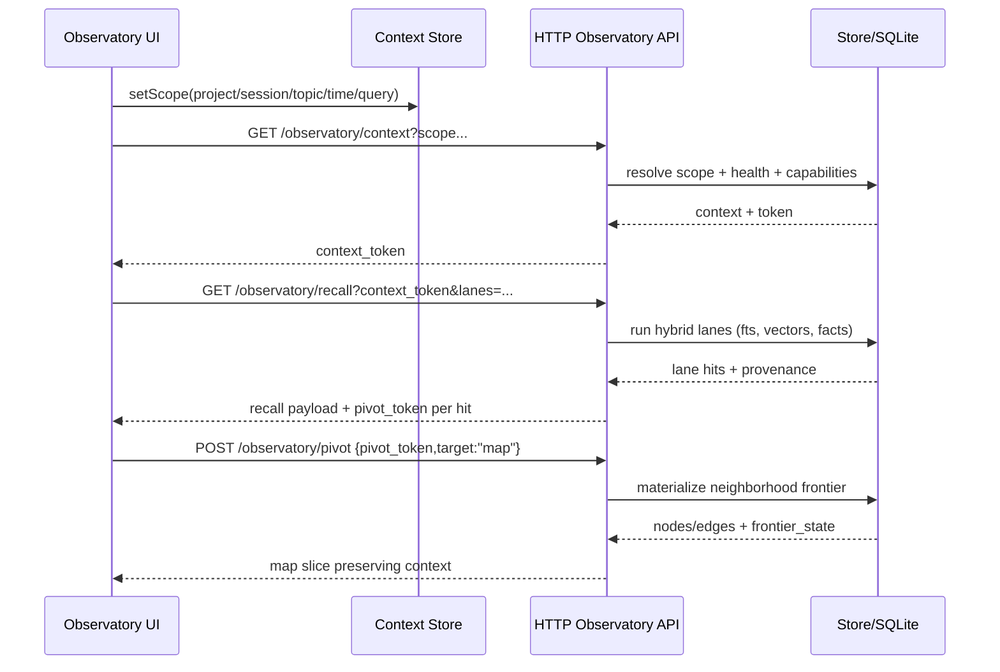
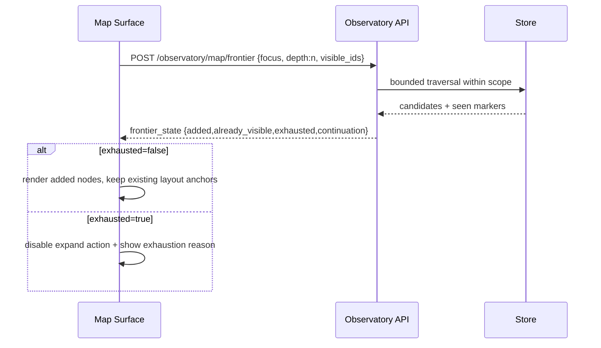

# Design: Memory Observatory Dashboard

## Technical Approach
Build a unified `ObservatoryWorkspace` as the default dashboard experience, replacing page-silo navigation with coordinated multi-surface exploration over shared read-only context state.

The observatory is organized into six technical layers:
1. `Context/Pivot State`: single source of truth for project/session/topic/time/query/lane/focus/frontier state.
2. `Recall Workspace`: hybrid retrieval lanes (`lexical`, `sentence-vector`, `chunk-vector`, `fact-kg`) with explicit evidence/provenance.
3. `Memory Map`: frontier-based graph exploration with deterministic seeds, incremental neighborhood expansion, and depth semantics.
4. `Timeline`: windowed chronological playback bound to active context and focus node.
5. `Knowledge Ledger`: structured What/Why/Where/Learned + fact triples + provenance links.
6. `Health & Indexing`: lane/index readiness, staleness/degraded states, and payload capability hints.

The implementation is intentionally from-scratch at UX composition level: legacy route-level pages become either embedded panels or compatibility redirects into observatory pivots.

## Architecture Decisions
### Decision: Replace route-first dashboard with workspace-first shell
**Choice**: Introduce `/observatory` as canonical route and make `/` resolve to it. Keep legacy routes as shallow adapters that open observatory with a pivot token.
**Alternatives considered**: Keep existing pages and add cross-links; map-only default with side tabs.
**Rationale**: Existing page isolation (`Overview`, `SearchExplorer`, `GraphLiteView`, map workspace) loses scope on every transition and cannot satisfy spec context-preserving pivots.

### Decision: Add observatory context API + pivot token contract
**Choice**: Add new `/observatory/*` read-only endpoints with explicit `context_token` and `pivot_token` payloads.
**Alternatives considered**: Reuse current `/viz/*`, `/context`, `/timeline`, `/projects/*` directly from UI.
**Rationale**: Current endpoints are surface-specific and do not carry full cross-surface continuity or lane provenance contracts.

### Decision: Frontier model for depth/expand semantics
**Choice**: Represent traversal as `frontier_state` with `added`, `already_visible`, `exhausted`, and continuation cursor.
**Alternatives considered**: Keep current `expandVisualizationNode` response shape.
**Rationale**: Current expand path filters by single `obs:{id}` and may return fallback rows without explicit progress semantics.

### Decision: Keep local-first, read-only, privacy-safe boundary
**Choice**: All observatory operations remain GET/POST read-only queries over local SQLite-backed store; no mutation endpoints or external telemetry.
**Alternatives considered**: optimistic inline edits, remote sync overlays.
**Rationale**: Matches current product safety stance and existing sanitization behavior in viz/tests.

### Decision: Retire legacy map/type abstractions where they block observatory semantics
**Choice**: Replace `MapFilters`/`VizSliceResponse`-centric client state with `ObservatoryState` and feature adapters; preserve deterministic coordinate utilities where useful.
**Alternatives considered**: incremental extension of `MapWorkspace` state.
**Rationale**: Existing model is map-centric and cannot model recall lanes, timeline windows, ledger focus, or pivot graph.

## Data Flow
### Cross-surface pivot flow

### Depth and expand frontier flow

## File Changes
- `dashboard/src/App.tsx` (modify): route orchestration to observatory-first.
- `dashboard/src/components/Layout.tsx` (modify): observatory navigation model and legacy adapters.
- `dashboard/src/routes.ts` (modify): route constants for observatory + compatibility redirects.
- `dashboard/src/router.tsx` (modify): preserve query/state token navigation helpers.
- `dashboard/src/api/client.ts` (modify): add observatory contracts; keep `/viz/*` as legacy fallback.
- `dashboard/src/components/observatory/ObservatoryWorkspace.tsx` (new): integrated shell.
- `dashboard/src/components/observatory/RecallWorkspace.tsx` (new).
- `dashboard/src/components/observatory/MemoryMapSurface.tsx` (new; wraps/adapts map renderer).
- `dashboard/src/components/observatory/TimelineSurface.tsx` (new).
- `dashboard/src/components/observatory/KnowledgeLedgerSurface.tsx` (new).
- `dashboard/src/components/observatory/HealthIndexingSurface.tsx` (new).
- `dashboard/src/components/observatory/context-store.ts` (new): shared pivot/scope state.
- `dashboard/src/components/observatory/pivot-token.ts` (new): encode/decode/validate pivot tokens.
- `dashboard/src/components/map/*` (modify/heavy trim): keep projection/render utilities, retire panel ownership.
- `dashboard/src/components/Overview.tsx` (modify -> adapter or deprecate).
- `dashboard/src/components/SearchExplorer.tsx` (modify -> adapter or deprecate).
- `dashboard/src/components/GraphLiteView.tsx` (modify -> adapter or deprecate).
- `src/http-routes.ts` (modify): add `/observatory/*` handlers and legacy route shims.
- `src/http-openapi.ts` (modify): new observatory schemas/contracts.
- `src/store/types.ts` (modify): observatory request/response types, frontier states, pivot tokens.
- `src/store/index.ts` (modify): unified scoped read model + lane/ledger/timeline/frontier query methods.
- `tests/dashboard/*` (new/modify): workspace, pivot preservation, reduced-motion, panel behavior.
- `tests/http-viz.test.ts` (modify): observatory API compatibility + frontier semantics.
- `tests/store/visualization.test.ts` (modify): deterministic frontier/state/provenance checks.

## Interfaces / Contracts
### New HTTP contracts (read-only)
- `GET /observatory/context`: returns scoped context summary, health snapshot, capability flags, `context_token`.
- `GET /observatory/recall`: params `context_token`, lane toggles, window/limit; returns lane buckets + evidence + per-hit `pivot_token`.
- `POST /observatory/pivot`: consumes `pivot_token` and target surface (`map|timeline|ledger|recall`), returns target payload preserving scope.
- `POST /observatory/map/frontier`: input `focus_node_id`, `context_token`, `depth`, `visible_node_ids`, bounds; returns `frontier_state` and incremental graph payload.
- `GET /observatory/ledger/:id`: structured fields `{what,why,where,learned}` + facts + provenance/source chain.
- `GET /observatory/timeline`: scoped windowed timeline with continuation markers.
- `GET /observatory/health`: lane/index health, stale/degraded details, recommended UI degradations.

### Response primitives
- `context_token`: opaque, signed/hashable local token for stable scope replay.
- `pivot_token`: opaque, short-lived token embedding focus + scope + evidence references.
- `frontier_state`:
  - `added_node_ids: string[]`
  - `already_visible_node_ids: string[]`
  - `exhausted: boolean`
  - `continuation: string | null`
  - `reason?: 'limit' | 'no-neighbors' | 'scope-filtered'`

### UX behavior for Depth/Expand
- Depth slider changes traversal radius query (not cosmetic zoom).
- Expand action is node-scoped; disabled when `exhausted=true`.
- Inspector renders explicit expansion delta counts (`+N new`, `M already visible`).
- Expansion never silently replaces map; merges incremental payload with deterministic node identity.

### Accessibility and performance constraints
- Respect `prefers-reduced-motion`: disable organic transitions, spring physics, and stagger animation.
- Animation caps: max 150ms opacity/position transitions; no continuous motion while idle.
- Graph payload bounds enforced server-side and client-side (hard caps + continuation).
- Window/virtualize long recall/timeline/ledger lists.
- Canvas fallback text list for keyboard/screen-reader mode.
- Keyboard traversal for pivotable entities and panel focus traps.

## Testing Strategy
- Store-level:
  - deterministic frontier progression across repeated calls.
  - lane attribution/provenance completeness.
  - scope token replay correctness and privacy sanitization continuity.
- HTTP-level:
  - contract tests for all `/observatory/*` endpoints.
  - pivot token invalid/expired handling.
  - frontier classification (`added/already_visible/exhausted`) deterministic behavior.
- Dashboard UI:
  - shared context persistence across all surfaces.
  - pivot journeys (recall->map->timeline->ledger->recall).
  - reduced-motion behavior and keyboard accessibility.
  - bounded rendering with large payload simulation.
- Regression compatibility:
  - legacy `/viz/*` endpoints remain available while adapters exist.

## Migration / Rollout
1. Add store + HTTP observatory contracts behind compatibility-safe paths.
2. Build new observatory UI surfaces and shared context store.
3. Switch default route `/` to observatory workspace.
4. Convert legacy pages into lightweight redirects/adapters with pivot tokens.
5. Keep `/viz/*` and legacy components temporarily for rollback and external consumers.
6. Remove legacy-only components after task phase confirms parity-plus.

Rollback: restore legacy default route and disable observatory routes via feature flag while preserving new backend methods.

## Open Questions
- Should `pivot_token` be stateless (signed payload) or stateful (ephemeral cache row) for local deployments?
- Do we expose lane-level scoring calibration in UI now or defer to a later explainability pass?
- Should timeline default window be time-based (e.g., 7d) or count-based (e.g., 200 events) when both are available?
- How far do we normalize legacy relation labels beyond current factual set without distorting provenance?
