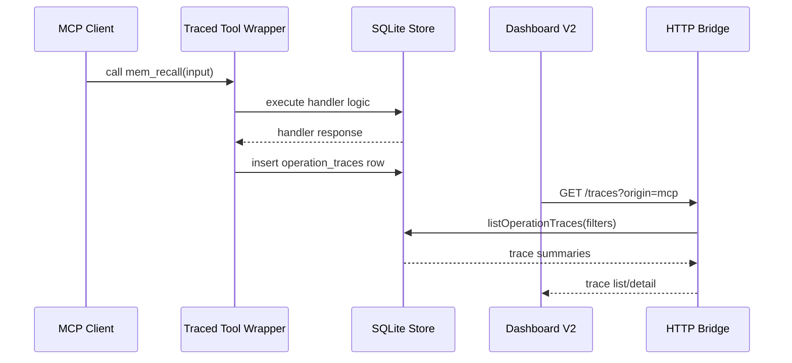

# Design: Production Hardening and Dashboard V2

## Technical Approach

Implement production hardening in two connected layers:

1. Backend observability and operation contracts:
   - Add durable trace persistence in SQLite.
   - Add MCP wrapping in the tool registration path.
   - Add HTTP tracing at the bridge route boundary.
   - Add operation and indexing endpoints required by Dashboard v2.
2. Dashboard v2:
   - Replace the existing component tree with a new operator console.
   - Preserve useful API client types but reorganize around operations, traces, retrieval lanes, indexing, and graph exploration.
   - Add Motion for view transitions and tactile controls.

## Architecture Decisions

### Decision: Use a Dedicated `operation_traces` Table
**Choice**: Add a dedicated table instead of overloading `sync_mutations`.
**Alternatives considered**: Reuse `sync_mutations` for traces.
**Rationale**: Trace rows are observational telemetry, not convergence mutations. A dedicated table avoids polluting sync semantics and supports query filters tailored to operations.

### Decision: Store Sanitized, Bounded Payload Snapshots
**Choice**: Persist sanitized JSON/text snapshots with truncation flags and lengths.
**Alternatives considered**: Store only metadata; store raw full payloads.
**Rationale**: The user explicitly needs to inspect calls and responses, but production safety requires redaction and bounded storage.

### Decision: Trace MCP at the Tool Handler Boundary
**Choice**: Add a shared helper that wraps handlers before calling `server.tool`.
**Alternatives considered**: Add tracing manually inside every handler.
**Rationale**: A shared wrapper makes future tools traceable by construction and avoids inconsistent trace schemas.

### Decision: Rebuild Dashboard UI, Preserve Useful API Client Pieces
**Choice**: Replace React surfaces and CSS, while reusing or rewriting client calls as needed.
**Alternatives considered**: Incrementally restyle the existing dashboard.
**Rationale**: The user judged the current dashboard obsolete; preserving old layout would violate scope.

### Decision: Treat Dashboard as a Local Operator Console
**Choice**: Dense, restrained, tool-first UI with clear status, trace drilldowns, and operation forms.
**Alternatives considered**: A visual map-first dashboard.
**Rationale**: Production hardening requires knowing what happened, what is stale, what is queued, and how to replay operations.

## Data Flow



## File Changes

- Modify `src/store/schema.ts`: add `operation_traces` table and indexes.
- Modify `src/store/types.ts`: add trace and operation response types.
- Modify `src/store/index.ts`: add trace insert/list/detail helpers, sanitization, and indexing health extensions.
- Add `src/utils/trace-sanitize.ts`: bounded payload and secret redaction utilities.
- Modify `src/tools/index.ts` and tool registration files: route registrations through traced helper.
- Modify `src/http-server.ts`: trace route executions and dashboard fallback paths for v2.
- Modify `src/http-routes.ts`: add traces, operations, version, rebuild graph, rebuild index routes.
- Modify `src/http-openapi.ts`: document new endpoints.
- Modify `dashboard/package.json`: add `motion`.
- Replace `dashboard/src/App.tsx`, `dashboard/src/index.css`, API client, and dashboard components with v2 console modules.
- Add/modify tests under `tests/store`, `tests/tools`, `tests/http-server.test.ts`, and `tests/dashboard`.
- Update `README.md` with dashboard v2 and trace observability notes.

## Interfaces / Contracts

### Operation Trace

```ts
interface OperationTrace {
  id: number;
  trace_id: string;
  origin: 'mcp' | 'http' | 'cli' | 'system';
  target: string;
  status: 'ok' | 'error';
  project: string | null;
  session_id: string | null;
  started_at: string;
  finished_at: string;
  duration_ms: number;
  request_json: string;
  response_json: string | null;
  error: string | null;
  request_truncated: boolean;
  response_truncated: boolean;
}
```

### HTTP Endpoints

- `GET /traces`
- `GET /traces/:id`
- `GET /operations`
- `GET /version`
- `POST /admin/rebuild-graph`
- `POST /admin/rebuild-index`
- `GET /admin/rebuild-index/status`

## Testing Strategy

- Start with failing tests for trace persistence and sanitization.
- Add route tests for traces, operation catalog, rebuild endpoints, and OpenAPI.
- Add dashboard client tests for new endpoints.
- Add dashboard typecheck/build gates.
- Use browser QA for desktop and mobile rendering after implementation.

## Migration / Rollout

- Schema changes are additive and idempotent.
- Existing MCP tools and HTTP routes keep their names and behavior.
- Dashboard v2 can be served from the same HTTP bridge root.
- Existing archived OpenSpec dashboard changes remain historical context only.

## Open Questions

- Real-provider soak tests depend on available local providers. If providers are unavailable, deterministic mock-provider soak tests will be used first, with optional real-provider commands documented.
