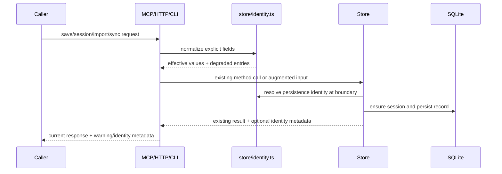

# Design: Stable Memory Identity Bootstrap

## Technical Approach

Introduce a small shared identity helper and thread its metadata through the existing Store-centered persistence paths. The change keeps the current public surfaces and schema intact while making compatibility fallbacks visible.

The implementation will centralize identity normalization in `src/store/identity.ts`. Tool and HTTP handlers can use the helper when they currently synthesize `manual-save-*`; Store save/import/apply paths will use the same helper when they must create a session or satisfy `sessions.project NOT NULL`. Result shapes will gain optional identity metadata so existing callers that only read current fields continue to work.

Upstream handoff hints preserved:

- The six MCP tools remain unchanged; no identity-specific tool is added.
- Fallback reporting uses a reusable shape shared by MCP text and HTTP JSON.
- Store boundaries own enough normalization/reporting to prevent MCP, HTTP, CLI, import, and sync from diverging.
- `sessions.project` stays non-null, while `observations.project` and `user_prompts.project` remain nullable.
- Historical `manual-save-*` and `unknown` records are not repaired or rewritten.
- CLI `sync` and `sync-import` keep the existing `process.cwd()/.thoth-sync` default and show the resolved directory.
- No `MemoryIntegrationCore` migration, no multi-harness hooks, no destructive schema changes.

## Architecture Decisions

### Decision: Centralize Identity Helpers In Store Layer

**Choice**: Add `src/store/identity.ts` exporting pure helpers and metadata types.

**Alternatives considered**:

- Put helpers in `src/utils/identity.ts`.
- Keep per-surface local helpers.

**Rationale**: Identity fallback is persistence policy, not generic string utility. Store, sync, HTTP, and MCP all depend on Store contracts already, and `src/store/types.ts` is the natural place for additive result metadata. Keeping helpers pure avoids introducing Store state or config coupling.

### Decision: Additive Metadata, No Schema Migration

**Choice**: Extend result interfaces with optional degraded identity metadata and leave row interfaces unchanged.

**Alternatives considered**:

- Add identity provenance columns.
- Rewrite placeholder rows at startup or import.

**Rationale**: Specs require no historical rewrite and no destructive schema changes. Optional metadata lets callers observe fallback use without changing persisted record shapes or breaking tests that compare existing row objects.

### Decision: Preserve Placeholder Vocabulary

**Choice**: Continue using `manual-save-${project || 'unknown'}` for synthesized manual session ids and `unknown` when `sessions.project` requires a non-null placeholder.

**Alternatives considered**:

- Introduce new placeholder strings such as `degraded-project`.
- Reject missing identity.

**Rationale**: Existing callers and historical queries may depend on the current vocabulary. The defect is silent fallback, not the exact placeholder text. Rejecting missing identity would break compatibility.

### Decision: Surface Identity Per Channel

**Choice**: MCP handlers append concise text when `identity.degraded.length > 0`; HTTP responses include structured `identity` metadata; CLI sync output includes resolved directory and fallback warning text when applicable.

**Alternatives considered**:

- Return structured JSON from MCP text responses.
- Add new HTTP routes or CLI flags.

**Rationale**: MCP handlers currently return human-readable text. HTTP already returns JSON. This keeps public route/tool names stable while making the same degraded identity facts observable.

## Data Flow



Explicit non-empty caller/import values win first. Existing centralized config/data-dir behavior remains the runtime foundation but this design does not add mandatory config keys. Missing values fall through to deterministic compatibility fallback and produce metadata.

## File Changes

| File | Planned change |
| --- | --- |
| `src/store/identity.ts` | New pure helper module for explicit/fallback/degraded identity normalization. |
| `src/store/types.ts` | Add identity metadata interfaces and optional fields on `SaveResult`, `ImportResult`, and apply/import/sync-related result types. Row interfaces stay unchanged. |
| `src/store/index.ts` | Use helpers in `ensureSession`, `startSession`, `savePrompt`, `saveObservation`, `importData`, and `applyV2Chunk`; preserve explicit identity; report synthesized/placeholder identity; keep idempotent project enrichment. |
| `src/tools/mem-save.ts` | Replace local fallback synthesis with helper calls or Store metadata; append concise fallback/degraded text to responses. |
| `src/tools/mem-session.ts` | Preserve explicit start identity; report fallback session id for summary/checkpoint when `id` is omitted. |
| `src/http-routes.ts` | Replace local `manual-save-*` helper use with shared metadata; add `identity` or `degraded_identity` JSON fields to save/session/import/sync responses. |
| `src/sync/index.ts` | Aggregate optional degraded identity details from Store import/apply results into sync import results. Preserve export identity as currently serialized. |
| `src/cli.ts` | Keep `process.cwd()/.thoth-sync` default; print resolved sync directory and an explicit CWD-based default note when `--dir` is omitted; include sync import degraded identity summary when present. |
| `tests/tools/mem-session.test.ts` | Add explicit identity and omitted-id fallback visibility coverage. |
| `tests/tools/mem-save.test.ts` | Add prompt, session summary, observation, missing project/session, and no-fallback-on-explicit coverage. |
| `tests/http-server.test.ts` | Add HTTP/MCP parity expectations for explicit identity and degraded identity JSON; extend import/sync response checks additively. |
| `tests/store/sessions.test.ts` | Add placeholder project enrichment and stable project non-downgrade tests. |
| `tests/store/export-import.test.ts` | Add legacy missing identity import, explicit identity preservation, and historical placeholder stability tests. |
| `tests/store/sync.test.ts` or nearest existing sync suite | Add v2 apply/import degradation and replay idempotency tests if a sync-specific suite exists; otherwise place focused cases in `export-import.test.ts`. |
| `tests/config.test.ts` | Preserve `THOTH_DATA_DIR`, `dbPath`, and no-new-required-config behavior. |

## Interfaces / Contracts

```ts
export type IdentityField = 'session_id' | 'project';
export type IdentitySource = 'explicit' | 'config' | 'fallback' | 'import' | 'legacy';
export type IdentityReason = 'missing' | 'blank' | 'placeholder' | 'schema-required';

export interface DegradedIdentityEntry {
  field: IdentityField;
  reason: IdentityReason;
  source: IdentitySource;
  value: string | null;
  fallback_value?: string | null;
}

export interface IdentityResolution {
  session_id?: string;
  project?: string | null;
  session_project: string;
  degraded: DegradedIdentityEntry[];
}

export interface IdentityMetadata {
  degraded: DegradedIdentityEntry[];
  synthesized_session_id?: string;
  synthesized_project?: string;
}

export function normalizeExplicitString(value: string | null | undefined): string | undefined;
export function isPlaceholderProject(value: string | null | undefined): boolean;
export function isManualFallbackSessionId(value: string | null | undefined): boolean;
export function fallbackManualSessionId(project: string | null | undefined): string;

export function resolveSaveIdentity(input: {
  session_id?: string | null;
  project?: string | null;
  requireSessionProject?: boolean;
  category?: 'prompt' | 'observation' | 'session_summary' | 'passive_learning' | 'import' | 'sync';
}): IdentityResolution;

export function mergeIdentityMetadata(...entries: Array<IdentityMetadata | undefined>): IdentityMetadata | undefined;
export function formatIdentityWarning(metadata: IdentityMetadata | undefined): string;
```

Planned additive result shape:

```ts
export interface SaveResult {
  observation: Observation;
  action: 'created' | 'deduplicated' | 'upserted';
  identity?: IdentityMetadata;
}

export interface ImportResult {
  sessions_imported: number;
  observations_imported: number;
  prompts_imported: number;
  skipped: number;
  identity?: IdentityMetadata;
}

export interface ApplyV2ChunkResult {
  applied: number;
  skipped: number;
  deleted: number;
  identity?: IdentityMetadata;
}

export interface SyncImportResult {
  chunks_processed: number;
  imported: number;
  skipped: number;
  failed: number;
  sessions_imported: number;
  observations_imported: number;
  prompts_imported: number;
  identity?: IdentityMetadata;
}
```

HTTP response additions are optional and additive:

```ts
{
  "id": 123,
  "action": "created",
  "identity": {
    "degraded": [
      {
        "field": "session_id",
        "reason": "missing",
        "source": "fallback",
        "value": null,
        "fallback_value": "manual-save-unknown"
      }
    ],
    "synthesized_session_id": "manual-save-unknown"
  }
}
```

MCP text appends a short block only when fallback was used:

```text
Identity fallback: session_id missing -> manual-save-unknown; project missing -> unknown.
```

## Testing Strategy

Run narrow tests first around changed behavior:

- `pnpm test -- tests/tools/mem-session.test.ts`
- `pnpm test -- tests/tools/mem-save.test.ts`
- `pnpm test -- tests/store/sessions.test.ts`
- `pnpm test -- tests/store/export-import.test.ts`
- `pnpm test -- tests/http-server.test.ts`
- `pnpm test -- tests/config.test.ts`

Then run broad verification because the change touches shared Store, HTTP, sync, and type contracts:

- `pnpm run build`
- `pnpm test`

Focused edge cases:

- Blank strings are treated as missing after normalization.
- Explicit non-placeholder project never downgrades to `unknown`.
- Existing `unknown` or `manual-save-*` rows remain query-stable.
- Nullable prompt/observation projects stay nullable.
- Legacy imports with missing project succeed and report degradation.
- Replaying the same legacy chunk does not create divergent placeholders.
- CLI sync without `--dir` prints the resolved CWD default.

## Migration / Rollout

No database migration is required. Existing data remains unchanged, including historical `manual-save-*` sessions and `unknown` projects. Public MCP tool names, HTTP route names, CLI command names, sync chunk versions, and observation taxonomy remain stable.

Rollout is backward-compatible:

1. Add helper/types and Store metadata while preserving current persistence behavior.
2. Surface metadata in MCP/HTTP/CLI responses additively.
3. Expand tests around identity visibility and explicit identity precedence.
4. Keep import/export compatible with legacy payloads.

## Risks and Rollback

Risk: Client tests with exact HTTP body equality may fail when metadata is added. Mitigation: add metadata only when degraded identity exists, or update tests to assert additive fields where expected.

Risk: Store result interface changes ripple through callers. Mitigation: optional fields only; existing callers can ignore `identity`.

Risk: Fallback metadata could be too verbose in MCP text. Mitigation: use one concise line and only emit it when fallback occurs.

Risk: Import aggregation may double-count repeated degraded entries. Mitigation: deduplicate by `field`, `reason`, `source`, `value`, and `fallback_value` in `mergeIdentityMetadata`.

Rollback: remove response metadata and helper calls from surface handlers while keeping persistence behavior unchanged. Since no schema migration or historical rewrite occurs, rollback needs no database repair.

## Constitution Check

- P1 Compact MCP Surface: Pass. The design keeps exactly the existing six tools and adds no MCP tools.
- P2 Deterministic-First Retrieval With Safe Degradation: Pass. Retrieval is not changed; degraded identity state is explicitly signaled, matching the principle's degradation discipline.
- P3 Harness-Agnostic Memory Contract: Pass. Identity metadata is plain TypeScript/JSON/text and shared across MCP, HTTP, CLI, Store, and sync without harness-specific fields.
- P4 Token-Efficient, Bounded Recall Outputs: Pass. Recall behavior and output budgeting are not changed.
- P5 Stable Public Contract With Explicit Deprecation Discipline: Pass. No route/tool/CLI command/taxonomy is renamed or removed; all response changes are additive and no destructive migration is introduced.

No Constitution violation detected; no override is required.

## Resolved Notes

- `IdentitySource = 'config'` is retained as a future-compatible source in the helper type, but no config-derived project default is implemented in this change because the specs do not require a new config key.
- Sync degradation metadata uses aggregate unique degraded entries by default, deduplicated by `field`, `reason`, `source`, `value`, and `fallback_value`; full per-record degradation detail is out of scope to avoid noisy output.
