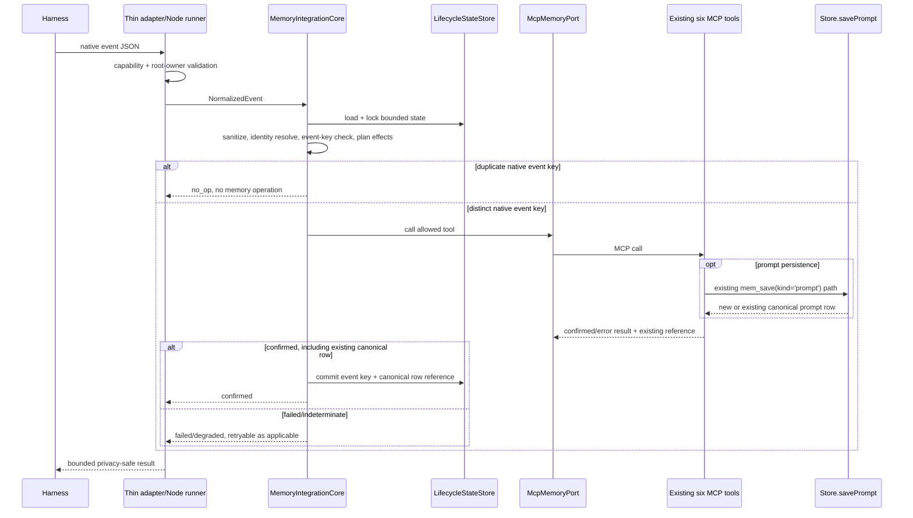
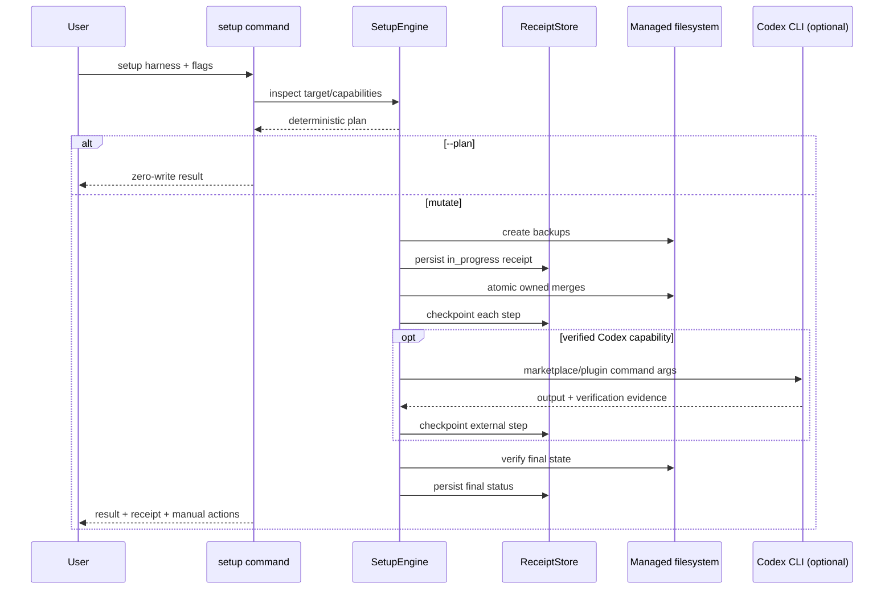

# Design: Native Multi-Harness Parity

## Technical Approach

Implement one thoth-mem-owned lifecycle engine and keep every host integration thin. Native adapters translate host payloads into normalized lifecycle events; the core validates root ownership and stable identity, sanitizes prompt content, plans effects, invokes only the existing six MCP tools through a `MemoryPort`, and commits lifecycle state only after confirmed tool success.

Setup is a separate transaction-oriented subsystem. It inspects one harness/scope, produces a deterministic zero-write plan, creates backups and a write-ahead receipt, applies only owned changes, verifies every step, and derives the exact result/exit status. OpenCode uses filesystem-managed installation. Codex combines reversible filesystem work with independently tracked best-effort CLI marketplace/plugin operations. Claude Code is installed through repository marketplace assets and portable Node hook runners.

The npm tarball is the release authority. A canonical inventory reconciles every manifest, skill, hook, adapter, runner, and setup asset; version/path verification and smoke tests operate on the packed artifact, never the source tree.

### Codebase Evidence

- `src/index.ts` currently recognizes a fixed `CLI_SUBCOMMANDS` set and collapses all CLI failures to exit `1`; exact setup exit codes require returning an exit code from `runCli()` and propagating it from `main()`.
- `src/cli.ts` has a monolithic command switch, reusable validation helpers, and a global `--project` option. Setup needs a command-aware parser so `--project <path>` has setup-path semantics without changing existing project-filter behavior.
- `src/store/identity.ts` already provides explicit-first project/session resolution, deterministic fallback, and degraded metadata. The integration core will call this contract rather than define adapter-local identity rules.
- `src/utils/privacy.ts` removes balanced `<private>...</private>` regions but does not fail closed on malformed tags. A new strict sanitizer will wrap/reuse the balanced behavior and handle malformed input before the 8,000-code-point cap.
- `src/tools/index.ts` registers exactly six tools. `src/server.ts` owns the shared memory protocol text. Both are regression anchors.
- `Store.savePrompt()` preserves a current 30-second same-session/content canonical-row collapse. The approved design keeps it unchanged: byte-identical intentional repeats inside the window may execute distinct capture operations but resolve to the same returned prompt row.
- `scripts/build.mjs` creates one Node 18 ESM bundle, while `package.json` currently publishes only `dist`, `config.schema.json`, and `README.md`. Integration assets and package verification must be added explicitly.
- The Engram reference confirms useful topology patterns—separate OpenCode/Codex/Claude assets, repository marketplace descriptors, `.mcp.json`, skills, and hook manifests—but its shell scripts and direct HTTP behavior are not copied. Thoth-mem uses portable Node runners and the six-tool MCP contract.

## Upstream Handoff Hints Preserved

### Harness integration

- Preserve one lifecycle outcome vocabulary and state-transition contract across OpenCode, Codex, and Claude Code.
- Keep capability detection and native event translation at adapter boundaries; unsupported events remain explicit.
- Cover every excluded traffic class and malformed-private-tag behavior with negative fixtures.
- Advance state only after confirmed memory success; prove retry, duplicate, restart, compaction, and terminal sequences.
- Preserve `supported|degraded|unsupported`, `confirmed|failed|degraded|no_op`, the 8,000-code-point prompt rule, private-only zero-operation behavior, stable event-equivalence precedence, and the Store's 30-second canonical-row collapse.
- Test duplicate delivery separately from distinct intentional byte-identical prompt events inside and after the 30-second window.
- Do not absorb orchestration, SDD routing, or sub-agent lifecycle behavior.

### CLI

- Use one result model for plan, setup, Codex external steps, and rollback with exact status/exit mappings.
- Separate reversible filesystem transactions from non-atomic Codex registration while keeping one receipt and per-step evidence.
- Prove zero-write planning and scope confinement.
- Preserve unrelated configuration through merge, force, rollback, and later user edits.
- Preserve exact flags, JSON field types, step outcomes, plan precedence, and write-ahead recovery.
- Treat Codex plugin installation as capability-gated best effort; marketplace success alone never means `complete`.

### Packaging

- Use one authoritative inventory for package verification and packed installation.
- Resolve runtime paths from the installed package or marketplace root and test with the checkout inaccessible.
- Exercise every runner on Windows and POSIX paths containing spaces.
- Validate version and plugin identity before hook execution.
- Preserve exact package-version equality, inventory cardinality, and lexical plus realpath containment.
- Perform no publishing or credentialed remote mutation.

### Tools

- Preserve the exact six-name registry in implementation and packed smoke tests.
- Keep adapters on public tool contracts and outside Store internals.
- Reuse identity, privacy, deduplication, and retrieval behavior.
- Prove fixed-input behavior before and after each integration is enabled.
- Preserve lifecycle-to-tool mapping, adapter-side diagnostics, and deterministic byte-for-byte parity.
- Add no prompt idempotency input, schema/storage/cardinality migration, public MCP input expansion, or new HTTP semantic.

## Architecture Decisions

### Decision: Pure lifecycle planning with effect execution

**Choice:** Split `MemoryIntegrationCore` into a pure planner and an executor. The planner consumes `LifecycleState`, `NormalizedEvent`, and `AdapterCapabilities` and returns ordered `LifecycleEffect[]`. The executor invokes effects through injected ports and commits state only after confirmed outcomes.

**Alternatives considered:** Put all logic in each plugin; place host SDK types inside the core; mutate state before tool completion.

**Rationale:** A pure planner provides one parity suite for all hosts, keeps host APIs at adapter boundaries, and makes failure/retry sequences deterministic.

### Decision: Six-tool MCP boundary through an in-process client

**Choice:** `McpMemoryPort` creates a linked MCP client/server pair around `createServer()` and calls only `mem_save`, `mem_recall`, `mem_context`, `mem_get`, `mem_project`, and `mem_session`. It never imports `Store` or a tool handler directly.

**Alternatives considered:** Direct Store access; HTTP bridge calls; new harness-specific MCP tools; shelling out once per individual tool call.

**Rationale:** This exercises the public contract, preserves tool tracing/validation, avoids a seventh tool, and remains injectable for contract tests.

### Decision: Store canonical prompt rows remain authoritative

**Choice:** Duplicate delivery of the same native event/message identity is suppressed before `MemoryPort`, so it produces one memory operation and one lifecycle effect. Two distinct intentional events have distinct event keys and may each call existing `mem_save(kind='prompt')`. If their same-session sanitized content is byte-identical inside 30 seconds, a successful response returning the existing `Store.savePrompt` row is treated as confirmed prompt persistence for the later event; stored-row cardinality remains one. A byte-identical event after the window follows existing Store behavior and may create a new row.

**Alternatives considered:** Add an optional idempotency/event key to `mem_save`; change prompt schema or cardinality; bypass Store through HTTP/direct access; append invisible event markers to content.

**Rationale:** This preserves the approved compatibility behavior and six-tool contract while separating event-effect idempotency from canonical storage-row cardinality. No tool input, schema, Store implementation, or HTTP semantic changes.

### Decision: Strict root ownership and privacy before persistence

**Choice:** Adapters must prove `actor='root_user'` and root-session ownership. The strict sanitizer removes balanced private regions, drops the suffix after an unmatched opening tag, rejects the whole prompt for an unmatched closing tag, normalizes line endings, then retains at most the first 8,000 Unicode code points. Empty sanitized content yields `no_op` and no memory call.

**Alternatives considered:** Trust every user-role payload; truncate before sanitizing; permissively repair malformed tags; reuse current balanced-only behavior unchanged.

**Rationale:** Central ordering prevents adapters from leaking private suffixes or persisting generated/delegated content.

### Decision: Bounded privacy-safe lifecycle state

**Choice:** Persist per-root-session state under the resolved thoth data directory at `integrations/state/<harness>/<session-key>.json`. State contains no prompt text: only normalized identity metadata, capability snapshot, transition outcomes, HMAC event keys, canonical prompt-row references returned by MCP, timestamps, and terminal state. A per-install 0600 secret creates HMAC-SHA256 event keys. State is written atomically under a bounded lock.

Active sessions retain at most 16,384 event keys or 1 MiB, whichever is reached first; finalized state is retained for 30 days. Reaching a bound changes dedup/restart capability to `degraded` before eviction and never claims confirmed exactly-once behavior. Lock acquisition is bounded to two seconds; timeout returns `failed` with `retryable=true` and does not advance state.

**Alternatives considered:** Raw prompt hashes; unbounded append logs; in-memory-only sets; a schema migration.

**Rationale:** HMAC keys avoid content leakage, restart state survives one-shot hooks, and explicit degradation preserves truthfulness without changing the SQLite schema.

### Decision: Thin adapters plus one portable hook protocol

**Choice:** Every host adapter implements `HarnessAdapter` and converts native input into `NormalizedEvent`. Command hooks invoke a checked-in Node 18 runner with JSON on stdin. The runner locates the installed `thoth-mem` command from managed installation metadata, `THOTH_MEM_BIN`, or PATH—in that order—and invokes the package-internal `integration-event` CLI protocol with argument arrays, never a shell string.

OpenCode's in-process plugin serializes the same protocol. Codex and Claude hook manifests invoke plugin-root-local runner copies generated from the canonical runner and verified byte-identical.

**Alternatives considered:** Bash/PowerShell scripts; checkout-relative imports; direct HTTP fetches; independent host implementations.

**Rationale:** One protocol keeps adapters small and works with paths containing spaces on Windows and POSIX.

### Decision: Capability mappings are runtime evidence, not optimistic defaults

**Choice:** Each adapter publishes five capability entries: enrollment, prompt capture, recall guidance, compaction, and finalization. A capability is `supported` only when the native trigger and required payload fields are verified; limited payload/event evidence is `degraded`; absent or unknown triggers are `unsupported`.

**Alternatives considered:** Assume all manifest-declared hooks work; simulate missing events; silently omit terminal behavior.

**Rationale:** Harness APIs evolve independently and Codex plugin installation is not a stable documented surface.

### Decision: Setup is inspect → plan → backup → receipt → apply → verify

**Choice:** `SetupEngine` is harness-neutral and delegates path/config/command details to `SetupAdapter`. Plan-only stops after deterministic planning. A mutating run backs up all existing target files, then writes an HMAC-protected `in_progress` receipt before its first mutation. Each step update is flushed atomically. Verification produces the final result.

**Alternatives considered:** In-place best-effort writes; whole-file restore without ownership; receipt only after success.

**Rationale:** Write-ahead evidence permits interruption recovery and preserves unrelated user state.

### Decision: Text-preserving managed configuration

**Choice:** Use `jsonc-parser` edits for OpenCode JSON/JSONC and a validated marker-block splice for Codex TOML. `smol-toml` validates the original and resulting TOML, while only the thoth-mem marker block changes. Conflicting owned locations stop unless `--force`; force never rewrites unrelated keys/comments.

**Alternatives considered:** JSON.parse/stringify; full TOML reserialization; regex-only TOML mutation.

**Rationale:** Semantic and textual preservation is important for user-owned configuration and rollback.

### Decision: Codex external operations are independently planned and verified

**Choice:** `CodexCliCapabilities` probes `codex` help surfaces with `spawn` argument arrays and only enables command shapes explicitly advertised by the detected CLI. Marketplace add and plugin install are separate receipt steps. A step is `confirmed` only through a supported list/status verification; command success without verification is not enough for `complete`.

Project scope attempts external registration only when Codex advertises a project-local scope. Otherwise it leaves global state untouched and returns `requires_user_action` with exact manual guidance.

**Alternatives considered:** Hard-code undocumented commands; infer success from exit zero; mutate global registration during project setup.

**Rationale:** This meets best-effort behavior without false success or scope escape.

### Decision: Canonical package inventory and exact version synchronization

**Choice:** `integrations/inventory.json` lists one harness owner, role, and unique package-relative path per runtime asset. Verification reconciles inventory, manifest references, and tarball entries; checks lexical and realpath containment; and requires every version-bearing manifest to equal `package.json`. An npm `version` lifecycle script synchronizes version fields, while verification fails any uncommitted drift.

**Alternatives considered:** Hand-maintained independent allowlists; source-tree smoke tests; compatible version ranges.

**Rationale:** One inventory makes omission and stale-manifest failures observable before release.

### Decision: No cross-repository mutation

**Choice:** All implementation is confined to thoth-mem. Engram and thoth-agents are read-only references. Any retirement/repointing of thoth-agents behavior remains a separately approved downstream change.

**Alternatives considered:** Modify both repositories in one apply phase.

**Rationale:** The accepted scope explicitly prohibits silent external refactors and duplicate ownership needs coordinated rollout.

## Interfaces / Contracts

```ts
export type HarnessId = 'opencode' | 'codex' | 'claude';
export type LifecycleIntent =
  | 'enroll_session'
  | 'capture_root_prompt'
  | 'recall_guidance'
  | 'compact_session'
  | 'finalize_session';
export type CapabilityState = 'supported' | 'degraded' | 'unsupported';
export type LifecycleOutcome = 'confirmed' | 'failed' | 'degraded' | 'no_op';

export interface NormalizedEvent {
  harness: HarnessId;
  intent: LifecycleIntent;
  actor: 'root_user' | 'assistant' | 'subagent' | 'tool' | 'system';
  isRootSession: boolean;
  identity: { sessionId?: string; project?: string; cwd?: string };
  nativeEventId?: string;
  hostTimestamp?: string;
  hostSequence?: string;
  content?: string;
  nativeEvent: string;
}

export interface Capability {
  state: CapabilityState;
  trigger?: string;
  reason?: string;
}
export type AdapterCapabilities = Record<LifecycleIntent, Capability>;

export type LifecycleEffect =
  | { kind: 'memory_call'; tool: MemoryToolName; input: Record<string, unknown>; transition: string }
  | { kind: 'inject_protocol'; text: string }
  | { kind: 'diagnostic'; diagnostic: SafeDiagnostic };

export interface LifecycleResult {
  outcome: LifecycleOutcome;
  retryable: boolean;
  harness: HarnessId;
  intent: LifecycleIntent;
  effects: EffectResult[];
  diagnostic?: SafeDiagnostic;
}
```

```ts
export type MemoryToolName =
  | 'mem_save' | 'mem_recall' | 'mem_context'
  | 'mem_get' | 'mem_project' | 'mem_session';

export interface MemoryPort {
  call(tool: MemoryToolName, input: Record<string, unknown>): Promise<{
    confirmed: boolean;
    isError: boolean;
    text: string;
    reference?: { kind: 'prompt' | 'observation'; id: number };
  }>;
  close(): Promise<void>;
}

export interface Clock {
  now(): Date;
  sleep(ms: number): Promise<void>;
}

export interface PromptSanitizer {
  sanitize(input: string):
    | { action: 'persist'; content: string; truncated: boolean; privacyDegraded: boolean }
    | { action: 'skip'; reason: 'private_only' | 'malformed_private_tag' | 'empty' };
}

export interface MemoryProtocol {
  systemInstructions(capabilities: AdapterCapabilities): string;
  recallNudge(identity: ResolvedIdentity): string;
  compactionInstruction(identity: ResolvedIdentity): string;
}
```

The planner maps lifecycle intents to tools exactly:

| Intent | Tool/effect |
| --- | --- |
| `enroll_session` | `mem_session(action='start')`, followed by `mem_context` only when host supports injected recovery context |
| `capture_root_prompt` | Duplicate event key: `no_op` before MCP. Distinct event key: one existing `mem_save(kind='prompt')` call after ownership/privacy/bound checks; a successful existing-row response is `confirmed` |
| `recall_guidance` | protocol injection; actual retrieval uses `mem_recall` compact/context, `mem_context`, then `mem_get` |
| `compact_session` | `mem_session(action='checkpoint')` plus bounded protocol/context injection; failed calls stay retryable |
| `finalize_session` | `mem_session(action='summary')` or `mem_save(kind='session_summary')` according to available summary content, never both for the same event |
| project navigation/health | `mem_project` only |

### Lifecycle state

```ts
interface LifecycleStateV1 {
  schemaVersion: 1;
  harness: HarnessId;
  projectId: string;
  rootSessionId: string;
  capabilities: AdapterCapabilities;
  enrollment: { status: 'pending' | 'confirmed'; confirmedAt?: string };
  confirmedEvents: Array<{ key: string; intent: LifecycleIntent; confirmedAt: string; canonicalPromptId?: number }>;
  terminal: { status: 'open' | 'pending' | 'confirmed'; confirmedAt?: string };
  dedupState: 'supported' | 'degraded';
  updatedAt: string;
}
```

Event-key precedence is native event/message id, then HMAC of harness + project + root session + intent + actor + sanitized content + host timestamp/sequence. Missing both native id and stable timestamp/sequence yields `degraded`; content alone is never sufficient because it would collapse intentional repetition at the lifecycle layer. Event keys decide whether to execute an effect, not whether Store creates a row. Distinct event keys inside the Store's 30-second byte-identical window may record the same `canonicalPromptId`; both successful events are `confirmed`.

### Setup contracts

```ts
interface SetupRequest {
  harness: 'opencode' | 'codex';
  scope: 'global' | 'project';
  projectPath?: string;
  planOnly: boolean;
  force: boolean;
  rollbackReceipt?: string;
  json: boolean;
}

type SetupStatus = 'complete' | 'failed' | 'partial' | 'requires_user_action';
type StepOutcome = 'planned' | 'skipped' | 'confirmed' | 'failed' | 'unavailable';

interface SetupResult {
  status: SetupStatus;
  changed: boolean;
  harness: 'opencode' | 'codex';
  scope: 'global' | 'project';
  target: string;
  steps: Array<{ name: string; outcome: StepOutcome }>;
  diagnostics: string[];
  manual_actions: string[];
  receipt: string | null;
}
```

Exit mapping is `complete=0`, `failed=1`, `partial=2`, `requires_user_action=3`. Successful plan-only returns `complete/0/changed=false`; an unforced blocking conflict returns `requires_user_action/3`; `--plan --force` remains zero-write and reports the replacement plan.

```ts
interface SetupReceiptV1 {
  schema_version: 1;
  id: string;
  operation: 'setup' | 'rollback';
  status: 'in_progress' | SetupStatus | 'rolled_back';
  harness: 'opencode' | 'codex';
  scope: 'global' | 'project';
  target: string;
  package_version: string;
  force: boolean;
  started_at: string;
  updated_at: string;
  steps: Array<{
    id: string;
    kind: 'filesystem' | 'external_command' | 'verification';
    outcome: StepOutcome;
    owned_key?: string;
    path?: string;
    external_scope?: 'global' | 'project';
    pre_hash?: string;
    post_hash?: string;
    backup_path?: string;
    diagnostic?: string;
  }>;
  hmac_sha256: string;
}
```

Global receipts/backups live under the resolved thoth data directory at `setup/receipts/<id>/`; project receipts live at `<project>/.thoth/setup/receipts/<id>/`. The receipt key remains in the resolved thoth data directory with owner-only permissions. Backups precede receipt creation; no mutation occurs if backup or initial receipt persistence fails.

## Adapter Capability Mapping

| Adapter | Enrollment | Prompt capture | Recall guidance | Compaction | Finalization |
| --- | --- | --- | --- | --- | --- |
| OpenCode | `session.created`, root only | `chat.message`, root user only | system transform/protocol injection | `experimental.session.compacting` when payload is verified | Supported only if a verified terminal event exists; `session.deleted` alone is cleanup, not assumed success |
| Codex | Manifest/runtime hook reported by capability probe | Verified root `UserPromptSubmit`-equivalent only | packaged skill/protocol plus supported hook injection | Verified compact hook only | Verified terminal hook only |
| Claude Code | `SessionStart` startup/resume/clear | `UserPromptSubmit` | packaged skill/protocol and session-start context | `PreCompact` plus compact-session recovery when available | `Stop`; `SubagentStop` is explicitly excluded |

Adapters reject sub-agent parent ids, sub-agent stop events, generated handoffs, assistant/tool output, and missing root identity evidence. Unknown host versions keep safe capabilities active and mark unproven ones `unsupported` or `degraded`.

## Data Flow

### Native lifecycle event



### Setup transaction



## Native Artifact Topology

```text
.agents/plugins/marketplace.json                 # Codex marketplace descriptor
.claude-plugin/marketplace.json                  # Claude repository marketplace
integrations/
├── inventory.json                               # canonical asset inventory
├── shared/
│   └── hook-runner.mjs                          # canonical Node 18 runner source
├── opencode/
│   ├── plugin.mjs                               # thin OpenCode event adapter
│   └── memory-protocol.md
├── codex/
│   ├── .codex-plugin/plugin.json
│   ├── .mcp.json
│   ├── hooks/hooks.json
│   ├── runners/hook-runner.mjs                  # verified copy
│   └── skills/thoth-mem/SKILL.md
└── claude-code/
    ├── .claude-plugin/plugin.json
    ├── .mcp.json
    ├── hooks/hooks.json
    ├── runners/hook-runner.mjs                  # verified copy
    └── skills/thoth-mem/SKILL.md
```

OpenCode global targets are `${XDG_CONFIG_HOME:-~/.config}/opencode/opencode.json` and its `plugins/` directory. Project targets are `<project>/opencode.json` and `<project>/.opencode/plugins/`. Codex global targets resolve from `CODEX_HOME` or `~/.codex`; project targets remain under `<project>/.codex/`. Setup writes a managed installation metadata file containing the absolute thoth-mem executable and package version, so copied adapters never depend on the invoking cwd.

Claude/Codex `.mcp.json` files launch `thoth-mem mcp --no-http`. Hook runners call the package-internal integration protocol; missing executable resolution is an explicit degraded result with the manual installation command, never silent success.

## File Changes

### Created

- `src/integration/core/types.ts` — normalized events, capabilities, effects, outcomes.
- `src/integration/core/lifecycle.ts` — pure planner and confirmed-success executor.
- `src/integration/core/memory-port.ts` — six-tool allowlist contract.
- `src/integration/core/mcp-memory-port.ts` — linked in-process MCP client/server implementation.
- `src/integration/core/sanitizer.ts` — root ownership and strict private-tag/8,000-code-point sanitization.
- `src/integration/core/protocol.ts` — shared memory, recall, compaction, and finalization guidance.
- `src/integration/core/state-store.ts` — HMAC event keys, returned canonical-row references, bounded locking, atomic restart state.
- `src/integration/adapters/opencode.ts` — OpenCode event/capability normalization.
- `src/integration/adapters/codex.ts` — Codex event/capability normalization.
- `src/integration/adapters/claude-code.ts` — Claude event/capability normalization.
- `src/integration/runtime/hook-command.ts` — package-internal JSON stdin/stdout integration protocol.
- `src/setup/types.ts` — setup requests, plans, steps, results, receipts.
- `src/setup/engine.ts` — inspect/plan/apply/verify orchestration.
- `src/setup/paths.ts` — platform/global/project target resolution.
- `src/setup/filesystem.ts` — backups, locks, fsync/temp/rename, hashes, containment.
- `src/setup/receipt.ts` — write-ahead receipt persistence, HMAC, recovery.
- `src/setup/managed-config.ts` — JSONC edits and validated TOML marker blocks.
- `src/setup/harnesses/opencode.ts` — OpenCode inspection, assets, merge, verification.
- `src/setup/harnesses/codex.ts` — Codex filesystem plan and verification.
- `src/setup/codex-cli.ts` — bounded capability probes, argument-array execution, verification.
- `.agents/plugins/marketplace.json` and `.claude-plugin/marketplace.json`.
- `integrations/inventory.json` and the native asset topology listed above.
- `scripts/sync-integration-assets.mjs` — version and canonical-copy synchronization.
- `scripts/verify-integration-package.mjs` — inventory/version/path/tarball checks.
- `tests/integration/lifecycle.test.ts`, `tests/integration/adapters.test.ts`, `tests/integration/hook-command.test.ts`.
- `tests/setup/engine.test.ts`, `tests/setup/rollback.test.ts`, `tests/setup/codex-cli.test.ts`.
- `tests/packaging/inventory.test.ts`, `tests/packaging/packed-install.test.ts`.

### Modified

- `src/index.ts` — route `setup` and package-internal integration events; propagate exact exit codes.
- `src/cli.ts` — command-aware setup parsing, help, handler, JSON/human rendering, numeric result return.
- `src/server.ts` — consume canonical protocol text without changing tool registration.
- `src/utils/privacy.ts` — expose strict fail-closed sanitization while retaining existing balanced-tag compatibility behavior.
- `scripts/build.mjs` — run integration source/inventory verification after the Node 18 bundle is produced.
- `package.json` — publish native assets, add JSONC/TOML dependencies, version/verification scripts, and release gate.
- `pnpm-lock.yaml` — dependency lock updates.
- `README.md` and `skills/thoth-mem/SKILL.md` — setup, states, scope, rollback, privacy, and manual recovery.
- `codemap.md` and `src/codemap.md` — integration/setup architecture map.
- `tests/cli.test.ts`, `tests/index.test.ts`, `tests/utils/privacy.test.ts`, `tests/store/identity.test.ts`, `tests/store/context.test.ts`, `tests/tools/registry.test.ts` — focused regression coverage, including unchanged `Store.savePrompt` canonical-row behavior.

### Deleted

- None.

No file under Engram or thoth-agents is modified by this change.

## Testing Strategy

| Spec area | Evidence |
| --- | --- |
| Host-neutral parity | Parameterized lifecycle suite runs identical normalized fixtures against all three adapters and compares effects/outcomes. |
| Root ownership/privacy | Root prompt, sub-agent, generated handoff, assistant, tool, balanced private, unmatched open/close, private-only, Unicode boundary, and 8,001-code-point fixtures. |
| State/retry/dedup | Failed start then retry; indeterminate result; repeated delivery of one native id causes one `mem_save` call/effect; two distinct intentional byte-identical events inside 30 seconds cause two processed events but one canonical row; an identical event after an aged-out window follows existing Store behavior; restart reload, lock timeout, state-bound degradation, duplicate terminal event. |
| Capability mapping | Supported/degraded/unsupported matrices for known, partial, and unknown host versions. |
| CLI plan/scope | Zero-write filesystem snapshots; global/project target assertions; invalid project scope; `--plan --force`; exact human/JSON output and exit codes. |
| Managed merge | JSONC comments/unknown keys; TOML comments/unknown tables; conflict refusal; force only owned block; atomic failure injection. |
| Receipt/recovery | Backup failure, receipt failure before mutation, interruption after each step, HMAC tamper, idempotent rollback, divergent owned state, forced rollback, later unrelated edits. |
| Codex best effort | Help-probe fixtures, safely exposed commands, missing commands, command failure, unverified success, marketplace-only success, project/global scope behavior. |
| Packaging | Inventory bijection, exact versions, missing/duplicate asset, lexical traversal, symlink escape, plugin identity mismatch. |
| Packed smoke | Build tarball, install into isolated global/project homes, hide checkout, fake harness CLIs, execute Node runners on Windows/POSIX space-containing paths, validate Claude marketplace install topology. |
| Six-tool/public parity | Existing registry test stays exactly six; deterministic fixed database/config/request snapshots remain byte-identical before/after integration enablement. |
| Prompt storage compatibility | Existing `Store.savePrompt` implementation is untouched; MCP success returning an existing prompt ID is confirmed; no optional idempotency input, schema/cardinality change, or HTTP behavior is added. |

Verification order during implementation is focused tests first, then `pnpm run build`, `pnpm test`, package verification, and packed-install smoke. No lint command is introduced unless separately added and documented.

## Migration / Rollout

1. Land the core, adapters, setup engine, and tests with no integrations auto-enabled.
2. Add native assets and package inventory; keep manual MCP configuration supported and retain existing prompt storage behavior without migration.
3. Release an npm package whose version exactly matches every manifest.
4. Users opt in with `thoth-mem setup opencode`, `thoth-mem setup codex`, or Claude marketplace/plugin commands.
5. Setup detects overlapping thoth-agents memory hooks and emits a non-destructive warning; it does not edit or disable the other repository.
6. Observe adapter capability/degraded diagnostics and packed smoke evidence before recommending broad migration.

Rollback uses the setup receipt to restore only prior owned values or remove receipt-created entries. Package rollback removes native assets/setup code while leaving the database, schema, six MCP tools, manual MCP configuration, and stored memories unchanged. External Codex operations are reported separately because they may require manual uninstall.

## Constitution Check

`rules.constitution.enforce_check` is enabled. The design passes every ratified principle:

| Principle | Result | Evidence |
| --- | --- | --- |
| P1 — Compact, Workflow-Level MCP Surface | PASS | `MemoryPort` allowlists the existing six tools; no idempotency tool/input is added; setup, hooks, receipts, package checks, and capability probes remain outside MCP. Registry tests run in source and packed smoke. |
| P2 — Deterministic-First Retrieval With Safe Degradation | PASS | No retrieval lane/ranking/schema change is planned. Existing lexical/KG fallback and degraded signaling remain authoritative; adapter failures are explicit. |
| P3 — Harness-Agnostic Memory Contract | PASS | Core events/effects are host-neutral, adapters contain native payloads, identity uses the shared resolver, and `Store.savePrompt`, schema/cardinality, sync, and HTTP semantics remain unchanged. |
| P4 — Token-Efficient, Bounded Recall Outputs | PASS | Existing compact→context→get flow and output bounds are reused. Hook diagnostics, state, command output, and prompt capture are independently bounded. |
| P5 — Stable Public Contract With Explicit Deprecation Discipline | PASS | Existing tool inputs, routes, storage behavior, and commands remain compatible; setup commands are additive. The package-internal hook protocol is versioned with its assets. No removal or rename is planned. |

No constitution violation or override is required. Independent plan review must repeat this check.

## Open Questions

1. **Codex native command grammar:** exact marketplace/plugin commands remain runtime-discovered. The design is complete without hard-coding them; packed tests use capability fixtures, and real unavailable commands produce `requires_user_action`.
2. **OpenCode/Codex event names across future versions:** mappings above are the initial compatibility table. Unknown versions remain safe through explicit capability degradation rather than guessed aliases.

Both questions are nonblocking implementation-time compatibility inputs with explicit fallback. Prompt cardinality is no longer open: the existing 30-second canonical-row collapse is the approved behavior.
