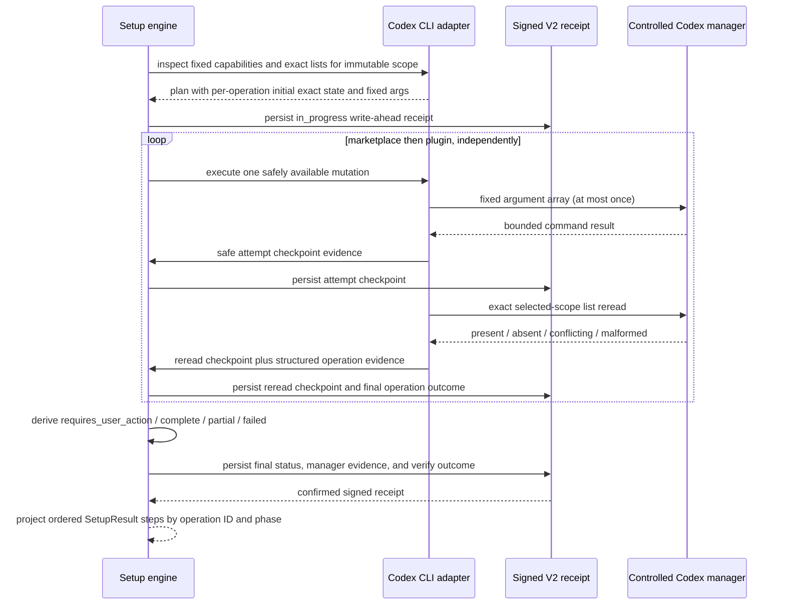

# Design: Codex Plugin Ingestion and Reporting Fix

## Technical Approach

Keep the selected Codex scope immutable from capability inspection through mutation, exact reread, receipt finalization, and result rendering. `src/setup/codex-cli.ts` will normalize command results into safe evidence, execute marketplace and plugin operations independently, and return structured per-operation evidence. `src/setup/engine.ts` will persist that evidence in the existing signed V2 receipt and project human/JSON steps from semantic operation IDs and checkpoint phases rather than from planned step names.

Exact selected-scope marketplace and plugin lists remain the only authority for registered, installed, and enabled state. Exit codes and sanitized diagnostics describe attempts and blockers but never establish state. Every safely invoked mutation is checkpointed before its exact reread; the reread is checkpointed before the next operation or aggregate status is derived. Marketplace failure does not suppress an independently safe plugin attempt.

The reproduced orphan is classified only when all of these hold:

- the initial exact marketplace list for the selected scope proves `EremesNG/thoth-mem` absent;
- the marketplace add uses the fixed, help-advertised argument array for the same selected scope;
- bounded command evidence matches the fixed `thoth-mem` different-source collision class;
- the post-attempt exact marketplace reread again proves the expected marketplace absent; and
- no exact-list change, conflicting source entry, malformed state, or scope mismatch appears between the observations.

That evidence identifies a stale manager-residue blocker, not ownership. Because the collision explicitly says `different source`, it does not prove that the residue belongs to this setup attempt or to `EremesNG/thoth-mem`. Therefore this design does **not** authorize automatic `marketplace remove`. Setup performs zero automatic cleanup, returns `requires_user_action`, and, only when capability inspection recognizes the selected-scope remove grammar, renders the fixed Codex-supported command as a bounded manual action. For the proven global Codex 0.144.0 grammar the command is `codex plugin marketplace remove thoth-mem --json`. Project scope renders the same recognized argument shape with a `<selected-project>` placeholder rather than a user-specific absolute home path. The user runs the command at most once and reruns setup; the new invocation performs a fresh exact preflight before any add. `--force` does not change this policy.

Handoff constraints preserved from clarification:

- exact selected-scope lists are authoritative and the selected scope never changes during an attempt;
- marketplace and plugin operations remain independent;
- `requires_user_action` outranks `partial` when ambiguity blocks a safe attempt or recovery; `partial` is used only when both requested operations were safely available/attempted and exactly one verifies;
- public statuses and step outcomes remain unchanged;
- command output, diagnostic, checkpoint-count, and receipt limits remain 64 KiB, 512 characters, 256 checkpoints, and 1 MiB;
- V2 is sufficient; there is no receipt version or public schema change;
- no direct Codex-state deletion, rename, rewrite, legacy fallback, real-home automated mutation, plugin-bundle change, topology change, or package-version change is introduced.

## Architecture Decisions

### Decision: Keep exact lists and immutable selected scope authoritative

**Choice**: Store the exact preflight state on each `CodexOperationPlan`, preserve `plan.scope` and its fixed argument arrays through execution, and classify final state only from `verifyState()` / `operationState()` results for those arrays. Diagnostics and hidden paths remain secondary evidence. Execute the plugin operation after the marketplace reread whenever the plugin command is independently safe for the same scope.

**Alternatives considered**: Treat nonzero output as final failure; infer success or ownership from the collision string or `.tmp` path; stop after the marketplace failure; switch to global verification when project verification is unavailable.

**Rationale**: The current exact parsers already distinguish present, absent, conflicting, and unclassifiable state. Reusing them preserves nonzero-then-verified success, prevents cross-scope promotion, and meets the clarified independence requirement without new public state values.

### Decision: Normalize command evidence by allowlisted synthesis, then truncate

**Choice**: Split `runSafe()` into explicit normalization stages:

1. `executeCommand()` captures combined stdout/stderr up to 64 KiB with `shell: false`; exceeding the byte limit kills the child and marks `outputTruncated`.
2. `normalizeCommandResult()` normalizes line endings and control characters in bounded in-memory output and derives only fixed metadata: reason, safe OS code, exit code, and an allowlisted failure class such as `different_source_marketplace_collision`.
3. Successful help/list stdout stays internal to strict grammar/list parsers and is never persisted or rendered.
4. Nonzero output is reduced immediately to a synthesized diagnostic from fixed capability, selected scope, failure class/exit code, and next action. Raw lines, arguments, URLs, config, environment content, unrelated entries, tokens, and absolute home prefixes are omitted rather than copied.
5. `redactSafeDiagnostic()` applies defense-in-depth replacements for authorization values, URL userinfo/query secrets, token-like key/value text, and known absolute prefixes.
6. `truncateSafeDiagnostic()` runs **after redaction**, caps the final JavaScript string length at 512, and reserves space for `… [truncated]` so omitted content is indicated without being echoed.

`SafeCommandResult` will return `reason`, `exitCode`, optional allowlisted `errorCode`, optional `failureClass`, and optional `safeDiagnostic`; it will never expose raw nonzero stdout/stderr to `executeCodexCli()`. Output-limit, timeout, and spawn-failure paths use fixed diagnostics and still trigger an exact reread after the attempt checkpoint because a safe invocation may have changed state before observation ended.

**Alternatives considered**: Persist redacted raw excerpts; truncate before redaction; keep current empty nonzero output; pass raw stdout/stderr to the engine for later filtering.

**Rationale**: Allowlisted synthesis retains the actionable collision class and exit code while making secret leakage and unrelated-entry leakage structurally harder. Redaction-before-truncation prevents a truncation boundary from exposing part of a secret and keeps all persisted/rendered evidence within the existing receipt validator.

### Decision: Return structured execution evidence and project steps by semantic ID

**Choice**: Extend the internal execution contract in `src/setup/codex-cli.ts` with evidence shaped as follows (names may be adjusted during implementation, semantics may not):

```ts
type CodexObservedState = 'present' | 'absent' | 'conflicting' | 'unclassifiable';
type CodexCheckpointPhase = 'attempt' | 'reread';

interface CodexOperationExecutionEvidence {
  id: 'codex-marketplace' | 'codex-plugin';
  initialState: CodexObservedState;
  safeAttempt: 'not_needed' | 'attempted' | 'blocked';
  commandReason: SafeCommandResult['reason'] | null;
  failureClass: SafeCommandResult['failureClass'] | null;
  diagnostic?: string;
  attemptCheckpoint: { persisted: boolean; outcome: SetupStepOutcome } | null;
  reread: { performed: boolean; state: CodexObservedState };
  rereadCheckpoint: { persisted: boolean; outcome: SetupStepOutcome } | null;
  finalOutcome: Exclude<SetupStepOutcome, 'planned'>;
  requiresUserAction: boolean;
}

interface CodexCliExecutionResult {
  status: SetupStatus;
  changed: boolean;
  operations: CodexOperationExecutionEvidence[];
  diagnostics: string[];
  manualActions: string[];
  checkpointsConfirmed: boolean;
}
```

The checkpoint callback gains an internal `phase` so the engine knows whether it is persisting attempt or reread evidence. A completed exit-zero attempt checkpoint is `confirmed`; a nonzero/timeout/output-limit/spawn attempt is `failed`. The exact reread checkpoint is `confirmed` only when the requested state is present, otherwise `failed`. `planned` remains limited to plan/write-ahead intent and never appears in a final mutating result.

`src/setup/engine.ts` will replace `externalByName`, `withFinalCodexManagerEvidence(...externalSteps)`, and blanket `planned -> confirmed` promotion with ID-based helpers such as `withExternalReceiptCheckpoint(phase, evidence)`, `withFinalCodexManagerEvidence(...operations)`, and `projectCodexExecutionSteps(scope, operations, finalStatus)`. The projector emits the existing ordered display rows for capability inspection, initial state, operation, checkpoint, reread, and final verification, but every outcome comes from structured evidence or the final signed receipt.

**Alternatives considered**: Continue mapping by human-readable names; add hidden suffixes to step names; infer checkpoint phases from status alone; add new public step outcomes.

**Rationale**: Semantic IDs and explicit phases prevent wording changes or unexecuted plan rows from manufacturing confirmation. The public `SetupResult` stays stable while internal evidence becomes precise enough for receipt and rendering consistency.

### Decision: Reuse the signed V2 ordered ledger without a schema change

**Choice**: Keep `SetupReceiptV2`, `SetupReceiptExternalCheckpoint`, the 256-entry limit, 512-character diagnostic validation, and 1 MiB receipt limit unchanged. Each attempted operation contributes exactly two ordered ledger entries with the same operation ID: attempt first, exact reread second. The internal callback phase controls projection but is not persisted; deterministic per-operation ordering provides the ledger interpretation. The external-command receipt step is finalized only from the reread evidence, and the `verify` step is finalized from the aggregate status. The final receipt contains no `planned` Codex operation or verification outcome.

The engine persists the final receipt before constructing `SetupResult`. `SetupResult.status`, diagnostics, manual actions, and ordered step outcomes are then projected from the same execution evidence and persisted receipt. `formatSetupResult()` remains unchanged: JSON serializes that object and human output renders the same object. A checkpoint failure stops further mutation and reports from the last valid signed receipt boundary without promoting later rows.

**Alternatives considered**: Introduce Receipt V3; add a persisted checkpoint-phase field; store raw command output; let human/JSON output be computed independently of the receipt.

**Rationale**: The existing V2 ledger already supports repeated ordered checkpoints and bounded diagnostics. Two deterministic entries per attempted operation are sufficient for attempt/reread evidence, avoid migration risk, and preserve V1/V2 reader compatibility.

### Decision: Keep orphan removal manual because provenance and concurrency authority are unproven

**Choice**: Extend marketplace capability inspection to recognize `remove` only from fixed help-advertised usage and selected-scope options, but never invoke it automatically in this change. The orphan state machine is:

1. `preflight`: exact selected-scope marketplace state captured.
2. `add_attempted`: fixed marketplace add invoked at most once.
3. `attempt_checkpointed`: safe attempt outcome durably persisted.
4. `reread_checkpointed`: exact selected-scope list result durably persisted.
5. `verified`: expected marketplace present; command exit remains diagnostic only.
6. `ordinary_failure`: absent without ownership/capability ambiguity; continue the independent plugin attempt and derive `failed`/`partial` normally.
7. `orphan_blocker`: stable exact absence plus recognized different-source collision; ownership remains unproven.
8. `manual_reconciliation_required`: return `requires_user_action`, include the selected scope, logical stale marketplace residue, exact-list absence, and the recognized supported remove command when available; perform zero remove/direct cleanup.
9. `ambiguous`: malformed/conflicting list, scope drift, or material pre/post state change; return generic `requires_user_action` inspection guidance and do not claim the orphan class.

There is no automatic reconciliation retry in this design: its automatic reconciliation budget is zero. The add mutation is attempted at most once per setup invocation; exact-list polling is observation, not mutation retry. If a later, separately specified change proves sufficient provenance, exclusive-manager, and immutable-scope evidence and enables automatic reconciliation, it MUST guard the supported remove mutation to at most one invocation followed by one exact post-remove reread, with no cleanup or retry loop. After the user runs the supported remove command once, a new setup invocation performs a fresh exact preflight, preserving the required pre/post boundary without assuming the manual command succeeded.

**Alternatives considered**: Automatically run `marketplace remove` after the collision; inspect and delete `.tmp` directly; trust a prior receipt or path name as ownership; run remove and retry add once under `--force`.

**Rationale**: Disposable Codex 0.144.0 evidence proves technical capability, but the collision's `different source` provenance does not prove cleanup authority or exclude concurrent/unrelated state. Manual Codex-owned removal is the only choice that preserves the clarified fail-closed contract without narrowing the accepted reconciliation goal.

### Decision: Verify only with controlled or disposable Codex state

**Choice**: Unit tests use the injected executor and virtual time. Packed-flow tests use a controlled Codex launcher, a disposable `CODEX_HOME`, disposable project paths, credential-scrubbed environment, and an isolation assertion that rejects the active real Codex home before any command. The orphan fixture may create `.tmp/marketplaces/thoth-mem` only beneath that disposable home. No automated test invokes a real installed Codex manager against a personal/global home.

**Alternatives considered**: Mock only the final result; use the developer's Codex installation; reproduce the orphan under the repository or real home; require ambient credentials.

**Rationale**: Controlled execution can prove command ordering, exact-state precedence, privacy bounds, manual recovery, and packed-artifact behavior deterministically while preserving user state and CI portability.

## Data Flow



Status derivation is deterministic:

1. `requires_user_action` if any requested operation was blocked before safe attempt, any exact state is conflicting/unclassifiable in a way that blocks recovery, or the classified orphan lacks cleanup authority.
2. Otherwise `complete` when both requested exact states are present.
3. Otherwise `partial` when exactly one is present and the other was safely attempted and reread without a manual-recovery ambiguity.
4. Otherwise `failed` when neither is present after all safely available attempts.
5. Receipt checkpoint failure returns `failed`, stops further mutation, and points to the last valid signed receipt.

## File Changes

| Path | Change | Symbols / responsibility |
| --- | --- | --- |
| `src/setup/codex-cli.ts` | Modify | `SafeCommandResult`, `CodexOperationPlan`, `CodexCliPlan`, `CodexExternalCheckpoint`, `CodexCliExecutionResult`, `inspectMarketplaceGrammar`, `inspectOperationGrammar`, `executeCodexCli`, `runSafe`, diagnostic helpers, exact-state/reconciliation classification, fixed manual remove command rendering. |
| `src/setup/engine.ts` | Modify | `withExternalReceiptCheckpoint`, `withFinalCodexManagerEvidence`, `executeCodexSetup`; add ID/phase-based final receipt and `SetupResult` projection; remove Codex name-based/blanket planned promotion. |
| `tests/setup/codex-cli.test.ts` | Modify | Controlled executor remove help/orphan fixtures; redaction/output-limit, nonzero-then-verified, independence, status precedence, checkpoint order, no automatic remove, force, concurrency/scope, and exact manual command tests. |
| `tests/setup/engine.test.ts` | Modify | Human/JSON/signed-receipt agreement, truthful auxiliary step projection, checkpoint failure, and final-receipt no-`planned` assertions. |
| `tests/packaging/packed-install.test.ts` | Modify | Disposable `CODEX_HOME` orphan reproduction, real-home isolation guard, controlled manual remove/rerun flow, and untouched outside sentinel. |

Reviewed compatibility surfaces that remain unchanged:

- `src/setup/types.ts`: no new `SetupStatus`, `SetupStepOutcome`, `SetupResult`, or exit code.
- `src/setup/receipt.ts`: no V3, no new persisted key, and no limit change; existing V2 ledger/validators remain authoritative.
- `src/cli.ts`: `formatSetupResult()` continues rendering the single evidence-backed `SetupResult` object for both human and JSON output.
- `.agents/plugins/marketplace.json`, `integrations/codex/**`, `integrations/inventory.json`, and `package.json`: current v0.3.7 bundle, flat MCP/hooks topology, marketplace identity, inventory, and package version are unchanged.

Created: `openspec/changes/codex-plugin-ingestion-reporting-fix/design.md` only. Deleted files: none.

## Interfaces / Contracts

- Public setup result and exit-code contracts remain unchanged.
- `CodexCommandResult` remains the executor boundary with bounded captured stdout/stderr. The normalization boundary prevents raw nonzero output from crossing into execution evidence.
- `CodexCliPlan` gains internal initial exact state and optional recognized marketplace-remove/manual-action capability. Its scope and argument arrays are immutable after inspection.
- `CodexExternalCheckpoint` gains internal phase information; `SetupReceiptExternalCheckpoint` does not change.
- `executeCodexCli()` returns per-operation evidence keyed by `codex-marketplace` / `codex-plugin`. Engine projection never joins by display name.
- Receipt checkpoint order for each attempted operation is exactly attempt then reread. A dependent/next operation starts only after the reread checkpoint persists.
- Diagnostics reaching `SetupResult`, manual actions, receipt steps, or external checkpoints are synthesized/redacted first and capped at 512 characters. Raw successful list/help output is parser-local; raw nonzero output is discarded after classification.
- The fixed manual remove command is rendered only when remove usage and selected-scope options were recognized from help. Unknown or conflicting grammar falls back to bounded `/plugins` inspection guidance.
- No route transition to `legacy_filesystem` is allowed after `plugin_manager` selection, including collision, checkpoint failure, or manual reconciliation.

## Testing Strategy

### Focused unit and integration tests

`tests/setup/codex-cli.test.ts` will cover:

- collision output containing tokens, authorization text, URL credentials, raw config, unrelated entries, and absolute home paths produces only the fixed collision diagnostic (<=512), exact scope, and bounded next action;
- combined output beyond 64 KiB produces the fixed output-limit diagnostic, discards raw bytes, still performs/checkpoints an exact reread, and lets a present state confirm the operation;
- nonzero add followed by exact present remains confirmed on result and receipt evidence;
- initial absent + collision + post absent classifies the blocker, attempts the plugin independently when safe, returns `requires_user_action`, and never calls remove;
- one exact success plus one ordinary safely attempted failure is `partial`, while the same one-success case plus orphan ambiguity is `requires_user_action`;
- malformed/conflicting or materially changed pre/post state does not claim the orphan class or removal authority;
- recognized global remove help renders `codex plugin marketplace remove thoth-mem --json`; project help renders the selected-scope template; unavailable/unknown grammar does not invent a command;
- `--force` does not call remove, change scope, create direct cleanup authority, or activate legacy files;
- attempt checkpoint precedes every exact reread, reread checkpoint precedes the next mutation, checkpoint failure halts, and final mutating evidence contains no `planned` operation outcome;
- pre-existing verified operations remain confirmed without mutation, and exact state from another scope never counts.

`tests/setup/engine.test.ts` will cover:

- ordered marketplace/plugin operation, checkpoint, reread, and final-verification rows use the structured evidence outcomes rather than plan names;
- failed/unexecuted auxiliary rows remain `failed`, `skipped`, or `unavailable` and are never blanket-confirmed;
- final `SetupResult.status`, JSON, human text, V2 receipt status, external checkpoint order, receipt external-command outcomes, and verify outcome agree;
- a failed attempt checkpoint or reread checkpoint stops later mutation and leaves the last signed receipt as the recovery boundary;
- V2 receipts remain within 256 checkpoints/1 MiB and every diagnostic is <=512.

### Packed-flow isolation

`tests/packaging/packed-install.test.ts` will extend the controlled Codex fixture so an orphan directory exists only under a disposable `CODEX_HOME`, the exact list remains absent, add emits the recognized collision, and remove is help-advertised. Setup must return exit code 3, preserve the orphan, emit the bounded manual command, and leave an outside sentinel unchanged. The test may invoke the controlled remove command directly once, verify exact absence, rerun packed setup, and require exact marketplace/plugin success. A guard compares normalized/resolved test targets against the active real Codex home and fails before manager/filesystem mutation if they overlap. Credentials remain scrubbed and no source checkout is required.

### Verification commands

Run the narrowest tests first, then the repository gates:

```text
pnpm test -- tests/setup/codex-cli.test.ts
pnpm test -- tests/setup/engine.test.ts
pnpm test -- tests/packaging/packed-install.test.ts
pnpm run build
pnpm test
```

## Migration / Rollout

- No data, SQLite, MCP, public CLI, plugin asset, receipt-version, or package-version migration is required.
- Existing V1 and V2 receipts retain their original claims and readers. New executions use the same V2 schema with stricter finalization/projection semantics.
- In-progress older V2 receipts remain recovery boundaries; the implementation does not reinterpret old planned checkpoints as confirmed.
- Rollout is code-and-test only. If collision classification proves unstable, fall back to the generic bounded `requires_user_action` path; do not add automatic cleanup.
- The manual remove guidance is capability-gated. Unknown Codex versions/grammar fail closed and receive generic selected-scope inspection guidance.
- The current v0.3.7 bundle and flat MCP/hooks/marketplace topology remain unchanged because clean Codex 0.144.0 ingestion already proves them valid.

## Constitution Check

`openspec/config.yaml` enables enforcement. The design was checked against every principle in `openspec/memory/constitution.md`:

| Principle | Result | Evidence |
| --- | --- | --- |
| P1 — Compact, Workflow-Level MCP Surface | PASS | No MCP tool is added, removed, or re-registered; work is confined to setup CLI internals and tests. |
| P2 — Deterministic-First Retrieval With Safe Degradation | PASS | Retrieval code and fallback lanes are untouched. Setup failure classification is deterministic and fails closed rather than simulating success. |
| P3 — Harness-Agnostic Memory Contract | PASS | Storage/MCP/lifecycle contracts are unchanged; Codex-specific grammar remains at the setup adapter boundary, unsupported capability is explicit, and unrelated harnesses are unchanged. |
| P4 — Token-Efficient, Bounded Recall Outputs | PASS | Recall behavior is untouched. New setup diagnostics are more tightly bounded (64 KiB capture, 512-character safe projection) and no unbounded output is introduced. |
| P5 — Stable Public Contract With Explicit Deprecation Discipline | PASS | Existing setup statuses, step outcomes, exit codes, JSON/human fields, receipt versions, CLI command names, and plugin identity remain compatible. No deprecation is required. |

No constitution violation or override is required. Evidence-led verification is provided by focused controlled executors, signed receipt assertions, packed disposable-home coverage, build, and full tests. OpenSpec-only persistence is respected; no thoth-mem artifact is written.

## Open Questions

None. Automatic reconciliation is explicitly excluded for this change because source provenance and exclusive manager authority are not proven. The supported Codex remove operation is exposed only as bounded manual recovery, and a fresh setup rerun supplies the authoritative post-action verification.
