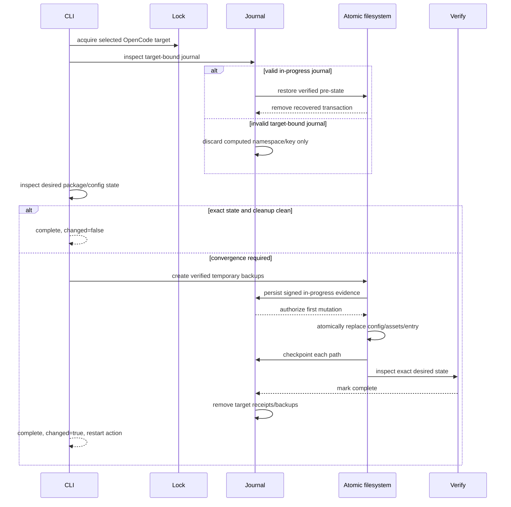

# Implementation Plan: OpenCode managed setup convergence

## Technical context

`inspectAndPlanSetup()` currently treats OpenCode state as managed only when canonical metadata has the running package version and all config/assets match exactly. Any stale or malformed metadata becomes a non-forceable conflict before `executeOpenCodeSetup()` can use the existing atomic filesystem transaction. Successful OpenCode mutations retain signed V1 receipts and backups for public rollback, while any invalid receipt in the shared receipt base blocks all setup.

The change makes the executing package authoritative for both global and project OpenCode scopes while leaving Codex and Claude Code behavior untouched. Exact desired state remains the no-op predicate, but every other canonical OpenCode state converges automatically. OpenCode mutation will use a target-bound temporary signed journal for crash recovery, remove durable rollback evidence after verification, repair configuration under the confirmed precedence rules, replace links without following them, and preserve the existing `SetupResult` JSON shape and exit-code mapping.

Primary route: `docs/agent/managed-delivery.md`, with `engineering.md`, `testing.md`, and `surfaces.md` overlays. No network lookup, real-home mutation, release, or generated `dist/` edit is authorized.

## Constitution Check (pre-design)

- **P1 — Compact, Workflow-Level MCP Surface**: PASS — the change touches only CLI setup internals and adds no MCP tool or registration.
- **P2 — Deterministic-First Retrieval With Safe Degradation**: PASS — retrieval, indexing, and semantic fallback behavior are not touched.
- **P3 — Harness-Agnostic Memory Contract**: PASS — OpenCode-specific ownership remains at the setup adapter boundary and does not enter memory requests, storage, or lifecycle semantics.
- **P4 — Token-Efficient, Bounded Recall Outputs**: PASS — recall output contracts are unaffected.
- **P5 — Stable Public Contract With Explicit Deprecation Discipline**: JUSTIFIED EXCEPTION — command names, request flags, result fields, statuses, and exit codes remain stable, but the user explicitly selected destructive OpenCode convergence and removal of post-success rollback evidence without a compatibility period. The exception is confined to OpenCode setup state; Codex/Claude receipts and explicit historical rollback validation remain unchanged until a successful OpenCode convergence removes receipts bound to that target.

## Design

### 1. Separate exact-state verification from OpenCode mutation authority

`src/setup/engine.ts` will keep exact current metadata/config/assets/plugin equality as the only `managed=true` no-op. For OpenCode only, metadata absence, schema/version mismatch, malformed metadata, target kind mismatch, and same-version drift will become convergence reasons rather than ownership conflicts. `--force` will not be required and will not change the OpenCode plan. Codex inspection and proof rules remain on their current branch.

`SetupInspection` will carry the selected OpenCode config path and bounded convergence facts needed by plan and execution; it will never include raw config or asset content. Config candidate selection will prefer `opencode.jsonc` whenever it exists, including when `opencode.json` also exists. Missing source assets or an unsafe target boundary will still fail before recovery state or target mutation.

### 2. Make OpenCode configuration repair explicit

`src/setup/harnesses/opencode.ts` will expose a deterministic convergence plan:

- a parseable object preserves unrelated root settings and normalizes only `mcp.thoth-mem`;
- a parseable non-object `mcp` value is replaced by the canonical managed object while other root settings remain;
- malformed or non-object root input is classified for full recreation rather than leaked through diagnostics;
- an exact canonical owned value remains unchanged.

For malformed/non-object-root input, `src/setup/engine.ts` will add a transaction-owned durable backup file at a non-colliding sibling path derived from the transaction id, with owner-only permissions where enforceable. The byte-exact backup is created as part of the same atomic change set, removed again if the transaction fails, retained after success, and disclosed only by path. The selected config is then recreated as minimal valid JSON/JSONC containing canonical `mcp.thoth-mem`. When both candidates exist, only JSONC changes and JSON remains untouched.

### 3. Extend the filesystem transaction for authoritative kind replacement

`src/setup/filesystem.ts` will add an opt-in replacement mode used only by OpenCode convergence. Default callers keep the current same-kind and no-link rules.

The opt-in path will:

- accept missing, file, directory, or link/junction state at a canonical managed target;
- validate containment using the real parent while never resolving through the final link entry;
- snapshot and back up links by their raw link identity without reading or mutating the destination;
- preserve link entries when backing up an old managed directory, while continuing to reject links in packaged source trees;
- allow staged file/directory content to replace a different prior entry kind;
- restore the exact prior entry kind and bytes/link identity on any in-process failure;
- retain existing pre-state race checks, atomic sibling rename, post-write snapshot verification, bounded diagnostics, and fault injection.

This supports complete replacement of `.thoth-mem` and `plugins/thoth-mem.js`, including unlinking a managed symlink/junction and creating a normal packaged entry.

### 4. Reuse signed V1 evidence as a target-bound temporary journal

OpenCode setup will reuse `SetupReceiptV1` step evidence instead of introducing a second receipt schema, but new temporary journals will live in a target-bound namespace:

- global: `<dataDir>/setup/opencode-journals/<target-hash>/<transaction-id>/receipt.json`;
- project: `<targetRoot>/.thoth/setup/opencode-journals/<target-hash>/<transaction-id>/receipt.json`.

The target hash is derived from the canonical selected target, never from untrusted metadata. `src/setup/receipt.ts` will allow an explicit key path so OpenCode journals use a dedicated key under their target-bound journal namespace and cannot rotate or invalidate the shared key used by existing Codex/Claude/legacy receipts.

The journal is persisted after verified backups and before the first target mutation, checkpointed after every changed path, and marked complete only after exact OpenCode post-state verification. An optional `config-backup` filesystem step records malformed-config quarantine creation. Public `SetupResult.receipt` remains `null` after successful cleanup.

### 5. Recover or reset journals before inspection-driven mutation

Under the existing setup target lock, `src/setup/engine.ts` will process the target-bound OpenCode journal namespace before normal convergence:

1. If a single valid in-progress journal is bound to the selected harness/scope/canonical target and all pre-state backups verify, restore its complete pre-state and remove that transaction tree.
2. If a journal, key, topology, backup, or binding is invalid or ambiguous, remove only the computed target-bound journal namespace and dedicated key without following receipt contents, then force a fresh canonical convergence.
3. If a valid complete journal remains because cleanup previously failed, do not restore it; verify/repair current desired state and retry cleanup.
4. Never use an untrusted embedded path to select a deletion target.

Existing valid legacy OpenCode receipts in the shared receipt base may be read for bounded target matching and post-success cleanup. Invalid legacy receipts that cannot be securely bound are not followed or allowed to block OpenCode convergence; they remain isolated and produce at most a bounded cleanup warning. Codex and Claude continue using strict shared-receipt scanning.

### 6. Verify first, then remove target rollback evidence

After mutation, `inspectSetup()` must verify exact current metadata, complete packaged directory contents, canonical plugin entry, and canonical owned config. Only then will a target-bounded cleanup helper in `src/setup/receipt.ts` remove:

- the current OpenCode journal and temporary backups;
- other target-bound OpenCode journal residue;
- every valid historical receipt/backup in the shared receipt base whose signed harness, scope, and canonical target match.

Cleanup never deletes another harness, scope, or target and never deletes the durable malformed-config backup. Cleanup failure does not invalidate an already verified installation: the result remains `complete`, includes a bounded warning, returns `receipt: null`, and a later setup retries cleanup before returning a clean no-op. Cleanup-only mutation does not set `changed=true` or request a host restart.

A changed successful install returns `complete`, `changed=true`, and a manual action to restart OpenCode. An exact no-op returns `complete`, `changed=false`, creates no journal, and has no restart action. Human and JSON rendering continue through the existing `SetupResult` fields.

### 7. Preserve plan-only and harness isolation

Plan mode uses only inspection and deterministic path derivation. It reports full asset replacement, plugin-entry replacement, config merge/recreation and backup, temporary journaling, receipt cleanup, and restart when applicable, but creates no directory, key, receipt, backup, or config change. OpenCode-specific recovery and permissive ownership branches are guarded by `request.harness === 'opencode'`; Codex and Claude tests must prove no behavior drift.

### Transaction sequence

### Requirement mapping

| Requirement | Technical decision | Files/interfaces | Verification seam |
| --- | --- | --- | --- |
| FR-001, FR-002 | OpenCode exact equality is no-op; every other canonical state is convergence without force | `src/setup/engine.ts` (`inspectSetup`, `inspectAndPlanSetup`) | Global/project engine fixtures for older/newer/missing/malformed/current drift |
| FR-003 | Opt-in cross-kind, link-safe whole-target replacement | `src/setup/filesystem.ts` (`FilesystemChange`, backup/snapshot/restore helpers) | Real filesystem tests with files, directories, symlinks/junctions, and removed extras |
| FR-004 | JSONC precedence, parseable semantic merge, malformed durable quarantine and recreation | `src/setup/harnesses/opencode.ts`, `src/setup/engine.ts` | Managed-config plus transaction tests; secret content absent from diagnostics |
| FR-005, FR-006 | Target-bound signed V1 temporary journal, dedicated key, automatic restore/reset | `src/setup/engine.ts`, `src/setup/receipt.ts` | Receipt/filesystem fault matrix and simulated process-interruption fixtures |
| FR-007, FR-008 | Verify-before-cleanup; target-matched purge; success warning and retry on cleanup failure | `src/setup/engine.ts`, `src/setup/receipt.ts`, `src/setup/types.ts` only if internal result evidence needs extension | Cleanup fault tests, receipt isolation tests, cleanup-only repeated run |
| FR-009 | Existing result schema with deterministic steps/diagnostics/manual restart action | `src/setup/engine.ts`, `src/cli.ts` rendering unchanged unless tests expose a gap | `tests/cli.test.ts`, plan snapshots, human/JSON agreement |
| FR-010 | Packed prior/newer/missing/diverged targets converge from tarball only | `tests/packaging/packed-install.test.ts` and fixtures | Isolated global/project packed-install scenarios and immediate no-op rerun |
| FR-011 | Source inventory and canonical boundary preflight precede all mutation | `src/setup/engine.ts`, `src/setup/filesystem.ts` | Missing source/escape/link-boundary tests assert zero journal and zero writes |

### Success criterion mapping

| Criterion | Evidence plan |
| --- | --- |
| SC-001 | Focused OpenCode engine matrix for 2 scopes and all named drift classes, followed by exact no-op assertions |
| SC-002 | Existing filesystem/receipt fault points plus recovery fixtures that compare pre/post snapshots byte-for-byte |
| SC-003 | Config planner/engine tests for JSONC precedence, unrelated settings, malformed backup, minimal recreated config, and canonical MCP state |
| SC-004 | Receipt directory assertions after success, injected cleanup failure warning, and later cleanup-only retry |
| SC-005 | Fake-filesystem plan tests prove zero writes; CLI tests compare human and JSON status/manual actions |
| SC-006 | Packed tarball installed into disposable homes/projects, converged without source checkout, then rerun once as no-op |
| SC-007 | Focused tests, `pnpm run integration:verify`, `pnpm run build`, and `pnpm test` |

## Optional support artifacts

- `research.md`: Not needed; repository source, tests, and existing transaction/receipt contracts resolve the design questions without external technology selection.
- `data-model.md`: Not needed; the design reuses signed `SetupReceiptV1` evidence transiently and adds no durable application data model.
- `contracts/`: Not needed; `SetupRequest`, `SetupResult`, CLI command names, JSON fields, statuses, and exit codes remain structurally unchanged.
- `quickstart.md`: Not needed; operator syntax remains `thoth-mem setup opencode` and changed results provide the restart action.

## Risks and migrations

- **Destructive managed ownership**: the complete `.thoth-mem` target and canonical plugin entry may contain edits or foreign files. This deletion is the explicitly confirmed product rule. Containment, target locking, link non-traversal, plan mode, and isolated tests limit the blast radius.
- **Intentional downgrade**: any version mismatch converges to the executing package. Diagnostics identify current convergence without blocking version direction; users control the desired version by choosing the executable package.
- **No post-success rollback**: OpenCode receipts/backups are removed after verification. Temporary evidence covers in-process and crash recovery only; the retained malformed-config quarantine is the sole explicit user-data recovery exception.
- **Legacy receipt migration**: valid historical OpenCode receipts matching the target are removed only after successful verification. Unbindable invalid shared receipts are never followed and cannot block OpenCode, but may remain as bounded cleanup residue.
- **Shared infrastructure regression**: filesystem and receipt changes are opt-in/default-preserving; focused Codex/Claude setup and rollback suites guard their existing strict ownership behavior.
- **Link restoration portability**: Windows junction and POSIX symlink behavior differs. The implementation stores raw link identity, does not traverse destinations, and uses platform-appropriate isolated tests; inability to create a verified temporary backup aborts before mutation.
- **Malformed config sensitivity**: the durable backup may contain secrets. It is never rendered, receives owner-only permissions where enforceable, and only its safe path is reported.
- **Cleanup after verified success**: cleanup faults return success with warning by explicit decision. Residue remains target-bounded and is retried on the next setup run.
- **Durable spec migration**: archive must add OpenCode-specific ownership, receipt, rollback, and packed-convergence requirements to `openspec/specs/cli/spec.md` and `openspec/specs/packaging/spec.md` while preserving existing Codex/Claude requirements and scenarios.
- **Rollback of this code change**: revert source/tests before release. Runtime setup itself intentionally has no durable post-success OpenCode rollback; failed or interrupted mutation uses the temporary journal path described above.

## Constitution Check (post-design)

- **P1 — Compact, Workflow-Level MCP Surface**: PASS — design changes no MCP registration or workflow tool.
- **P2 — Deterministic-First Retrieval With Safe Degradation**: PASS — no retrieval path is involved.
- **P3 — Harness-Agnostic Memory Contract**: PASS — every permissive behavior is guarded at the OpenCode setup boundary; memory/storage contracts and other harness adapters remain unchanged.
- **P4 — Token-Efficient, Bounded Recall Outputs**: PASS — no recall output or limit changes.
- **P5 — Stable Public Contract With Explicit Deprecation Discipline**: JUSTIFIED EXCEPTION — the design preserves CLI syntax, result shape, statuses, exit codes, and bounded diagnostics but intentionally changes OpenCode ownership and successful rollback availability per the confirmed decision map. Exact scope, destructive consequences, tests, durable spec delta, and release risk are explicit rather than hidden.
