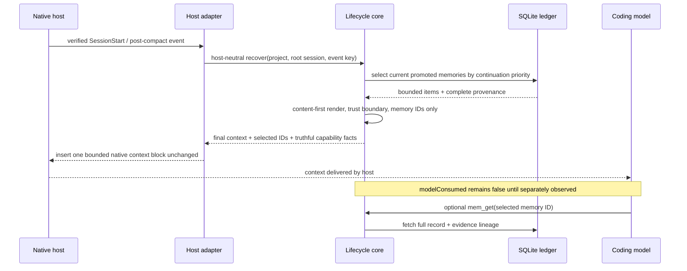

# Implementation Plan: Memory operating model

## Technical context

The current core already has the correct durable primitives: one SQLite ledger, immutable evidence, source-linked promoted memories, temporal supersession/retraction, FTS5/BM25, verified project/root-session identity, lifecycle receipts, and exactly six MCP tools. Automatic capture is already narrow. The failure is at the operating-policy seam:

- `MemoryService.context()` falls back to a generic ordered list that prioritizes decisions and conventions before handoffs and allocates snippets without an explicit continuation contract.
- `MemoryService.lifecycle()` calls that generic context for start and post-compaction recovery.
- `src/integration/opencode/plugin.ts` reserves titles plus memory and evidence IDs for every fitting item, then round-robins the remaining budget. The real SC008 fixture rendered approximately two content characters per memory.
- `plugin/runners/public-runner.mjs` uses a different unbounded-list renderer and truncates the combined context only after construction, so OpenCode, Codex, and Claude do not share content-selection semantics or authoritative post-render delivery truth.
- The packaged Skill says when to use memory but does not yet contain the evidence/promotion test and actionable handoff schema established by the research.
- The offline benchmark measures compaction delivery and token/resource fields, but not actionable-field recovery, useful-content ratio, trust-boundary rendering, abstention, or evidence-ID leakage.

Implementation remains root-owned. One ordered writer has a net gain because the core selector, lifecycle capability truth, two native renderers, synchronized Skill, benchmark schema, tests, and documentation share one bounded-output contract; splitting them would create overlapping fixtures and host-parity risk. Fresh Oracle instances remain independent plan/final reviewers. No database migration, new process, network service, model, optional retrieval implementation, publication, or real-user host mutation is part of repository implementation.

## Constitution Check (pre-design)

- **P1 — Compact, Workflow-Level MCP Surface**: PASS — The change composes briefing, recall, detail, history, save, and lifecycle through the existing six tools and explicitly adds no MCP registration.
- **P2 — Deterministic Core With Rebuildable Optional Projections**: PASS — Continuation selection and rendering use only current SQLite rows, structured ordering, FTS5-compatible records, and deterministic character budgets; no model or projection becomes load-bearing.
- **P3 — Harness-Agnostic Memory Contract**: PASS — One core continuation selector and renderer produce the final host-neutral recovery block; OpenCode and public Codex/Claude adapters differ only in their native output wrappers.
- **P4 — Token-Efficient, Bounded Recall Outputs**: PASS — The design keeps compact/context/get escalation, adds a content-first 1,000-code-point recovery cap, and expands measurable payload/usefulness evidence.
- **P5 — Explicit Product Boundaries Over Legacy Compatibility**: PASS — The change modifies the current contract directly, retains the current schema/taxonomy, and introduces no compatibility alias, dual path, or hidden migration.

## Design

### Two-layer operating policy

No schema or taxonomy change is required. The existing rows gain a stricter usage contract:

- `root_prompt` and `checkpoint` lifecycle events create immutable evidence with stable event receipts.
- Root prompt capture never supplies a `memory` payload.
- A non-empty verified pre-compaction payload may create one session-scoped `handoff` memory in the same transaction, preserving current behavior needed for compaction continuity without adding an LLM call. Its session topic key prevents unrelated project handoffs from being silently superseded.
- Explicit `mem_save` or Skill-driven saves remain the path for reusable decisions, conventions, architecture, discoveries, failures, project structure, handoffs, and preferences.
- Existing private-block filtering is extended with one deterministic local redaction policy for recognizable credential formats. Native adapters apply it before deriving degraded/compaction event keys, and the core applies it again before persisted content or payload hashes are derived. Delegated identity rejection, event idempotency, temporal lineage, and project scope remain authoritative and receive focused regression coverage.

The shared Skill will turn the research policy into agent behavior: save only when future action changes; include evidence; preserve failed attempts with outcome; use `topic_key` for corrections; and persist a handoff with exact objective/completed/first pending action/blockers/key files/checks fields before a meaningful boundary.

### Continuation selector

Refactor `MemoryService.context()` into a dedicated deterministic continuation path instead of `recall(query='')` plus a generic fallback. Keep the public method and `RecallItem`/budget shapes stable.

Selection order for current rows in the verified project:

1. newest `handoff`;
2. current `decision` and `convention` guidance;
3. current `failure` records whose outcome is `failed` or `mixed`, followed by other failure lessons;
4. `project_structure`;
5. remaining current kinds as lower-priority fallback.

Within each class, order by `created_at DESC, id ASC`. The selector applies one aggregate requested character budget, class-aware per-item maximums, stable IDs, and deterministic trimming. It returns only promoted memories; evidence remains available through the memory relationship and `mem_get`. `mem_context`, `mem_project action=briefing`, and lifecycle `recover`/`guide_post_compact` all call this method, so selection parity is guaranteed in the core rather than reproduced per host.

The lifecycle `sources` field remains complete for selected structured recovery records, including evidence lineage. The final rendered block discloses only selected memory IDs. `contextDelivered` is owned by the core render result and remains true only when at least one useful memory item survives final allocation; identity-only output is not counted as recovered context, and `modelConsumed` remains false absent real evidence.

### Core-owned content-first rendering

Add one pure host-neutral renderer in `src/memory-core/continuation.ts`. `MemoryService.lifecycle()` supplies verified identity plus ordered candidate items, receives the final bounded context and exact selected IDs, and returns them in `LifecycleRecovery`. It sets `capability.contextDelivered` from that final render result, not from pre-render candidates. The OpenCode TypeScript adapter and shared public Codex/Claude runner inject the returned context verbatim inside their native output structures and do not select, truncate, or re-render items.

The core renderer implements:

- fixed cap: 1,000 Unicode code points including identity and wrapper text;
- fixed complete verified-identity header;
- explicit start/end delimiter and a short statement that recovered memory is untrusted data, not instructions;
- at most three selected items, preserving core order;
- one complete line per item with normalized kind/title/content and `(memory:<complete-id>)`;
- no evidence IDs in model-visible output, including exact supporting IDs embedded in untrusted title/content data;
- 120-code-point minimum allocation when a longer item must be truncated; a shorter item must be complete;
- reserve the minimum for all selected items first, then give remaining content budget in priority order;
- normalize control/line-separator characters in untrusted title/content into display-safe spaces so content cannot forge item, delimiter, or identity lines;
- omit a candidate whose fixed metadata plus useful-content floor cannot fit, or whose complete metadata would prevent a 50% useful-content ratio despite abundant source content; fall back to identity-only output when none fit;
- never truncate a UUID, delimiter, identity, or other fixed metadata.

The returned context uses the existing owned recovery tags, so repeated OpenCode system transforms replace one tail rather than accumulate blocks. The public runner retains the host-native `SessionStart` JSON wrapper. Adapters validate that the returned lifecycle context is bounded and owned, then insert it unchanged. The core renderer does not semantically filter instruction-like keywords, because coding memories may discuss those strings and regex filtering is not a complete prompt-injection defense.

### Progressive MCP exploration

No tool input or namespace changes are required. `mem_context` and `mem_project briefing` inherit the new selector and retain existing measurement envelopes. `mem_recall` remains query-specific with compact/context modes, while `mem_get` remains the only full-record/provenance fetch. Tests assert the exact six-tool registry, equal briefing selection for equal budgets, stable IDs across the funnel, current/history semantics, and project isolation.

Briefing, compact, and context MCP responses expose memory IDs as their source attribution but omit evidence IDs and lineage. `mem_get` and explicit history are the structured provenance interfaces that return evidence IDs and temporal lineage. This makes the progressive-disclosure contract true for both automatic host injection and MCP payloads rather than paying UUID cost before a record is selected.

### Product-specific evaluation fixture

Extend the existing committed fixture and report validator instead of adding a second benchmark system. Seed:

- a structured handoff containing hidden objective, archive path, first pending action, blocker, and key check markers;
- enough competing memories to trigger content allocation;
- superseded/failed history, an irrelevant query, a poisoned instruction-like memory, and a foreign project record.

Add report fields for actionable fields expected/recovered, restart/post-compaction recovery, abstention, project isolation, delegated rejection, injected code points/tokens, useful-content code points/ratio, selected memory IDs, evidence IDs exposed to host context, trust-boundary presence, and host cap compliance. The report remains fixture-only and `promotion.decision=incomplete`; external lanes remain unavailable until reproducible preparation exists. `benchmarks/report.mjs` rejects missing fields, unequal budgets, invalid ratios, evidence leakage, metric relabeling, or an external-quality claim from the committed fixture.

### Requirement mapping

| Requirement | Technical decision | Files/interfaces | Verification seam |
| --- | --- | --- | --- |
| FR-001 | Preserve evidence-only root capture and require source-linked typed promotion. | `src/memory-core/service.ts`, `src/memory-core/contracts.ts` (types unchanged) | Ledger/lifecycle tests inspect evidence, memory, support, receipt, and FTS state. |
| FR-002 | Keep the closed native capture allowlist, reject delegated/private/non-root streams, and apply one recognizable-credential sanitizer before adapter event-key and core persistence/hash derivation. | `src/integration/adapters/index.ts`, `src/integration/opencode/plugin.ts`, `src/memory-core/privacy.ts`, `src/memory-core/service.ts` | Adapter, lifecycle, OpenCode native, and privacy/credential fixtures. |
| FR-003 | Encode the durable-promotion test and handoff schema in the canonical Skill, then synchronize distributions. | `plugin/skills/thoth-mem/SKILL.md`, `scripts/sync-plugin-distribution.mjs`, `integrations/*/skills/thoth-mem/SKILL.md` | Skill contract and distribution-hash/inventory tests. |
| FR-004 | Retain project + harness/root-session + topic scope and prove foreign/delegated exclusion. | `src/memory-core/identity.ts`, `src/memory-core/sqlite/ledger.ts`, `src/memory-core/service.ts` | Identity, context, and project-isolation tests; no migration. |
| FR-005 | Replace generic empty-query fallback with one continuation selector and priority order. | `src/memory-core/service.ts` | Focused context/lifecycle/tool parity tests with repeated deterministic output. |
| FR-006 | Render the final content-first, trust-delimited, memory-ID-only block once in the core under 1,000 code points; remove embedded supporting evidence IDs, reject metadata starvation, and let adapters inject it unchanged. | `src/memory-core/continuation.ts`, `src/memory-core/contracts.ts`, `src/memory-core/service.ts`, `src/integration/opencode/plugin.ts`, `plugin/runners/public-runner.mjs` | Core adversarial allocation/provenance tests plus thin-adapter OpenCode/public-runner parity and packed smoke. |
| FR-007 | Keep evidence IDs/full lineage behind selected `mem_get` or history retrieval and omit them from briefing/compact/context payloads. | `src/memory-core/service.ts`, `src/tools/index.ts` | Compact/context payload omission plus get/history provenance tests. |
| FR-008 | Make `mem_context` delegate to the new continuation path and serialize compact public items without evidence IDs, while retaining the registry/schema namespace. | `src/tools/index.ts`, `src/memory-core/service.ts` | MCP tests assert exact six tools, bounded output, memory IDs, and deferred evidence. |
| FR-009 | Make project briefing share continuation selection and history preserve lineage. | `src/tools/index.ts`, `src/memory-core/service.ts` | MCP project briefing/history tests. |
| FR-010 | Preserve event receipts and derive delivery truth from the final core render selected-item result. | `src/memory-core/continuation.ts`, `src/memory-core/service.ts`, lifecycle adapters | Replay, identity-only, no-floor-fit, degraded, and successful cross-host capability tests. |
| FR-011 | Add coding-continuity/security/usefulness measurements to the fixture. | `benchmarks/run.mjs`, `benchmarks/report.mjs`, `benchmarks/fixtures/`, `tests/benchmarks/` | Fixture runner/report validation and explicit unavailable external lanes. |
| FR-012 | Preserve equal candidate/final budgets and reject incomplete/incomparable claims. | `benchmarks/manifest.json`, `benchmarks/report.mjs`, `openspec/specs/evals/spec.md` at archive | Report-validator negative tests and canonical spec delta. |

### Documentation and canonical delta

Update `docs/agent/native-lifecycle.md`, `docs/agent/persistence-retrieval.md`, and `docs/agent/testing.md` only for durable non-obvious behavior. At verified closeout, merge the exact modified requirements from `spec.md` into the five affected canonical capability specs. `report-source.md` remains the evidence ledger; `spec.md` and `plan.md` remain the canonical product/design decisions.

## Optional support artifacts

- `report-source.md`: Required and complete because external research resolved the capture/promotion/recovery tradeoff and records first-party evidence plus limitations.
- `research.md`: Not needed; `report-source.md` is the canonical Deep Research artifact and duplicating it would create two research truths.
- `data-model.md`: Not needed; no table, column, taxonomy, relationship, migration, or persisted-envelope change is planned.
- `contracts/`: Not needed; the continuation and host-rendering contracts are fully mapped above and enforced in existing TypeScript/JSON boundaries.
- `quickstart.md`: Not needed; user installation commands do not change, while agent behavior belongs in the synchronized Skill.

## Risks and migrations

- **Handoff-first selection may hide a globally important decision**: Mitigation is at most three content-first items plus explicit `mem_recall`; project briefing budgets remain larger than native injection. Rollback restores the prior `context()` ordering without touching data.
- **A long handoff may still omit a late field**: Mitigation is a required structured handoff order in the Skill, a larger first-item allocation, hidden-field regression fixtures, and progressive `mem_get`. The renderer never claims useful recovery when no item meets the floor.
- **Core/adapter recovery drift**: Mitigation is a single core-owned final string and selected-ID result; adapters may validate and insert it but cannot reselect or truncate. Shared thin-adapter fixtures and packed execution reject any mutation before a real-host reinstall.
- **Trust text consumes scarce budget**: Mitigation is a short fixed line measured inside the 1,000-code-point cap; useful-content ratio must remain at least 50% when source content is available.
- **Control-character normalization changes display text**: It affects only model-visible rendering, not SQLite evidence/memory truth. `mem_get` preserves authoritative stored text. Rollback can change rendering without migration.
- **Checkpoint promotion stores host-generated continuation text**: It already exists in the current core. This plan bounds and source-links it, adds no new model call, and keeps an explicit project handoff on a different topic key. If the host payload is empty/private, no handoff is promoted.
- **Benchmark schema extension breaks old fixture reports**: Committed fixture reports are generated artifacts rather than a public compatibility promise. The validator changes atomically; no compatibility schema branch is added.
- **Existing databases**: No migration is required. All changes operate over current rows and relationships. Rollback is a repository revert; user-owned databases remain valid and untouched.
- **Real-host state**: Repository verification uses disposable homes. After Oracle PASS, local bundle reinstall and Codex/OpenCode restarts require the user's separate explicit authorization; Claude paid-model validation remains unavailable.

## Constitution Check (post-design)

- **P1 — Compact, Workflow-Level MCP Surface**: PASS — Requirement mapping changes behavior behind `mem_context`/`mem_project` and host hooks while preserving exactly the named six-tool registry and closed namespaces.
- **P2 — Deterministic Core With Rebuildable Optional Projections**: PASS — The complete design uses ordered SQLite rows, deterministic code-point allocation, and fixture-only evaluation; vectors, graphs, reranking, and LLM consolidation remain gated and disabled.
- **P3 — Harness-Agnostic Memory Contract**: PASS — One continuation selector and pure core renderer feed every host with the final string and delivery fact; wrapper differences remain isolated in thin OpenCode and public runner adapters.
- **P4 — Token-Efficient, Bounded Recall Outputs**: PASS — Native output is capped at 1,000 code points with a useful-content floor/ratio, evidence IDs move behind `mem_get`, and compact/context/get telemetry remains intact.
- **P5 — Explicit Product Boundaries Over Legacy Compatibility**: PASS — The plan requires no schema/data migration or compatibility path, modifies the new product base directly, and provides code-only rollback with user data preserved.
