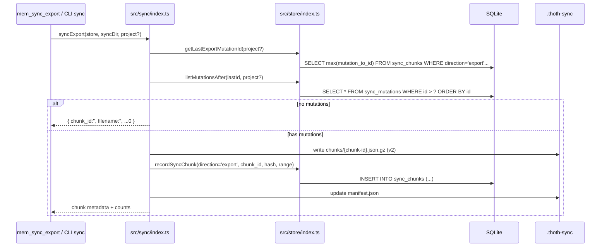
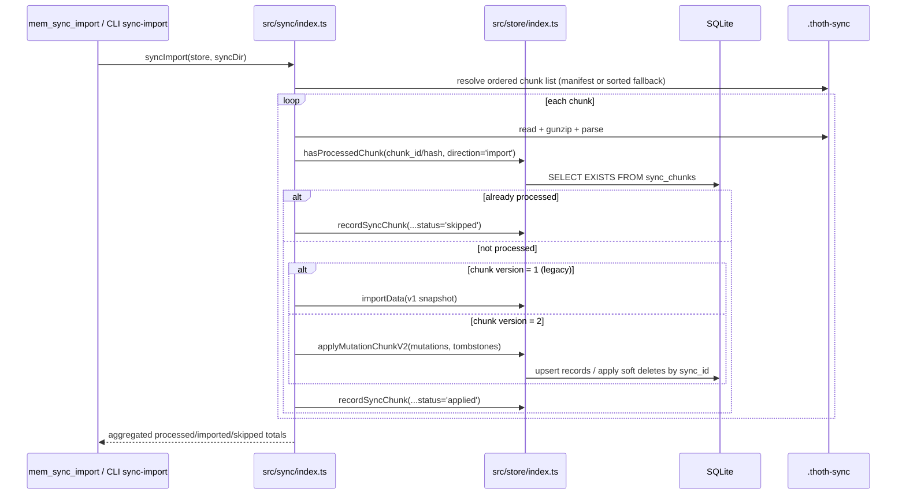

# Design: Sync and Resilience for thoth-mem

## Technical Approach
This change is implemented in five coordinated tracks, mapped directly to the approved proposal/spec deltas and current code layout:

1. **Unified runtime version source**
   - Add a shared runtime version module that reads `package.json` once and exports a cached value.
   - Replace hardcoded literals in `src/cli.ts`, `src/server.ts`, and `src/http-openapi.ts`.

2. **`topic_key` in FTS + deterministic exact lookup**
   - Extend `observations_fts` schema and triggers to index `topic_key`.
   - Add structured migration logic to rebuild FTS when `topic_key` is missing from the virtual table.
   - Add store-level exact lookup path (`WHERE topic_key = ?`) to bypass FTS tokenization for exact intent.

3. **Incremental sync with chunk state**
   - Add `sync_chunks` table for import/export chunk processing state, dedupe keys, and export watermark tracking.
   - Export only mutations newer than the last successful export cursor.

4. **Deletion-aware sync with mutation journal + tombstones**
   - Add `sync_mutations` table as the ordered mutation source.
   - Emit v2 incremental chunks that include mutation envelopes and `tombstones`.
   - Keep importer dual-path: legacy v1 chunks and new v2 chunks.

5. **Structured, idempotent migrations**
   - Replace blind `try/catch ALTER` migration flow with schema-introspection helpers.
   - Centralize migration orchestration in a dedicated module with deterministic ordering.

## Architecture Decisions
### Decision: Shared runtime version utility in `src/version.ts`
**Choice**: Create `src/version.ts` with a single exported getter/value resolved from `package.json` via `createRequire(import.meta.url)` and module-level caching.

**Alternatives considered**:
- Inline `readFileSync` in each caller (`cli.ts`, `server.ts`, `http-openapi.ts`)
- JSON import with assertions in each caller
- Put helper in `src/utils/version.ts`

**Rationale**:
- Keeps version source-of-truth centralized and prevents drift.
- `createRequire` is stable in Node16 ESM and works from both `src/` (tsx dev) and `dist/` (built runtime) with `../package.json`.
- `src/version.ts` is runtime metadata, not a generic string utility; root-level module keeps import intent clear for bootstrapping surfaces.

### Decision: Structured migration helpers in new `src/store/migrations.ts`
**Choice**: Create a dedicated migration module with helper functions (`tableExists`, `columnExists`, `triggerExists`, `ftsHasColumn`, `addColumnIfMissing`, `rebuildObservationsFts`, `runMigrations`).

**Alternatives considered**:
- Keep migration SQL string array in `schema.ts`
- Keep migration logic inline in `Store.runMigrations()`
- Introduce migration class state machine

**Rationale**:
- Current migration style silently swallows SQL exceptions and hides real startup issues.
- Function-based helpers match existing repository style (small focused modules), keep `Store` constructor lean, and are easy to unit test.
- Introspection-driven checks make startup reruns deterministic without destructive operations.

### Decision: Application-level sync mutation journaling (not SQLite triggers)
**Choice**: Journal mutations in Store write paths (`saveObservation`, `updateObservation`, `deleteObservation`, `savePrompt`, `importData` apply path when needed) rather than SQL triggers.

**Alternatives considered**:
- SQLite triggers on `observations` and `user_prompts`
- Hybrid triggers + app hints

**Rationale**:
- Application-level journaling gives precise control over when to emit mutations (especially during import/replay handling).
- Keeps mutation payload shaping in TypeScript where existing domain logic already exists.
- Avoids hidden side effects from triggers that are harder to reason about in tests.

### Decision: Sync chunk v2 envelope with explicit tombstones and cursor
**Choice**: Add a v2 chunk format for sync export/import with:
- `version: 2`
- `from_mutation_id` / `to_mutation_id` cursor range
- ordered `mutations` envelope
- top-level `tombstones` array (optional for compatibility but emitted by v2)

**Alternatives considered**:
- Keep snapshot-only v1 `ExportData` chunks forever
- Delta chunk with only materialized observations/prompts and no explicit mutation envelope

**Rationale**:
- Explicit mutation envelope preserves deterministic apply order.
- Top-level tombstones satisfy delete propagation and straightforward backward-compatible parsing (`tombstones` may be absent in legacy chunks).
- Cursor range allows robust incremental export watermarking.

### Decision: Exact topic-key search implemented in Store, with intent parsing in tool layer
**Choice**: Extend `SearchInput` with optional exact key path (`topic_key_exact`) and branch in `Store.searchObservations()` to SQL equality lookup before FTS.

**Alternatives considered**:
- FTS-only query tricks (`"topic_key:..."`) and tokenization heuristics
- Tool-layer-only exact filtering after broad FTS

**Rationale**:
- Exact semantics belong in persistence/query layer to keep behavior deterministic across CLI/HTTP/MCP callers.
- Equality lookup uses existing B-tree index (`idx_obs_topic`) and avoids FTS tokenizer ambiguity.
- Tool layer can still infer exact intent from query syntax without breaking existing `query` workflows.

## Data Flow
### Incremental export flow (v2)


### Import flow with dedupe + tombstones


## File Changes
- **CREATE** `src/version.ts`
  - Runtime package-version resolver (`package.json` single source-of-truth).

- **CREATE** `src/store/migrations.ts`
  - Structured migration helpers and ordered migration runner.
  - FTS rebuild helper for `observations_fts` evolution.

- **MODIFY** `src/store/schema.ts`
  - Add `topic_key` to `OBSERVATIONS_FTS_SQL` and related triggers.
  - Add `sync_chunks` and `sync_mutations` tables + indexes.
  - Keep base schema idempotent for fresh DB initialization.

- **MODIFY** `src/store/types.ts`
  - Extend search/sync types (`topic_key_exact` search path, sync v2 contracts, mutation/tombstone contracts).

- **MODIFY** `src/store/index.ts`
  - Replace blind migration loop with `runMigrations(db)` from `src/store/migrations.ts`.
  - Add exact `topic_key` lookup branch in search.
  - Add mutation journaling writes for create/update/delete paths.
  - Add sync chunk state read/write helpers and mutation cursor queries.
  - Add v2 mutation-apply path used by sync importer.

- **MODIFY** `src/sync/index.ts`
  - Export path changes from snapshot export to mutation-cursor incremental export.
  - Add chunk hash computation and processed-chunk dedupe checks.
  - Support dual import parser for v1 legacy and v2 incremental+tombstones.
  - Keep deterministic processing order (manifest first, sorted fallback).

- **MODIFY** `src/tools/mem-search.ts`
  - Accept exact-topic-key lookup intent (explicit field and/or query pattern parser).
  - Route exact lookup to Store exact path while preserving existing modes.

- **MODIFY** `src/tools/mem-sync-export.ts`
  - Update output semantics for incremental/no-op export.

- **MODIFY** `src/tools/mem-sync-import.ts`
  - Update output semantics for replay-safe import and skipped chunk reporting.

- **MODIFY** `src/tools/index.ts`
  - Register sync tools if not currently exposed in MCP tool registry.

- **MODIFY** `src/server.ts`
  - Replace hardcoded server version with shared runtime version.

- **MODIFY** `src/cli.ts`
  - Replace hardcoded `VERSION` constant source with shared runtime version utility.

- **MODIFY** `src/http-openapi.ts`
  - Replace hardcoded OpenAPI `info.version` with shared runtime version.

- **MODIFY** tests (targeted)
  - `tests/cli.test.ts` (runtime version output source)
  - `tests/http-server.test.ts` (OpenAPI version consistency + sync semantics)
  - `tests/tools/mem-search.test.ts` (exact topic-key behavior)
  - `tests/sync/sync.test.ts` (incremental export, v1/v2 import, replay-safe dedupe, tombstones)
  - `tests/store/migration.test.ts` + `tests/store/schema.test.ts` (structured migrations, FTS rebuild, sync tables)

## Interfaces / Contracts
```ts
// src/version.ts
export function getRuntimeVersion(): string;
```

```ts
// src/store/types.ts (additions)
export interface SearchInput {
  query: string;
  type?: ObservationType;
  project?: string;
  session_id?: string;
  scope?: ObservationScope;
  limit?: number;
  mode?: SearchMode;
  topic_key_exact?: string;
}

export type SyncEntityType = 'observation' | 'prompt';
export type SyncOperation = 'create' | 'update' | 'delete';

export interface SyncTombstoneV2 {
  entity_type: SyncEntityType;
  sync_id: string;
  deleted_at: string;
}

export interface SyncMutationEnvelopeV2 {
  mutation_id: number;
  entity_type: SyncEntityType;
  operation: SyncOperation;
  occurred_at: string;
  payload?: Observation | UserPrompt;
  tombstone?: SyncTombstoneV2;
}

export interface SyncChunkV2 {
  version: 2;
  chunk_id: string;
  exported_at: string;
  project?: string;
  from_mutation_id: number;
  to_mutation_id: number;
  mutations: SyncMutationEnvelopeV2[];
  tombstones?: SyncTombstoneV2[];
}
```

```ts
// src/store/migrations.ts
export function runMigrations(db: Database.Database): void;
```

**Behavioral contracts**:
- `searchObservations()` MUST run exact equality path when `topic_key_exact` is provided.
- `syncExport()` MUST emit no chunk when there are zero new mutations after watermark.
- `syncImport()` MUST skip by previously processed chunk id or equivalent content hash.
- Importer MUST accept both v1 chunks (`version: 1`, no tombstones) and v2 chunks (`version: 2`, tombstones-aware).

## Testing Strategy
1. **Version consistency regression**
   - Assert CLI `version`, MCP server metadata version, and OpenAPI `info.version` all equal `package.json`.

2. **FTS + exact topic-key tests**
   - Validate `topic_key` is present in FTS table/trigger sync behavior.
   - Validate exact lookup excludes partial/tokenized near-matches.

3. **Migration idempotency tests**
   - Fresh DB, partially migrated DB, and repeated startup runs produce convergent schema.
   - Explicit test for FTS rebuild preserving searchability.

4. **Incremental sync tests**
   - No new mutations => no-op export.
   - New mutations => single delta chunk with cursor range.
   - Re-import same chunk id/hash => skipped without side effects.

5. **Deletion convergence tests**
   - Soft-delete mutation exports tombstone and remote applies delete.
   - Tombstone replay remains idempotent.
   - Mixed repository import (v1 + v2) succeeds deterministically.

6. **Tool-level explicit error tests**
   - Corrupt/unreadable chunk returns tool error (`isError: true`) rather than silent success.

## Migration / Rollout
1. **Startup migration order**
   - Ensure base schema exists.
   - Ensure structured migration helpers run.
   - Ensure `sync_chunks` and `sync_mutations` exist.
   - Ensure `observations_fts` includes `topic_key`; if not, rebuild FTS + triggers.

2. **Compatibility guarantees**
   - Legacy sync chunks remain importable.
   - JSON `export/import` (`ExportData` v1) remains supported for non-sync workflows.
   - New sync export writes v2 chunks only after migrations are present.

3. **Operational rollout**
   - Deploy build with dual-format importer first.
   - Enable v2 incremental export by default.
   - Monitor skipped/applied counters for import/export correctness.

4. **Failure handling**
   - On migration failure: fail startup with explicit error (no silent swallow).
   - On chunk parse/apply failure: mark chunk status `failed` and return explicit tool error.

## Open Questions
- Should imported mutations be re-journaled for downstream fan-out, or intentionally excluded to prevent replay amplification across multi-hop topologies?
- What retention/compaction policy should be applied to `sync_chunks` and `sync_mutations` to control long-term SQLite growth?
- For hard deletes, do we need a dedicated persistent tombstone registry beyond mutation history to prevent possible stale resurrection in edge replay orders?
